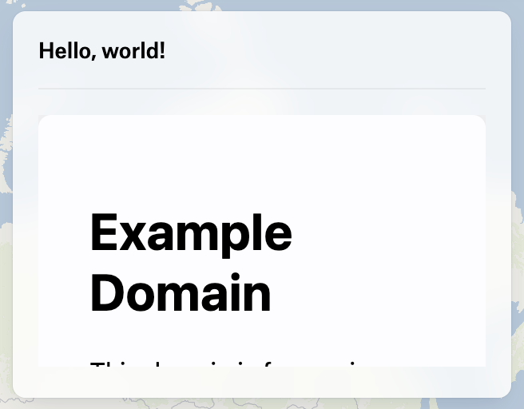

# Other

## PlaceElementCreate

### Properties

#### type

> **type**: `"Place"`

#### coordinates

> **coordinates**: [`LngLatTuple`](client.md#lnglattuple)

#### groupId?

> `optional` **groupId**: `null` | `string`

The ID of the element group that the element belongs to.
For elements that are not part of a group, this will be null.

#### color?

> `optional` **color**: `string`

The color of the element in some CSS-like format.

##### Example

```typescript
"#ABC123";
"rgb(255, 0, 0)";
"hsl(200, 100%, 50%)";
```

##### Default

```ts
"#C93535"
```

#### name?

> `optional` **name**: `null` | `string`

The element's name. For elements that can show a label or text on
the map (e.g. a Place or Text element) this is the text that will be shown.

For elements such as Polygons or Paths, the name is what is shown when
the element is selected by clicking on it.

#### description?

> `optional` **description**: `null` | `string`

Text describing the element, which is shown in an element's popup when it
is selected.

Note that some elements are not selectable on the map, such as Notes, Text
and Markers, so their description will not be shown.

#### attributes?

> `optional` **attributes**: `Record`\<`string`, `unknown`>

A set of key-value pairs that can be used to store arbitrary data about the element.

This is most useful for associating additional data with an element that is not
part of the element's core data, such as a Place's address or some other
data.

#### interaction?

> `optional` **interaction**: `"default"` | `"locked"`

Whether the element is interactive.

The `default` interaction mode means that the element can be selected and edited by
the user, if it was created by the SDK or by the user using a tool.

If the interaction mode is `locked`, the element will not be editable by the user,
which is often used for elements that you don't want the user to edit or move by
accident.

Elements that were created by the map author (i.e. not during an SDK "session") are
not editable and have special behaviour depending on their name, description and
attributes.

##### Default

```ts
"default"
```

#### imageUrl?

> `optional` **imageUrl**: `null` | `string`

The URL of an image that has been added to the element.

#### symbol?

> `optional` **symbol**: `string`

The symbol that is rendered for the Place.

This can be an emoji by using colon-enclosed characters (e.g. `":smiley:"`)
or one of the symbols available in Felt's symbol library.

You can see the available symbols in the Felt UI when editing a Place
by hovering a symbol and converting the tooltip to kebab-case. For example,
the "Oil barrel" symbol is `oil-barrel`.

#### frame?

> `optional` **frame**: `null` | `"frame-circle"` | `"frame-square"`

The frame that is rendered around the Place's symbol. This is
only available for non-emoji symbols.

#### hideLabel?

> `optional` **hideLabel**: `boolean`

Whether the element's label is hidden on the map. This allows you
to add a name to the element and can show in popups, but not have
it visible on the map.

This will also hide the faint placeholder label that is shown when
an editable Place is selected.

##### Default

```ts
false
```

## PathElementCreate

### Properties

#### type

> **type**: `"Path"`

#### coordinates

> **coordinates**: [`LngLatTuple`](client.md#lnglattuple)\[]\[]

#### groupId?

> `optional` **groupId**: `null` | `string`

The ID of the element group that the element belongs to.
For elements that are not part of a group, this will be null.

#### color?

> `optional` **color**: `string`

The color of the element in some CSS-like format.

##### Example

```typescript
"#ABC123";
"rgb(255, 0, 0)";
"hsl(200, 100%, 50%)";
```

##### Default

```ts
"#C93535"
```

#### name?

> `optional` **name**: `null` | `string`

The element's name. For elements that can show a label or text on
the map (e.g. a Place or Text element) this is the text that will be shown.

For elements such as Polygons or Paths, the name is what is shown when
the element is selected by clicking on it.

#### description?

> `optional` **description**: `null` | `string`

Text describing the element, which is shown in an element's popup when it
is selected.

Note that some elements are not selectable on the map, such as Notes, Text
and Markers, so their description will not be shown.

#### attributes?

> `optional` **attributes**: `Record`\<`string`, `unknown`>

A set of key-value pairs that can be used to store arbitrary data about the element.

This is most useful for associating additional data with an element that is not
part of the element's core data, such as a Place's address or some other
data.

#### interaction?

> `optional` **interaction**: `"default"` | `"locked"`

Whether the element is interactive.

The `default` interaction mode means that the element can be selected and edited by
the user, if it was created by the SDK or by the user using a tool.

If the interaction mode is `locked`, the element will not be editable by the user,
which is often used for elements that you don't want the user to edit or move by
accident.

Elements that were created by the map author (i.e. not during an SDK "session") are
not editable and have special behaviour depending on their name, description and
attributes.

##### Default

```ts
"default"
```

#### imageUrl?

> `optional` **imageUrl**: `null` | `string`

The URL of an image that has been added to the element.

#### strokeOpacity?

> `optional` **strokeOpacity**: `number`

A value between 0 and 1 that describes the opacity of the element's stroke.

##### Default

```ts
1
```

#### strokeWidth?

> `optional` **strokeWidth**: `number`

The width of the element's stroke in pixels.

##### Default

```ts
2
```

#### strokeStyle?

> `optional` **strokeStyle**: `"solid"` | `"dashed"` | `"dotted"`

The style of the element's stroke.

##### Default

```ts
"solid"
```

#### distanceMarker?

> `optional` **distanceMarker**: `boolean`

Whether a distance marker is shown at the midpoint of the path.

##### Default

```ts
false
```

#### routingMode?

> `optional` **routingMode**: `null` | `"driving"` | `"cycling"` | `"walking"` | `"flying"`

Whether this represents a route, and if so, what mode of transport
is used.

If this is `null`, the path is not considered to be a route, so while it
can have a `distanceMarker`, it will does not have a start or end cap.

##### Default

```ts
null
```

#### endCaps?

> `optional` **endCaps**: `boolean`

Whether or not to show Start and End caps on the path. This is
only available if the `routingMode` is set.

##### Default

```ts
false
```

## PolygonElementCreate

### Properties

#### type

> **type**: `"Polygon"`

#### coordinates

> **coordinates**: [`LngLatTuple`](client.md#lnglattuple)\[]\[]

#### groupId?

> `optional` **groupId**: `null` | `string`

The ID of the element group that the element belongs to.
For elements that are not part of a group, this will be null.

#### color?

> `optional` **color**: `string`

The color of the element in some CSS-like format.

##### Example

```typescript
"#ABC123";
"rgb(255, 0, 0)";
"hsl(200, 100%, 50%)";
```

##### Default

```ts
"#C93535"
```

#### name?

> `optional` **name**: `null` | `string`

The element's name. For elements that can show a label or text on
the map (e.g. a Place or Text element) this is the text that will be shown.

For elements such as Polygons or Paths, the name is what is shown when
the element is selected by clicking on it.

#### description?

> `optional` **description**: `null` | `string`

Text describing the element, which is shown in an element's popup when it
is selected.

Note that some elements are not selectable on the map, such as Notes, Text
and Markers, so their description will not be shown.

#### attributes?

> `optional` **attributes**: `Record`\<`string`, `unknown`>

A set of key-value pairs that can be used to store arbitrary data about the element.

This is most useful for associating additional data with an element that is not
part of the element's core data, such as a Place's address or some other
data.

#### interaction?

> `optional` **interaction**: `"default"` | `"locked"`

Whether the element is interactive.

The `default` interaction mode means that the element can be selected and edited by
the user, if it was created by the SDK or by the user using a tool.

If the interaction mode is `locked`, the element will not be editable by the user,
which is often used for elements that you don't want the user to edit or move by
accident.

Elements that were created by the map author (i.e. not during an SDK "session") are
not editable and have special behaviour depending on their name, description and
attributes.

##### Default

```ts
"default"
```

#### imageUrl?

> `optional` **imageUrl**: `null` | `string`

The URL of an image that has been added to the element.

#### strokeOpacity?

> `optional` **strokeOpacity**: `number`

A value between 0 and 1 that describes the opacity of the element's stroke.

##### Default

```ts
1
```

#### strokeWidth?

> `optional` **strokeWidth**: `number`

The width of the element's stroke in pixels.

##### Default

```ts
2
```

#### strokeStyle?

> `optional` **strokeStyle**: `"solid"` | `"dashed"` | `"dotted"`

The style of the element's stroke.

##### Default

```ts
"solid"
```

#### fillOpacity?

> `optional` **fillOpacity**: `number`

The opacity of the polygon's fill, between 0 and 1.

##### Default

```ts
0.25
```

#### areaMarker?

> `optional` **areaMarker**: `boolean`

Whether to show an area marker on the polygon.

##### Default

```ts
false
```

## CircleElementCreate

### Properties

#### type

> **type**: `"Circle"`

#### radius

> **radius**: `number`

The radius of the circle in meters.

#### center

> **center**: [`LngLatTuple`](client.md#lnglattuple)

The center of the circle.

#### groupId?

> `optional` **groupId**: `null` | `string`

The ID of the element group that the element belongs to.
For elements that are not part of a group, this will be null.

#### color?

> `optional` **color**: `string`

The color of the element in some CSS-like format.

##### Example

```typescript
"#ABC123";
"rgb(255, 0, 0)";
"hsl(200, 100%, 50%)";
```

##### Default

```ts
"#C93535"
```

#### name?

> `optional` **name**: `null` | `string`

The element's name. For elements that can show a label or text on
the map (e.g. a Place or Text element) this is the text that will be shown.

For elements such as Polygons or Paths, the name is what is shown when
the element is selected by clicking on it.

#### description?

> `optional` **description**: `null` | `string`

Text describing the element, which is shown in an element's popup when it
is selected.

Note that some elements are not selectable on the map, such as Notes, Text
and Markers, so their description will not be shown.

#### attributes?

> `optional` **attributes**: `Record`\<`string`, `unknown`>

A set of key-value pairs that can be used to store arbitrary data about the element.

This is most useful for associating additional data with an element that is not
part of the element's core data, such as a Place's address or some other
data.

#### interaction?

> `optional` **interaction**: `"default"` | `"locked"`

Whether the element is interactive.

The `default` interaction mode means that the element can be selected and edited by
the user, if it was created by the SDK or by the user using a tool.

If the interaction mode is `locked`, the element will not be editable by the user,
which is often used for elements that you don't want the user to edit or move by
accident.

Elements that were created by the map author (i.e. not during an SDK "session") are
not editable and have special behaviour depending on their name, description and
attributes.

##### Default

```ts
"default"
```

#### imageUrl?

> `optional` **imageUrl**: `null` | `string`

The URL of an image that has been added to the element.

#### strokeOpacity?

> `optional` **strokeOpacity**: `number`

A value between 0 and 1 that describes the opacity of the element's stroke.

##### Default

```ts
1
```

#### strokeWidth?

> `optional` **strokeWidth**: `number`

The width of the element's stroke in pixels.

##### Default

```ts
2
```

#### strokeStyle?

> `optional` **strokeStyle**: `"solid"` | `"dashed"` | `"dotted"`

The style of the element's stroke.

##### Default

```ts
"solid"
```

#### radiusMarker?

> `optional` **radiusMarker**: `boolean`

Whether to show a marker on the circle that indicates the radius

##### Default

```ts
false
```

#### radiusDisplayAngle?

> `optional` **radiusDisplayAngle**: `number`

The angle at which the control point for setting the radius is displayed,
in degrees. When the `radiusMarker` is `true`, there is a dotted line rendered
from the center of the circle to the control point, and the marker is shown
at the midpoint of this line.

##### Default

```ts
90
```

#### radiusDisplayUnit?

> `optional` **radiusDisplayUnit**: `null` | `"meter"` | `"kilometer"` | `"foot"` | `"mile"`

The unit of the radius used when the `radiusMarker` is `true`.

A value of `null` means that the unit matches the user's locale.

##### Default

```ts
null
```

#### fillOpacity?

> `optional` **fillOpacity**: `number`

The opacity of the circle's fill.

##### Default

```ts
0.25
```

## MarkerElementCreate

### Properties

#### type

> **type**: `"Marker"`

#### coordinates

> **coordinates**: [`LngLatTuple`](client.md#lnglattuple)\[]\[]

#### groupId?

> `optional` **groupId**: `null` | `string`

The ID of the element group that the element belongs to.
For elements that are not part of a group, this will be null.

#### color?

> `optional` **color**: `string`

The color of the element in some CSS-like format.

##### Example

```typescript
"#ABC123";
"rgb(255, 0, 0)";
"hsl(200, 100%, 50%)";
```

##### Default

```ts
"#C93535"
```

#### name?

> `optional` **name**: `null` | `string`

The element's name. For elements that can show a label or text on
the map (e.g. a Place or Text element) this is the text that will be shown.

For elements such as Polygons or Paths, the name is what is shown when
the element is selected by clicking on it.

#### description?

> `optional` **description**: `null` | `string`

Text describing the element, which is shown in an element's popup when it
is selected.

Note that some elements are not selectable on the map, such as Notes, Text
and Markers, so their description will not be shown.

#### attributes?

> `optional` **attributes**: `Record`\<`string`, `unknown`>

A set of key-value pairs that can be used to store arbitrary data about the element.

This is most useful for associating additional data with an element that is not
part of the element's core data, such as a Place's address or some other
data.

#### interaction?

> `optional` **interaction**: `"default"` | `"locked"`

Whether the element is interactive.

The `default` interaction mode means that the element can be selected and edited by
the user, if it was created by the SDK or by the user using a tool.

If the interaction mode is `locked`, the element will not be editable by the user,
which is often used for elements that you don't want the user to edit or move by
accident.

Elements that were created by the map author (i.e. not during an SDK "session") are
not editable and have special behaviour depending on their name, description and
attributes.

##### Default

```ts
"default"
```

#### opacity?

> `optional` **opacity**: `number`

The opacity of the marker, between 0 and 1.

##### Default

```ts
1
```

#### size?

> `optional` **size**: `number`

The size of the marker, used in conjunction with the `zoom` to determine
the actual size of the marker.

##### Default

```ts
10
```

#### zoom?

> `optional` **zoom**: `number`

The zoom level at which the marker was created. This is combined with
the `size` to determine the actual size of the marker.

When creating a marker, if you don't supply this value it defaults to
the current zoom of the map when you call `createElement`.

## HighlighterElementCreate

### Properties

#### type

> **type**: `"Highlighter"`

#### coordinates

> **coordinates**: [`LngLatTuple`](client.md#lnglattuple)\[]\[]\[]

A multipolygon describing the area that is highlighted.

If `renderHoles` is set to false, only the outer ring of each polygon
will be rendered, filling in the area inside the highlighted region.

#### groupId?

> `optional` **groupId**: `null` | `string`

The ID of the element group that the element belongs to.
For elements that are not part of a group, this will be null.

#### color?

> `optional` **color**: `string`

The color of the element in some CSS-like format.

##### Example

```typescript
"#ABC123";
"rgb(255, 0, 0)";
"hsl(200, 100%, 50%)";
```

##### Default

```ts
"#C93535"
```

#### name?

> `optional` **name**: `null` | `string`

The element's name. For elements that can show a label or text on
the map (e.g. a Place or Text element) this is the text that will be shown.

For elements such as Polygons or Paths, the name is what is shown when
the element is selected by clicking on it.

#### description?

> `optional` **description**: `null` | `string`

Text describing the element, which is shown in an element's popup when it
is selected.

Note that some elements are not selectable on the map, such as Notes, Text
and Markers, so their description will not be shown.

#### attributes?

> `optional` **attributes**: `Record`\<`string`, `unknown`>

A set of key-value pairs that can be used to store arbitrary data about the element.

This is most useful for associating additional data with an element that is not
part of the element's core data, such as a Place's address or some other
data.

#### interaction?

> `optional` **interaction**: `"default"` | `"locked"`

Whether the element is interactive.

The `default` interaction mode means that the element can be selected and edited by
the user, if it was created by the SDK or by the user using a tool.

If the interaction mode is `locked`, the element will not be editable by the user,
which is often used for elements that you don't want the user to edit or move by
accident.

Elements that were created by the map author (i.e. not during an SDK "session") are
not editable and have special behaviour depending on their name, description and
attributes.

##### Default

```ts
"default"
```

#### renderHoles?

> `optional` **renderHoles**: `boolean`

Whether to render the holes of the highlighted area.

##### Default

```ts
false
```

#### opacity?

> `optional` **opacity**: `number`

The opacity of the highlighter, between 0 and 1.

##### Default

```ts
0.5
```

## TextElementCreate

### Properties

#### type

> **type**: `"Text"`

#### text

> **text**: `string`

#### groupId?

> `optional` **groupId**: `null` | `string`

The ID of the element group that the element belongs to.
For elements that are not part of a group, this will be null.

#### color?

> `optional` **color**: `string`

The color of the element in some CSS-like format.

##### Example

```typescript
"#ABC123";
"rgb(255, 0, 0)";
"hsl(200, 100%, 50%)";
```

##### Default

```ts
"#C93535"
```

#### description?

> `optional` **description**: `null` | `string`

Text describing the element, which is shown in an element's popup when it
is selected.

Note that some elements are not selectable on the map, such as Notes, Text
and Markers, so their description will not be shown.

#### attributes?

> `optional` **attributes**: `Record`\<`string`, `unknown`>

A set of key-value pairs that can be used to store arbitrary data about the element.

This is most useful for associating additional data with an element that is not
part of the element's core data, such as a Place's address or some other
data.

#### interaction?

> `optional` **interaction**: `"default"` | `"locked"`

Whether the element is interactive.

The `default` interaction mode means that the element can be selected and edited by
the user, if it was created by the SDK or by the user using a tool.

If the interaction mode is `locked`, the element will not be editable by the user,
which is often used for elements that you don't want the user to edit or move by
accident.

Elements that were created by the map author (i.e. not during an SDK "session") are
not editable and have special behaviour depending on their name, description and
attributes.

##### Default

```ts
"default"
```

#### rotation?

> `optional` **rotation**: `number`

The rotation of the element in degrees.

##### Default

```ts
0
```

#### scale?

> `optional` **scale**: `number`

The relative scale of the element from the default size. This is combined
with the `zoom` to determine the actual size of the element.

##### Default

```ts
1
```

#### zoom?

> `optional` **zoom**: `number`

The zoom level at which the element was created. This is combined with
the `scale` to determine the actual size of the element.

When creating an element, if you don't supply this value it defaults to
the current zoom of the map when you call `createElement`.

#### align?

> `optional` **align**: `"center"` | `"left"` | `"right"`

The alignment of the text, either `left`, `center` or `right`.

##### Default

```ts
"center"
```

#### style?

> `optional` **style**: `"italic"` | `"light"` | `"regular"` | `"caps"`

The style of the text, either `italic`, `light`, `regular` or `caps`.

##### Default

```ts
"regular"
```

#### position?

> `optional` **position**: [`LngLatTuple`](client.md#lnglattuple)

The geographical position of the center of the text element.

If this is omitted, the text will be placed at the center of the current
viewport.

## NoteElementCreate

### Properties

#### type

> **type**: `"Note"`

#### text

> **text**: `string`

#### groupId?

> `optional` **groupId**: `null` | `string`

The ID of the element group that the element belongs to.
For elements that are not part of a group, this will be null.

#### color?

> `optional` **color**: `string`

The color of the element in some CSS-like format.

##### Example

```typescript
"#ABC123";
"rgb(255, 0, 0)";
"hsl(200, 100%, 50%)";
```

##### Default

```ts
"#C93535"
```

#### description?

> `optional` **description**: `null` | `string`

Text describing the element, which is shown in an element's popup when it
is selected.

Note that some elements are not selectable on the map, such as Notes, Text
and Markers, so their description will not be shown.

#### attributes?

> `optional` **attributes**: `Record`\<`string`, `unknown`>

A set of key-value pairs that can be used to store arbitrary data about the element.

This is most useful for associating additional data with an element that is not
part of the element's core data, such as a Place's address or some other
data.

#### interaction?

> `optional` **interaction**: `"default"` | `"locked"`

Whether the element is interactive.

The `default` interaction mode means that the element can be selected and edited by
the user, if it was created by the SDK or by the user using a tool.

If the interaction mode is `locked`, the element will not be editable by the user,
which is often used for elements that you don't want the user to edit or move by
accident.

Elements that were created by the map author (i.e. not during an SDK "session") are
not editable and have special behaviour depending on their name, description and
attributes.

##### Default

```ts
"default"
```

#### rotation?

> `optional` **rotation**: `number`

The rotation of the element in degrees.

##### Default

```ts
0
```

#### scale?

> `optional` **scale**: `number`

The relative scale of the element from the default size. This is combined
with the `zoom` to determine the actual size of the element.

##### Default

```ts
1
```

#### zoom?

> `optional` **zoom**: `number`

The zoom level at which the element was created. This is combined with
the `scale` to determine the actual size of the element.

When creating an element, if you don't supply this value it defaults to
the current zoom of the map when you call `createElement`.

#### align?

> `optional` **align**: `"center"` | `"left"` | `"right"`

The alignment of the text, either `left`, `center` or `right`.

##### Default

```ts
"center"
```

#### style?

> `optional` **style**: `"italic"` | `"light"` | `"regular"` | `"caps"`

The style of the text, either `italic`, `light`, `regular` or `caps`.

##### Default

```ts
"regular"
```

#### widthScale?

> `optional` **widthScale**: `number`

#### position?

> `optional` **position**: [`LngLatTuple`](client.md#lnglattuple)

The geographical position of the center of the note element.

If this is omitted, the note will be placed at the center of the current
viewport.

## ImageElementCreate

### Properties

#### type

> **type**: `"Image"`

#### coordinates

> **coordinates**: \[`number`, `number`]\[]\[] = `MultiLineStringGeometrySchema.shape.coordinates`

#### imageUrl

> **imageUrl**: `string`

The URL of the image that is rendered in this element

#### groupId?

> `optional` **groupId**: `null` | `string`

The ID of the element group that the element belongs to.
For elements that are not part of a group, this will be null.

#### name?

> `optional` **name**: `null` | `string`

The element's name. For elements that can show a label or text on
the map (e.g. a Place or Text element) this is the text that will be shown.

For elements such as Polygons or Paths, the name is what is shown when
the element is selected by clicking on it.

#### description?

> `optional` **description**: `null` | `string`

Text describing the element, which is shown in an element's popup when it
is selected.

Note that some elements are not selectable on the map, such as Notes, Text
and Markers, so their description will not be shown.

#### attributes?

> `optional` **attributes**: `Record`\<`string`, `unknown`>

A set of key-value pairs that can be used to store arbitrary data about the element.

This is most useful for associating additional data with an element that is not
part of the element's core data, such as a Place's address or some other
data.

#### interaction?

> `optional` **interaction**: `"default"` | `"locked"`

Whether the element is interactive.

The `default` interaction mode means that the element can be selected and edited by
the user, if it was created by the SDK or by the user using a tool.

If the interaction mode is `locked`, the element will not be editable by the user,
which is often used for elements that you don't want the user to edit or move by
accident.

Elements that were created by the map author (i.e. not during an SDK "session") are
not editable and have special behaviour depending on their name, description and
attributes.

##### Default

```ts
"default"
```

#### opacity?

> `optional` **opacity**: `number`

The opacity of the image, between 0 and 1.

##### Default

```ts
1
```

## PlaceElementRead

### Properties

#### id

> **id**: `string`

The unique identifier for the element.

#### groupId

> **groupId**: `null` | `string`

The ID of the element group that the element belongs to.
For elements that are not part of a group, this will be null.

#### color

> **color**: `string`

The color of the element in some CSS-like format.

##### Example

```typescript
"#ABC123";
"rgb(255, 0, 0)";
"hsl(200, 100%, 50%)";
```

##### Default

```ts
"#C93535"
```

#### name

> **name**: `null` | `string`

The element's name. For elements that can show a label or text on
the map (e.g. a Place or Text element) this is the text that will be shown.

For elements such as Polygons or Paths, the name is what is shown when
the element is selected by clicking on it.

#### description

> **description**: `null` | `string`

Text describing the element, which is shown in an element's popup when it
is selected.

Note that some elements are not selectable on the map, such as Notes, Text
and Markers, so their description will not be shown.

#### attributes

> **attributes**: `Record`\<`string`, `unknown`>

A set of key-value pairs that can be used to store arbitrary data about the element.

This is most useful for associating additional data with an element that is not
part of the element's core data, such as a Place's address or some other
data.

#### imageUrl

> **imageUrl**: `null` | `string`

The URL of an image that has been added to the element.

#### type

> **type**: `"Place"`

#### symbol

> **symbol**: `string`

The symbol that is rendered for the Place.

This can be an emoji by using colon-enclosed characters (e.g. `":smiley:"`)
or one of the symbols available in Felt's symbol library.

You can see the available symbols in the Felt UI when editing a Place
by hovering a symbol and converting the tooltip to kebab-case. For example,
the "Oil barrel" symbol is `oil-barrel`.

#### frame

> **frame**: `null` | `"frame-circle"` | `"frame-square"`

The frame that is rendered around the Place's symbol. This is
only available for non-emoji symbols.

#### hideLabel

> **hideLabel**: `boolean`

Whether the element's label is hidden on the map. This allows you
to add a name to the element and can show in popups, but not have
it visible on the map.

This will also hide the faint placeholder label that is shown when
an editable Place is selected.

##### Default

```ts
false
```

#### coordinates

> **coordinates**: [`LngLatTuple`](client.md#lnglattuple)

#### interaction?

> `optional` **interaction**: `"default"` | `"locked"`

Whether the element is interactive.

The `default` interaction mode means that the element can be selected and edited by
the user, if it was created by the SDK or by the user using a tool.

If the interaction mode is `locked`, the element will not be editable by the user,
which is often used for elements that you don't want the user to edit or move by
accident.

Elements that were created by the map author (i.e. not during an SDK "session") are
not editable and have special behaviour depending on their name, description and
attributes.

##### Default

```ts
"default"
```

## PathElementRead

### Properties

#### id

> **id**: `string`

The unique identifier for the element.

#### groupId

> **groupId**: `null` | `string`

The ID of the element group that the element belongs to.
For elements that are not part of a group, this will be null.

#### color

> **color**: `string`

The color of the element in some CSS-like format.

##### Example

```typescript
"#ABC123";
"rgb(255, 0, 0)";
"hsl(200, 100%, 50%)";
```

##### Default

```ts
"#C93535"
```

#### name

> **name**: `null` | `string`

The element's name. For elements that can show a label or text on
the map (e.g. a Place or Text element) this is the text that will be shown.

For elements such as Polygons or Paths, the name is what is shown when
the element is selected by clicking on it.

#### description

> **description**: `null` | `string`

Text describing the element, which is shown in an element's popup when it
is selected.

Note that some elements are not selectable on the map, such as Notes, Text
and Markers, so their description will not be shown.

#### attributes

> **attributes**: `Record`\<`string`, `unknown`>

A set of key-value pairs that can be used to store arbitrary data about the element.

This is most useful for associating additional data with an element that is not
part of the element's core data, such as a Place's address or some other
data.

#### imageUrl

> **imageUrl**: `null` | `string`

The URL of an image that has been added to the element.

#### strokeOpacity

> **strokeOpacity**: `number`

A value between 0 and 1 that describes the opacity of the element's stroke.

##### Default

```ts
1
```

#### strokeWidth

> **strokeWidth**: `number`

The width of the element's stroke in pixels.

##### Default

```ts
2
```

#### strokeStyle

> **strokeStyle**: `"solid"` | `"dashed"` | `"dotted"`

The style of the element's stroke.

##### Default

```ts
"solid"
```

#### type

> **type**: `"Path"`

#### distanceMarker

> **distanceMarker**: `boolean`

Whether a distance marker is shown at the midpoint of the path.

##### Default

```ts
false
```

#### routingMode

> **routingMode**: `null` | `"driving"` | `"cycling"` | `"walking"` | `"flying"`

Whether this represents a route, and if so, what mode of transport
is used.

If this is `null`, the path is not considered to be a route, so while it
can have a `distanceMarker`, it will does not have a start or end cap.

##### Default

```ts
null
```

#### endCaps

> **endCaps**: `boolean`

Whether or not to show Start and End caps on the path. This is
only available if the `routingMode` is set.

##### Default

```ts
false
```

#### interaction?

> `optional` **interaction**: `"default"` | `"locked"`

Whether the element is interactive.

The `default` interaction mode means that the element can be selected and edited by
the user, if it was created by the SDK or by the user using a tool.

If the interaction mode is `locked`, the element will not be editable by the user,
which is often used for elements that you don't want the user to edit or move by
accident.

Elements that were created by the map author (i.e. not during an SDK "session") are
not editable and have special behaviour depending on their name, description and
attributes.

##### Default

```ts
"default"
```

## PolygonElementRead

### Properties

#### id

> **id**: `string`

The unique identifier for the element.

#### groupId

> **groupId**: `null` | `string`

The ID of the element group that the element belongs to.
For elements that are not part of a group, this will be null.

#### color

> **color**: `string`

The color of the element in some CSS-like format.

##### Example

```typescript
"#ABC123";
"rgb(255, 0, 0)";
"hsl(200, 100%, 50%)";
```

##### Default

```ts
"#C93535"
```

#### name

> **name**: `null` | `string`

The element's name. For elements that can show a label or text on
the map (e.g. a Place or Text element) this is the text that will be shown.

For elements such as Polygons or Paths, the name is what is shown when
the element is selected by clicking on it.

#### description

> **description**: `null` | `string`

Text describing the element, which is shown in an element's popup when it
is selected.

Note that some elements are not selectable on the map, such as Notes, Text
and Markers, so their description will not be shown.

#### attributes

> **attributes**: `Record`\<`string`, `unknown`>

A set of key-value pairs that can be used to store arbitrary data about the element.

This is most useful for associating additional data with an element that is not
part of the element's core data, such as a Place's address or some other
data.

#### imageUrl

> **imageUrl**: `null` | `string`

The URL of an image that has been added to the element.

#### strokeOpacity

> **strokeOpacity**: `number`

A value between 0 and 1 that describes the opacity of the element's stroke.

##### Default

```ts
1
```

#### strokeWidth

> **strokeWidth**: `number`

The width of the element's stroke in pixels.

##### Default

```ts
2
```

#### strokeStyle

> **strokeStyle**: `"solid"` | `"dashed"` | `"dotted"`

The style of the element's stroke.

##### Default

```ts
"solid"
```

#### type

> **type**: `"Polygon"`

#### fillOpacity

> **fillOpacity**: `number`

The opacity of the polygon's fill, between 0 and 1.

##### Default

```ts
0.25
```

#### areaMarker

> **areaMarker**: `boolean`

Whether to show an area marker on the polygon.

##### Default

```ts
false
```

#### interaction?

> `optional` **interaction**: `"default"` | `"locked"`

Whether the element is interactive.

The `default` interaction mode means that the element can be selected and edited by
the user, if it was created by the SDK or by the user using a tool.

If the interaction mode is `locked`, the element will not be editable by the user,
which is often used for elements that you don't want the user to edit or move by
accident.

Elements that were created by the map author (i.e. not during an SDK "session") are
not editable and have special behaviour depending on their name, description and
attributes.

##### Default

```ts
"default"
```

## CircleElementRead

### Properties

#### id

> **id**: `string`

The unique identifier for the element.

#### groupId

> **groupId**: `null` | `string`

The ID of the element group that the element belongs to.
For elements that are not part of a group, this will be null.

#### color

> **color**: `string`

The color of the element in some CSS-like format.

##### Example

```typescript
"#ABC123";
"rgb(255, 0, 0)";
"hsl(200, 100%, 50%)";
```

##### Default

```ts
"#C93535"
```

#### name

> **name**: `null` | `string`

The element's name. For elements that can show a label or text on
the map (e.g. a Place or Text element) this is the text that will be shown.

For elements such as Polygons or Paths, the name is what is shown when
the element is selected by clicking on it.

#### description

> **description**: `null` | `string`

Text describing the element, which is shown in an element's popup when it
is selected.

Note that some elements are not selectable on the map, such as Notes, Text
and Markers, so their description will not be shown.

#### attributes

> **attributes**: `Record`\<`string`, `unknown`>

A set of key-value pairs that can be used to store arbitrary data about the element.

This is most useful for associating additional data with an element that is not
part of the element's core data, such as a Place's address or some other
data.

#### imageUrl

> **imageUrl**: `null` | `string`

The URL of an image that has been added to the element.

#### strokeOpacity

> **strokeOpacity**: `number`

A value between 0 and 1 that describes the opacity of the element's stroke.

##### Default

```ts
1
```

#### strokeWidth

> **strokeWidth**: `number`

The width of the element's stroke in pixels.

##### Default

```ts
2
```

#### strokeStyle

> **strokeStyle**: `"solid"` | `"dashed"` | `"dotted"`

The style of the element's stroke.

##### Default

```ts
"solid"
```

#### type

> **type**: `"Circle"`

#### radius

> **radius**: `number`

The radius of the circle in meters.

#### radiusMarker

> **radiusMarker**: `boolean`

Whether to show a marker on the circle that indicates the radius

##### Default

```ts
false
```

#### radiusDisplayAngle

> **radiusDisplayAngle**: `number`

The angle at which the control point for setting the radius is displayed,
in degrees. When the `radiusMarker` is `true`, there is a dotted line rendered
from the center of the circle to the control point, and the marker is shown
at the midpoint of this line.

##### Default

```ts
90
```

#### radiusDisplayUnit

> **radiusDisplayUnit**: `null` | `"meter"` | `"kilometer"` | `"foot"` | `"mile"`

The unit of the radius used when the `radiusMarker` is `true`.

A value of `null` means that the unit matches the user's locale.

##### Default

```ts
null
```

#### fillOpacity

> **fillOpacity**: `number`

The opacity of the circle's fill.

##### Default

```ts
0.25
```

#### center

> **center**: [`LngLatTuple`](client.md#lnglattuple)

The center of the circle.

#### interaction?

> `optional` **interaction**: `"default"` | `"locked"`

Whether the element is interactive.

The `default` interaction mode means that the element can be selected and edited by
the user, if it was created by the SDK or by the user using a tool.

If the interaction mode is `locked`, the element will not be editable by the user,
which is often used for elements that you don't want the user to edit or move by
accident.

Elements that were created by the map author (i.e. not during an SDK "session") are
not editable and have special behaviour depending on their name, description and
attributes.

##### Default

```ts
"default"
```

## MarkerElementRead

### Properties

#### id

> **id**: `string`

The unique identifier for the element.

#### groupId

> **groupId**: `null` | `string`

The ID of the element group that the element belongs to.
For elements that are not part of a group, this will be null.

#### color

> **color**: `string`

The color of the element in some CSS-like format.

##### Example

```typescript
"#ABC123";
"rgb(255, 0, 0)";
"hsl(200, 100%, 50%)";
```

##### Default

```ts
"#C93535"
```

#### name

> **name**: `null` | `string`

The element's name. For elements that can show a label or text on
the map (e.g. a Place or Text element) this is the text that will be shown.

For elements such as Polygons or Paths, the name is what is shown when
the element is selected by clicking on it.

#### description

> **description**: `null` | `string`

Text describing the element, which is shown in an element's popup when it
is selected.

Note that some elements are not selectable on the map, such as Notes, Text
and Markers, so their description will not be shown.

#### attributes

> **attributes**: `Record`\<`string`, `unknown`>

A set of key-value pairs that can be used to store arbitrary data about the element.

This is most useful for associating additional data with an element that is not
part of the element's core data, such as a Place's address or some other
data.

#### type

> **type**: `"Marker"`

#### opacity

> **opacity**: `number`

The opacity of the marker, between 0 and 1.

##### Default

```ts
1
```

#### size

> **size**: `number`

The size of the marker, used in conjunction with the `zoom` to determine
the actual size of the marker.

##### Default

```ts
10
```

#### zoom

> **zoom**: `number`

The zoom level at which the marker was created. This is combined with
the `size` to determine the actual size of the marker.

When creating a marker, if you don't supply this value it defaults to
the current zoom of the map when you call `createElement`.

#### interaction?

> `optional` **interaction**: `"default"` | `"locked"`

Whether the element is interactive.

The `default` interaction mode means that the element can be selected and edited by
the user, if it was created by the SDK or by the user using a tool.

If the interaction mode is `locked`, the element will not be editable by the user,
which is often used for elements that you don't want the user to edit or move by
accident.

Elements that were created by the map author (i.e. not during an SDK "session") are
not editable and have special behaviour depending on their name, description and
attributes.

##### Default

```ts
"default"
```

## HighlighterElementRead

### Properties

#### id

> **id**: `string`

The unique identifier for the element.

#### groupId

> **groupId**: `null` | `string`

The ID of the element group that the element belongs to.
For elements that are not part of a group, this will be null.

#### color

> **color**: `string`

The color of the element in some CSS-like format.

##### Example

```typescript
"#ABC123";
"rgb(255, 0, 0)";
"hsl(200, 100%, 50%)";
```

##### Default

```ts
"#C93535"
```

#### name

> **name**: `null` | `string`

The element's name. For elements that can show a label or text on
the map (e.g. a Place or Text element) this is the text that will be shown.

For elements such as Polygons or Paths, the name is what is shown when
the element is selected by clicking on it.

#### description

> **description**: `null` | `string`

Text describing the element, which is shown in an element's popup when it
is selected.

Note that some elements are not selectable on the map, such as Notes, Text
and Markers, so their description will not be shown.

#### attributes

> **attributes**: `Record`\<`string`, `unknown`>

A set of key-value pairs that can be used to store arbitrary data about the element.

This is most useful for associating additional data with an element that is not
part of the element's core data, such as a Place's address or some other
data.

#### type

> **type**: `"Highlighter"`

#### renderHoles

> **renderHoles**: `boolean`

Whether to render the holes of the highlighted area.

##### Default

```ts
false
```

#### opacity

> **opacity**: `number`

The opacity of the highlighter, between 0 and 1.

##### Default

```ts
0.5
```

#### interaction?

> `optional` **interaction**: `"default"` | `"locked"`

Whether the element is interactive.

The `default` interaction mode means that the element can be selected and edited by
the user, if it was created by the SDK or by the user using a tool.

If the interaction mode is `locked`, the element will not be editable by the user,
which is often used for elements that you don't want the user to edit or move by
accident.

Elements that were created by the map author (i.e. not during an SDK "session") are
not editable and have special behaviour depending on their name, description and
attributes.

##### Default

```ts
"default"
```

## TextElementRead

### Properties

#### id

> **id**: `string`

The unique identifier for the element.

#### groupId

> **groupId**: `null` | `string`

The ID of the element group that the element belongs to.
For elements that are not part of a group, this will be null.

#### color

> **color**: `string`

The color of the element in some CSS-like format.

##### Example

```typescript
"#ABC123";
"rgb(255, 0, 0)";
"hsl(200, 100%, 50%)";
```

##### Default

```ts
"#C93535"
```

#### description

> **description**: `null` | `string`

Text describing the element, which is shown in an element's popup when it
is selected.

Note that some elements are not selectable on the map, such as Notes, Text
and Markers, so their description will not be shown.

#### attributes

> **attributes**: `Record`\<`string`, `unknown`>

A set of key-value pairs that can be used to store arbitrary data about the element.

This is most useful for associating additional data with an element that is not
part of the element's core data, such as a Place's address or some other
data.

#### rotation

> **rotation**: `number`

The rotation of the element in degrees.

##### Default

```ts
0
```

#### scale

> **scale**: `number`

The relative scale of the element from the default size. This is combined
with the `zoom` to determine the actual size of the element.

##### Default

```ts
1
```

#### zoom

> **zoom**: `number`

The zoom level at which the element was created. This is combined with
the `scale` to determine the actual size of the element.

When creating an element, if you don't supply this value it defaults to
the current zoom of the map when you call `createElement`.

#### text

> **text**: `string`

The text in the element.

#### align

> **align**: `"center"` | `"left"` | `"right"`

The alignment of the text, either `left`, `center` or `right`.

##### Default

```ts
"center"
```

#### style

> **style**: `"italic"` | `"light"` | `"regular"` | `"caps"`

The style of the text, either `italic`, `light`, `regular` or `caps`.

##### Default

```ts
"regular"
```

#### name

> **name**: `string`

The text shown in the element, which is identical to the `text` property.

##### Remarks

This is added for consistency with other elements that have a `name`
property.

#### type

> **type**: `"Text"`

#### position

> **position**: [`LngLatTuple`](client.md#lnglattuple)

The geographical position of the center of the text element.

#### interaction?

> `optional` **interaction**: `"default"` | `"locked"`

Whether the element is interactive.

The `default` interaction mode means that the element can be selected and edited by
the user, if it was created by the SDK or by the user using a tool.

If the interaction mode is `locked`, the element will not be editable by the user,
which is often used for elements that you don't want the user to edit or move by
accident.

Elements that were created by the map author (i.e. not during an SDK "session") are
not editable and have special behaviour depending on their name, description and
attributes.

##### Default

```ts
"default"
```

## NoteElementRead

### Properties

#### id

> **id**: `string`

The unique identifier for the element.

#### groupId

> **groupId**: `null` | `string`

The ID of the element group that the element belongs to.
For elements that are not part of a group, this will be null.

#### color

> **color**: `string`

The color of the element in some CSS-like format.

##### Example

```typescript
"#ABC123";
"rgb(255, 0, 0)";
"hsl(200, 100%, 50%)";
```

##### Default

```ts
"#C93535"
```

#### description

> **description**: `null` | `string`

Text describing the element, which is shown in an element's popup when it
is selected.

Note that some elements are not selectable on the map, such as Notes, Text
and Markers, so their description will not be shown.

#### attributes

> **attributes**: `Record`\<`string`, `unknown`>

A set of key-value pairs that can be used to store arbitrary data about the element.

This is most useful for associating additional data with an element that is not
part of the element's core data, such as a Place's address or some other
data.

#### rotation

> **rotation**: `number`

The rotation of the element in degrees.

##### Default

```ts
0
```

#### scale

> **scale**: `number`

The relative scale of the element from the default size. This is combined
with the `zoom` to determine the actual size of the element.

##### Default

```ts
1
```

#### zoom

> **zoom**: `number`

The zoom level at which the element was created. This is combined with
the `scale` to determine the actual size of the element.

When creating an element, if you don't supply this value it defaults to
the current zoom of the map when you call `createElement`.

#### text

> **text**: `string`

The text in the element.

#### align

> **align**: `"center"` | `"left"` | `"right"`

The alignment of the text, either `left`, `center` or `right`.

##### Default

```ts
"center"
```

#### style

> **style**: `"italic"` | `"light"` | `"regular"` | `"caps"`

The style of the text, either `italic`, `light`, `regular` or `caps`.

##### Default

```ts
"regular"
```

#### name

> **name**: `string`

The text shown in the element, which is identical to the `text` property.

##### Remarks

This is added for consistency with other elements that have a `name`
property.

#### type

> **type**: `"Note"`

#### widthScale

> **widthScale**: `number`

#### position

> **position**: [`LngLatTuple`](client.md#lnglattuple)

The geographical position of the center of the note element.

#### interaction?

> `optional` **interaction**: `"default"` | `"locked"`

Whether the element is interactive.

The `default` interaction mode means that the element can be selected and edited by
the user, if it was created by the SDK or by the user using a tool.

If the interaction mode is `locked`, the element will not be editable by the user,
which is often used for elements that you don't want the user to edit or move by
accident.

Elements that were created by the map author (i.e. not during an SDK "session") are
not editable and have special behaviour depending on their name, description and
attributes.

##### Default

```ts
"default"
```

## ImageElementRead

### Properties

#### id

> **id**: `string`

The unique identifier for the element.

#### groupId

> **groupId**: `null` | `string`

The ID of the element group that the element belongs to.
For elements that are not part of a group, this will be null.

#### name

> **name**: `null` | `string`

The element's name. For elements that can show a label or text on
the map (e.g. a Place or Text element) this is the text that will be shown.

For elements such as Polygons or Paths, the name is what is shown when
the element is selected by clicking on it.

#### description

> **description**: `null` | `string`

Text describing the element, which is shown in an element's popup when it
is selected.

Note that some elements are not selectable on the map, such as Notes, Text
and Markers, so their description will not be shown.

#### attributes

> **attributes**: `Record`\<`string`, `unknown`>

A set of key-value pairs that can be used to store arbitrary data about the element.

This is most useful for associating additional data with an element that is not
part of the element's core data, such as a Place's address or some other
data.

#### type

> **type**: `"Image"`

#### imageUrl

> **imageUrl**: `string`

The URL of the image that is rendered in this element

#### opacity

> **opacity**: `number`

The opacity of the image, between 0 and 1.

##### Default

```ts
1
```

#### interaction?

> `optional` **interaction**: `"default"` | `"locked"`

Whether the element is interactive.

The `default` interaction mode means that the element can be selected and edited by
the user, if it was created by the SDK or by the user using a tool.

If the interaction mode is `locked`, the element will not be editable by the user,
which is often used for elements that you don't want the user to edit or move by
accident.

Elements that were created by the map author (i.e. not during an SDK "session") are
not editable and have special behaviour depending on their name, description and
attributes.

##### Default

```ts
"default"
```

## LinkElementRead

### Properties

#### id

> **id**: `string`

The unique identifier for the element.

#### groupId

> **groupId**: `null` | `string`

The ID of the element group that the element belongs to.
For elements that are not part of a group, this will be null.

#### color

> **color**: `string`

The color of the element in some CSS-like format.

##### Example

```typescript
"#ABC123";
"rgb(255, 0, 0)";
"hsl(200, 100%, 50%)";
```

##### Default

```ts
"#C93535"
```

#### name

> **name**: `null` | `string`

The element's name. For elements that can show a label or text on
the map (e.g. a Place or Text element) this is the text that will be shown.

For elements such as Polygons or Paths, the name is what is shown when
the element is selected by clicking on it.

#### description

> **description**: `null` | `string`

Text describing the element, which is shown in an element's popup when it
is selected.

Note that some elements are not selectable on the map, such as Notes, Text
and Markers, so their description will not be shown.

#### attributes

> **attributes**: `Record`\<`string`, `unknown`>

A set of key-value pairs that can be used to store arbitrary data about the element.

This is most useful for associating additional data with an element that is not
part of the element's core data, such as a Place's address or some other
data.

#### type

> **type**: `"Link"`

#### url

> **url**: `string`

The URL of the link that is rendered in this element.

#### interaction?

> `optional` **interaction**: `"default"` | `"locked"`

Whether the element is interactive.

The `default` interaction mode means that the element can be selected and edited by
the user, if it was created by the SDK or by the user using a tool.

If the interaction mode is `locked`, the element will not be editable by the user,
which is often used for elements that you don't want the user to edit or move by
accident.

Elements that were created by the map author (i.e. not during an SDK "session") are
not editable and have special behaviour depending on their name, description and
attributes.

##### Default

```ts
"default"
```

## PlaceElementUpdate

### Properties

#### id

> **id**: `string`

The unique identifier for the element.

#### type

> **type**: `"Place"`

#### groupId?

> `optional` **groupId**: `null` | `string`

The ID of the element group that the element belongs to.
For elements that are not part of a group, this will be null.

#### color?

> `optional` **color**: `string`

The color of the element in some CSS-like format.

##### Example

```typescript
"#ABC123";
"rgb(255, 0, 0)";
"hsl(200, 100%, 50%)";
```

##### Default

```ts
"#C93535"
```

#### name?

> `optional` **name**: `null` | `string`

The element's name. For elements that can show a label or text on
the map (e.g. a Place or Text element) this is the text that will be shown.

For elements such as Polygons or Paths, the name is what is shown when
the element is selected by clicking on it.

#### description?

> `optional` **description**: `null` | `string`

Text describing the element, which is shown in an element's popup when it
is selected.

Note that some elements are not selectable on the map, such as Notes, Text
and Markers, so their description will not be shown.

#### attributes?

> `optional` **attributes**: `Record`\<`string`, `unknown`>

A set of key-value pairs that can be used to store arbitrary data about the element.

This is most useful for associating additional data with an element that is not
part of the element's core data, such as a Place's address or some other
data.

#### interaction?

> `optional` **interaction**: `"default"` | `"locked"`

Whether the element is interactive.

The `default` interaction mode means that the element can be selected and edited by
the user, if it was created by the SDK or by the user using a tool.

If the interaction mode is `locked`, the element will not be editable by the user,
which is often used for elements that you don't want the user to edit or move by
accident.

Elements that were created by the map author (i.e. not during an SDK "session") are
not editable and have special behaviour depending on their name, description and
attributes.

##### Default

```ts
"default"
```

#### imageUrl?

> `optional` **imageUrl**: `null` | `string`

The URL of an image that has been added to the element.

#### symbol?

> `optional` **symbol**: `string`

The symbol that is rendered for the Place.

This can be an emoji by using colon-enclosed characters (e.g. `":smiley:"`)
or one of the symbols available in Felt's symbol library.

You can see the available symbols in the Felt UI when editing a Place
by hovering a symbol and converting the tooltip to kebab-case. For example,
the "Oil barrel" symbol is `oil-barrel`.

#### frame?

> `optional` **frame**: `null` | `"frame-circle"` | `"frame-square"`

The frame that is rendered around the Place's symbol. This is
only available for non-emoji symbols.

#### hideLabel?

> `optional` **hideLabel**: `boolean`

Whether the element's label is hidden on the map. This allows you
to add a name to the element and can show in popups, but not have
it visible on the map.

This will also hide the faint placeholder label that is shown when
an editable Place is selected.

##### Default

```ts
false
```

#### coordinates?

> `optional` **coordinates**: [`LngLatTuple`](client.md#lnglattuple)

## PathElementUpdate

### Properties

#### id

> **id**: `string`

The unique identifier for the element.

#### type

> **type**: `"Path"`

#### groupId?

> `optional` **groupId**: `null` | `string`

The ID of the element group that the element belongs to.
For elements that are not part of a group, this will be null.

#### color?

> `optional` **color**: `string`

The color of the element in some CSS-like format.

##### Example

```typescript
"#ABC123";
"rgb(255, 0, 0)";
"hsl(200, 100%, 50%)";
```

##### Default

```ts
"#C93535"
```

#### name?

> `optional` **name**: `null` | `string`

The element's name. For elements that can show a label or text on
the map (e.g. a Place or Text element) this is the text that will be shown.

For elements such as Polygons or Paths, the name is what is shown when
the element is selected by clicking on it.

#### description?

> `optional` **description**: `null` | `string`

Text describing the element, which is shown in an element's popup when it
is selected.

Note that some elements are not selectable on the map, such as Notes, Text
and Markers, so their description will not be shown.

#### attributes?

> `optional` **attributes**: `Record`\<`string`, `unknown`>

A set of key-value pairs that can be used to store arbitrary data about the element.

This is most useful for associating additional data with an element that is not
part of the element's core data, such as a Place's address or some other
data.

#### interaction?

> `optional` **interaction**: `"default"` | `"locked"`

Whether the element is interactive.

The `default` interaction mode means that the element can be selected and edited by
the user, if it was created by the SDK or by the user using a tool.

If the interaction mode is `locked`, the element will not be editable by the user,
which is often used for elements that you don't want the user to edit or move by
accident.

Elements that were created by the map author (i.e. not during an SDK "session") are
not editable and have special behaviour depending on their name, description and
attributes.

##### Default

```ts
"default"
```

#### imageUrl?

> `optional` **imageUrl**: `null` | `string`

The URL of an image that has been added to the element.

#### strokeOpacity?

> `optional` **strokeOpacity**: `number`

A value between 0 and 1 that describes the opacity of the element's stroke.

##### Default

```ts
1
```

#### strokeWidth?

> `optional` **strokeWidth**: `number`

The width of the element's stroke in pixels.

##### Default

```ts
2
```

#### strokeStyle?

> `optional` **strokeStyle**: `"solid"` | `"dashed"` | `"dotted"`

The style of the element's stroke.

##### Default

```ts
"solid"
```

#### distanceMarker?

> `optional` **distanceMarker**: `boolean`

Whether a distance marker is shown at the midpoint of the path.

##### Default

```ts
false
```

#### routingMode?

> `optional` **routingMode**: `null` | `"driving"` | `"cycling"` | `"walking"` | `"flying"`

Whether this represents a route, and if so, what mode of transport
is used.

If this is `null`, the path is not considered to be a route, so while it
can have a `distanceMarker`, it will does not have a start or end cap.

##### Default

```ts
null
```

#### endCaps?

> `optional` **endCaps**: `boolean`

Whether or not to show Start and End caps on the path. This is
only available if the `routingMode` is set.

##### Default

```ts
false
```

#### coordinates?

> `optional` **coordinates**: [`LngLatTuple`](client.md#lnglattuple)\[]\[]

## PolygonElementUpdate

### Properties

#### id

> **id**: `string`

The unique identifier for the element.

#### type

> **type**: `"Polygon"`

#### groupId?

> `optional` **groupId**: `null` | `string`

The ID of the element group that the element belongs to.
For elements that are not part of a group, this will be null.

#### color?

> `optional` **color**: `string`

The color of the element in some CSS-like format.

##### Example

```typescript
"#ABC123";
"rgb(255, 0, 0)";
"hsl(200, 100%, 50%)";
```

##### Default

```ts
"#C93535"
```

#### name?

> `optional` **name**: `null` | `string`

The element's name. For elements that can show a label or text on
the map (e.g. a Place or Text element) this is the text that will be shown.

For elements such as Polygons or Paths, the name is what is shown when
the element is selected by clicking on it.

#### description?

> `optional` **description**: `null` | `string`

Text describing the element, which is shown in an element's popup when it
is selected.

Note that some elements are not selectable on the map, such as Notes, Text
and Markers, so their description will not be shown.

#### attributes?

> `optional` **attributes**: `Record`\<`string`, `unknown`>

A set of key-value pairs that can be used to store arbitrary data about the element.

This is most useful for associating additional data with an element that is not
part of the element's core data, such as a Place's address or some other
data.

#### interaction?

> `optional` **interaction**: `"default"` | `"locked"`

Whether the element is interactive.

The `default` interaction mode means that the element can be selected and edited by
the user, if it was created by the SDK or by the user using a tool.

If the interaction mode is `locked`, the element will not be editable by the user,
which is often used for elements that you don't want the user to edit or move by
accident.

Elements that were created by the map author (i.e. not during an SDK "session") are
not editable and have special behaviour depending on their name, description and
attributes.

##### Default

```ts
"default"
```

#### imageUrl?

> `optional` **imageUrl**: `null` | `string`

The URL of an image that has been added to the element.

#### strokeOpacity?

> `optional` **strokeOpacity**: `number`

A value between 0 and 1 that describes the opacity of the element's stroke.

##### Default

```ts
1
```

#### strokeWidth?

> `optional` **strokeWidth**: `number`

The width of the element's stroke in pixels.

##### Default

```ts
2
```

#### strokeStyle?

> `optional` **strokeStyle**: `"solid"` | `"dashed"` | `"dotted"`

The style of the element's stroke.

##### Default

```ts
"solid"
```

#### fillOpacity?

> `optional` **fillOpacity**: `number`

The opacity of the polygon's fill, between 0 and 1.

##### Default

```ts
0.25
```

#### areaMarker?

> `optional` **areaMarker**: `boolean`

Whether to show an area marker on the polygon.

##### Default

```ts
false
```

#### coordinates?

> `optional` **coordinates**: [`LngLatTuple`](client.md#lnglattuple)\[]\[]

## CircleElementUpdate

### Properties

#### id

> **id**: `string`

The unique identifier for the element.

#### type

> **type**: `"Circle"`

#### groupId?

> `optional` **groupId**: `null` | `string`

The ID of the element group that the element belongs to.
For elements that are not part of a group, this will be null.

#### color?

> `optional` **color**: `string`

The color of the element in some CSS-like format.

##### Example

```typescript
"#ABC123";
"rgb(255, 0, 0)";
"hsl(200, 100%, 50%)";
```

##### Default

```ts
"#C93535"
```

#### name?

> `optional` **name**: `null` | `string`

The element's name. For elements that can show a label or text on
the map (e.g. a Place or Text element) this is the text that will be shown.

For elements such as Polygons or Paths, the name is what is shown when
the element is selected by clicking on it.

#### description?

> `optional` **description**: `null` | `string`

Text describing the element, which is shown in an element's popup when it
is selected.

Note that some elements are not selectable on the map, such as Notes, Text
and Markers, so their description will not be shown.

#### attributes?

> `optional` **attributes**: `Record`\<`string`, `unknown`>

A set of key-value pairs that can be used to store arbitrary data about the element.

This is most useful for associating additional data with an element that is not
part of the element's core data, such as a Place's address or some other
data.

#### interaction?

> `optional` **interaction**: `"default"` | `"locked"`

Whether the element is interactive.

The `default` interaction mode means that the element can be selected and edited by
the user, if it was created by the SDK or by the user using a tool.

If the interaction mode is `locked`, the element will not be editable by the user,
which is often used for elements that you don't want the user to edit or move by
accident.

Elements that were created by the map author (i.e. not during an SDK "session") are
not editable and have special behaviour depending on their name, description and
attributes.

##### Default

```ts
"default"
```

#### imageUrl?

> `optional` **imageUrl**: `null` | `string`

The URL of an image that has been added to the element.

#### strokeOpacity?

> `optional` **strokeOpacity**: `number`

A value between 0 and 1 that describes the opacity of the element's stroke.

##### Default

```ts
1
```

#### strokeWidth?

> `optional` **strokeWidth**: `number`

The width of the element's stroke in pixels.

##### Default

```ts
2
```

#### strokeStyle?

> `optional` **strokeStyle**: `"solid"` | `"dashed"` | `"dotted"`

The style of the element's stroke.

##### Default

```ts
"solid"
```

#### radius?

> `optional` **radius**: `number`

The radius of the circle in meters.

#### radiusMarker?

> `optional` **radiusMarker**: `boolean`

Whether to show a marker on the circle that indicates the radius

##### Default

```ts
false
```

#### radiusDisplayAngle?

> `optional` **radiusDisplayAngle**: `number`

The angle at which the control point for setting the radius is displayed,
in degrees. When the `radiusMarker` is `true`, there is a dotted line rendered
from the center of the circle to the control point, and the marker is shown
at the midpoint of this line.

##### Default

```ts
90
```

#### radiusDisplayUnit?

> `optional` **radiusDisplayUnit**: `null` | `"meter"` | `"kilometer"` | `"foot"` | `"mile"`

The unit of the radius used when the `radiusMarker` is `true`.

A value of `null` means that the unit matches the user's locale.

##### Default

```ts
null
```

#### fillOpacity?

> `optional` **fillOpacity**: `number`

The opacity of the circle's fill.

##### Default

```ts
0.25
```

#### center?

> `optional` **center**: [`LngLatTuple`](client.md#lnglattuple)

The center of the circle.

## MarkerElementUpdate

### Properties

#### id

> **id**: `string`

The unique identifier for the element.

#### type

> **type**: `"Marker"`

#### groupId?

> `optional` **groupId**: `null` | `string`

The ID of the element group that the element belongs to.
For elements that are not part of a group, this will be null.

#### color?

> `optional` **color**: `string`

The color of the element in some CSS-like format.

##### Example

```typescript
"#ABC123";
"rgb(255, 0, 0)";
"hsl(200, 100%, 50%)";
```

##### Default

```ts
"#C93535"
```

#### name?

> `optional` **name**: `null` | `string`

The element's name. For elements that can show a label or text on
the map (e.g. a Place or Text element) this is the text that will be shown.

For elements such as Polygons or Paths, the name is what is shown when
the element is selected by clicking on it.

#### description?

> `optional` **description**: `null` | `string`

Text describing the element, which is shown in an element's popup when it
is selected.

Note that some elements are not selectable on the map, such as Notes, Text
and Markers, so their description will not be shown.

#### attributes?

> `optional` **attributes**: `Record`\<`string`, `unknown`>

A set of key-value pairs that can be used to store arbitrary data about the element.

This is most useful for associating additional data with an element that is not
part of the element's core data, such as a Place's address or some other
data.

#### interaction?

> `optional` **interaction**: `"default"` | `"locked"`

Whether the element is interactive.

The `default` interaction mode means that the element can be selected and edited by
the user, if it was created by the SDK or by the user using a tool.

If the interaction mode is `locked`, the element will not be editable by the user,
which is often used for elements that you don't want the user to edit or move by
accident.

Elements that were created by the map author (i.e. not during an SDK "session") are
not editable and have special behaviour depending on their name, description and
attributes.

##### Default

```ts
"default"
```

#### opacity?

> `optional` **opacity**: `number`

The opacity of the marker, between 0 and 1.

##### Default

```ts
1
```

#### size?

> `optional` **size**: `number`

The size of the marker, used in conjunction with the `zoom` to determine
the actual size of the marker.

##### Default

```ts
10
```

#### zoom?

> `optional` **zoom**: `number`

The zoom level at which the marker was created. This is combined with
the `size` to determine the actual size of the marker.

When creating a marker, if you don't supply this value it defaults to
the current zoom of the map when you call `createElement`.

#### coordinates?

> `optional` **coordinates**: [`LngLatTuple`](client.md#lnglattuple)\[]\[]

## HighlighterElementUpdate

### Properties

#### id

> **id**: `string`

The unique identifier for the element.

#### type

> **type**: `"Highlighter"`

#### groupId?

> `optional` **groupId**: `null` | `string`

The ID of the element group that the element belongs to.
For elements that are not part of a group, this will be null.

#### color?

> `optional` **color**: `string`

The color of the element in some CSS-like format.

##### Example

```typescript
"#ABC123";
"rgb(255, 0, 0)";
"hsl(200, 100%, 50%)";
```

##### Default

```ts
"#C93535"
```

#### name?

> `optional` **name**: `null` | `string`

The element's name. For elements that can show a label or text on
the map (e.g. a Place or Text element) this is the text that will be shown.

For elements such as Polygons or Paths, the name is what is shown when
the element is selected by clicking on it.

#### description?

> `optional` **description**: `null` | `string`

Text describing the element, which is shown in an element's popup when it
is selected.

Note that some elements are not selectable on the map, such as Notes, Text
and Markers, so their description will not be shown.

#### attributes?

> `optional` **attributes**: `Record`\<`string`, `unknown`>

A set of key-value pairs that can be used to store arbitrary data about the element.

This is most useful for associating additional data with an element that is not
part of the element's core data, such as a Place's address or some other
data.

#### interaction?

> `optional` **interaction**: `"default"` | `"locked"`

Whether the element is interactive.

The `default` interaction mode means that the element can be selected and edited by
the user, if it was created by the SDK or by the user using a tool.

If the interaction mode is `locked`, the element will not be editable by the user,
which is often used for elements that you don't want the user to edit or move by
accident.

Elements that were created by the map author (i.e. not during an SDK "session") are
not editable and have special behaviour depending on their name, description and
attributes.

##### Default

```ts
"default"
```

#### renderHoles?

> `optional` **renderHoles**: `boolean`

Whether to render the holes of the highlighted area.

##### Default

```ts
false
```

#### opacity?

> `optional` **opacity**: `number`

The opacity of the highlighter, between 0 and 1.

##### Default

```ts
0.5
```

#### coordinates?

> `optional` **coordinates**: [`LngLatTuple`](client.md#lnglattuple)\[]\[]\[]

A multipolygon describing the area that is highlighted.

If `renderHoles` is set to false, only the outer ring of each polygon
will be rendered, filling in the area inside the highlighted region.

## TextElementUpdate

### Properties

#### id

> **id**: `string`

The unique identifier for the element.

#### type

> **type**: `"Text"`

#### groupId?

> `optional` **groupId**: `null` | `string`

The ID of the element group that the element belongs to.
For elements that are not part of a group, this will be null.

#### color?

> `optional` **color**: `string`

The color of the element in some CSS-like format.

##### Example

```typescript
"#ABC123";
"rgb(255, 0, 0)";
"hsl(200, 100%, 50%)";
```

##### Default

```ts
"#C93535"
```

#### description?

> `optional` **description**: `null` | `string`

Text describing the element, which is shown in an element's popup when it
is selected.

Note that some elements are not selectable on the map, such as Notes, Text
and Markers, so their description will not be shown.

#### attributes?

> `optional` **attributes**: `Record`\<`string`, `unknown`>

A set of key-value pairs that can be used to store arbitrary data about the element.

This is most useful for associating additional data with an element that is not
part of the element's core data, such as a Place's address or some other
data.

#### interaction?

> `optional` **interaction**: `"default"` | `"locked"`

Whether the element is interactive.

The `default` interaction mode means that the element can be selected and edited by
the user, if it was created by the SDK or by the user using a tool.

If the interaction mode is `locked`, the element will not be editable by the user,
which is often used for elements that you don't want the user to edit or move by
accident.

Elements that were created by the map author (i.e. not during an SDK "session") are
not editable and have special behaviour depending on their name, description and
attributes.

##### Default

```ts
"default"
```

#### rotation?

> `optional` **rotation**: `number`

The rotation of the element in degrees.

##### Default

```ts
0
```

#### scale?

> `optional` **scale**: `number`

The relative scale of the element from the default size. This is combined
with the `zoom` to determine the actual size of the element.

##### Default

```ts
1
```

#### zoom?

> `optional` **zoom**: `number`

The zoom level at which the element was created. This is combined with
the `scale` to determine the actual size of the element.

When creating an element, if you don't supply this value it defaults to
the current zoom of the map when you call `createElement`.

#### text?

> `optional` **text**: `string`

The text in the element.

#### align?

> `optional` **align**: `"center"` | `"left"` | `"right"`

The alignment of the text, either `left`, `center` or `right`.

##### Default

```ts
"center"
```

#### style?

> `optional` **style**: `"italic"` | `"light"` | `"regular"` | `"caps"`

The style of the text, either `italic`, `light`, `regular` or `caps`.

##### Default

```ts
"regular"
```

#### position?

> `optional` **position**: [`LngLatTuple`](client.md#lnglattuple)

The geographical position of the center of the text element.

## NoteElementUpdate

### Properties

#### id

> **id**: `string`

The unique identifier for the element.

#### type

> **type**: `"Note"`

#### groupId?

> `optional` **groupId**: `null` | `string`

The ID of the element group that the element belongs to.
For elements that are not part of a group, this will be null.

#### color?

> `optional` **color**: `string`

The color of the element in some CSS-like format.

##### Example

```typescript
"#ABC123";
"rgb(255, 0, 0)";
"hsl(200, 100%, 50%)";
```

##### Default

```ts
"#C93535"
```

#### description?

> `optional` **description**: `null` | `string`

Text describing the element, which is shown in an element's popup when it
is selected.

Note that some elements are not selectable on the map, such as Notes, Text
and Markers, so their description will not be shown.

#### attributes?

> `optional` **attributes**: `Record`\<`string`, `unknown`>

A set of key-value pairs that can be used to store arbitrary data about the element.

This is most useful for associating additional data with an element that is not
part of the element's core data, such as a Place's address or some other
data.

#### interaction?

> `optional` **interaction**: `"default"` | `"locked"`

Whether the element is interactive.

The `default` interaction mode means that the element can be selected and edited by
the user, if it was created by the SDK or by the user using a tool.

If the interaction mode is `locked`, the element will not be editable by the user,
which is often used for elements that you don't want the user to edit or move by
accident.

Elements that were created by the map author (i.e. not during an SDK "session") are
not editable and have special behaviour depending on their name, description and
attributes.

##### Default

```ts
"default"
```

#### rotation?

> `optional` **rotation**: `number`

The rotation of the element in degrees.

##### Default

```ts
0
```

#### scale?

> `optional` **scale**: `number`

The relative scale of the element from the default size. This is combined
with the `zoom` to determine the actual size of the element.

##### Default

```ts
1
```

#### zoom?

> `optional` **zoom**: `number`

The zoom level at which the element was created. This is combined with
the `scale` to determine the actual size of the element.

When creating an element, if you don't supply this value it defaults to
the current zoom of the map when you call `createElement`.

#### text?

> `optional` **text**: `string`

The text in the element.

#### align?

> `optional` **align**: `"center"` | `"left"` | `"right"`

The alignment of the text, either `left`, `center` or `right`.

##### Default

```ts
"center"
```

#### style?

> `optional` **style**: `"italic"` | `"light"` | `"regular"` | `"caps"`

The style of the text, either `italic`, `light`, `regular` or `caps`.

##### Default

```ts
"regular"
```

#### widthScale?

> `optional` **widthScale**: `number`

#### position?

> `optional` **position**: [`LngLatTuple`](client.md#lnglattuple)

The geographical position of the center of the note element.

## ImageElementUpdate

### Properties

#### id

> **id**: `string`

The unique identifier for the element.

#### type

> **type**: `"Image"`

#### groupId?

> `optional` **groupId**: `null` | `string`

The ID of the element group that the element belongs to.
For elements that are not part of a group, this will be null.

#### name?

> `optional` **name**: `null` | `string`

The element's name. For elements that can show a label or text on
the map (e.g. a Place or Text element) this is the text that will be shown.

For elements such as Polygons or Paths, the name is what is shown when
the element is selected by clicking on it.

#### description?

> `optional` **description**: `null` | `string`

Text describing the element, which is shown in an element's popup when it
is selected.

Note that some elements are not selectable on the map, such as Notes, Text
and Markers, so their description will not be shown.

#### attributes?

> `optional` **attributes**: `Record`\<`string`, `unknown`>

A set of key-value pairs that can be used to store arbitrary data about the element.

This is most useful for associating additional data with an element that is not
part of the element's core data, such as a Place's address or some other
data.

#### interaction?

> `optional` **interaction**: `"default"` | `"locked"`

Whether the element is interactive.

The `default` interaction mode means that the element can be selected and edited by
the user, if it was created by the SDK or by the user using a tool.

If the interaction mode is `locked`, the element will not be editable by the user,
which is often used for elements that you don't want the user to edit or move by
accident.

Elements that were created by the map author (i.e. not during an SDK "session") are
not editable and have special behaviour depending on their name, description and
attributes.

##### Default

```ts
"default"
```

#### coordinates?

> `optional` **coordinates**: \[`number`, `number`]\[]\[] = `MultiLineStringGeometrySchema.shape.coordinates`

#### imageUrl?

> `optional` **imageUrl**: `string`

The URL of the image that is rendered in this element

#### opacity?

> `optional` **opacity**: `number`

The opacity of the image, between 0 and 1.

##### Default

```ts
1
```

## ElementGroup

### Properties

#### id

> **id**: `string`

A string identifying the element group.

#### name

> **name**: `string`

The name of the element group. This is shown in the legend.

#### caption

> **caption**: `null` | `string`

The caption of the element group. This is shown in the legend.

#### elementIds

> **elementIds**: `string`\[]

The ids of the elements in the element group.

##### Remarks

You can use these ids to get the full element objects via the ElementsController.getElements | \`getElements\` method.

#### visible

> **visible**: `boolean`

Whether the element group is visible or not.

#### shownInLegend

> **shownInLegend**: `boolean`

Whether the element group is shown in the legend or not.

## GetElementsConstraint

The constraints to apply when getting elements.

### Properties

#### ids?

> `optional` **ids**: `string`\[]

The ids of the elements to get.

## GetElementGroupsConstraint

The constraints to apply when getting element groups.

### Properties

#### ids?

> `optional` **ids**: `string`\[]

The ids of the element groups to get.

## ElementChangeCallbackParams

The parameters for the ElementsController.onElementChange | \`onElementChange\` and the ElementsController.onElementCreate | \`onElementCreate\` listeners.

### Properties

#### element

> **element**: `null` | [`Element`](client.md#element-1)

The new data for the element or null if the element was removed.

#### isBeingCreated

> **isBeingCreated**: `boolean`

Whether or not this element is still being created by a drawing tool.

For example, if the user begins drawing a polygon, they need to place
multiple points until they've ultimately completed the polygon. All
the time they are still placing points, this will be true.

For elements that require text entry (such as Places, Text and Notes)
this will be true all the time the user is typing text until the point
at which the user finishes, by pressing Escape for example.

If the user is editing an existing element, this will be false.

For elements that are created programmatically, this will be false.

## ElementGroupChangeCallbackParams

The parameters for the ElementsController.onElementGroupChange | \`onElementGroupChange\` listener.

### Properties

#### elementGroup

> **elementGroup**: `null` | [`ElementGroup`](client.md#elementgroup)

## MapInteractionEvent

The event object passed to the interaction listeners.

### Properties

#### coordinate

> **coordinate**: [`LatLng`](client.md#latlng)

The cursor position in world coordinates.

#### point

> **point**: `object`

The pixel coordinates of the mouse cursor, relative to the map and measured from the top left corner.

##### x

> **x**: `number`

##### y

> **y**: `number`

#### features

> **features**: [`LayerFeature`](client.md#layerfeature)\[]

The vector features that are under the cursor.

#### rasterValues

> **rasterValues**: [`RasterValue`](client.md#rastervalue)\[]

The raster pixel values that are under the cursor.

## LayerFeature

A LayerFeature is a single geographical item in a layer.

It is intended to be a lightweight object that contains the properties of a
feature, but not the geometry. It is returned by methods like
[FeltController.getRenderedFeatures](client.md#getrenderedfeatures) and [FeltController.getFeature](client.md#getfeature),
and as part of the methods in the SelectionController

The geometry can be obtained via the [FeltController.getGeoJsonFeature](client.md#getgeojsonfeature)
method, which returns a [GeoJsonFeature](client.md#geojsonfeature) object.

### Properties

#### id

> **id**: `string` | `number`

The identifier of the feature, unique within the layer.

#### isDeterministicId

> **isDeterministicId**: `boolean`

Whether the id is deterministic.

##### Remarks

If the id is deterministic, it means that the id can be used to reference the feature
in the layer and therefore in all the SDK feature-related methods.

When the id is not deterministic, the feature cannot be referenced on SDK methods like [FeltController.getFeature](client.md#getfeature)
or [SelectionController.selectFeature](client.md#selectfeature).

For layers created and processed on Felt servers, the feature IDs are deterministic because Felt ensures every feature is correctly identified in vector tiles.
This cannot be guaranteed for layers created using a GeoJSON source on the SDK (see [LayersController.createLayersFromGeoJson](client.md#createlayersfromgeojson))
where the ID will only be deterministic if GeoJSON features have an `id` property.

#### layerId

> **layerId**: `string`

The identifier of the layer that the feature belongs to.

#### geometryType

> **geometryType**: `"Polygon"` | `"MultiPolygon"` | `"LineString"` | `"MultiLineString"` | `"Point"` | `"MultiPoint"` | `string` & `object`

The type of geometry of the feature.

##### Remarks

Because LayerFeatures can be read from tiled features, it's
possible that this `geometryType` won't match the `geometry.type` of the
[GeoJsonFeature](client.md#geojsonfeature) returned by [FeltController.getGeoJsonFeature](client.md#getgeojsonfeature).

For example, this may return `LineString` but the full feature is a `MultiLineString`,
or, similarly `Polygon` here may be a `MultiPolygon` in the full feature.

As a result, you should treat this property as being indicative only.

#### bbox

> **bbox**: `undefined` | \[`number`, `number`, `number`, `number`]

The bounding box of the feature.

##### Remarks

Because LayerFeatures can be read from tiled features and considering
that feature geometry can go through multiple tiles, it's possible that this
is not the complete bounding box of the feature.

#### properties

> **properties**: [`GeoJsonProperties`](client.md#geojsonproperties)

The properties of the feature, as a bag of attributes.

## RasterValue

A raster pixel value for a specific layer.

### Properties

#### value

> **value**: `number`

The value of the pixel.

#### layerId

> **layerId**: `string`

The ID of the layer that the pixel belongs to.

#### categoryName

> **categoryName**: `null` | `string`

The name of the category that the pixel belongs to.

#### color

> **color**: `null` | \{ `r`: `number`; `g`: `number`; `b`: `number`; `a`: `number`; }

The color of the pixel. Each value is between 0 and 255.

## LayerFilters

The filters that are currently set on a layer.

A layer's filters are the combination of various different places
in which filters can be applied.

### Properties

#### style

> **style**: [`Filters`](client.md#filters)

Filters that are set in the layer's style. These are the lowest level
of filters, and can only be set by editing the map.

#### components

> **components**: [`Filters`](client.md#filters)

Filters that are set in the layer's components, which are interactive
elements in the legend. These can be set by viewers for their own session,
but their default value can be set by the map creator.

#### ephemeral

> **ephemeral**: [`Filters`](client.md#filters)

Filters that are set ephemerally by viewers in their own session.

These are the filters that are set when the LayersController.setLayerFilters | \`setLayerFilters\` method is
called. There is no way to set these in the Felt UI - they can only be
set using the SDK.

#### combined

> **combined**: [`Filters`](client.md#filters)

The combined result of all the filters set on the layer.

## LayerBoundaries

All the different sources for boundaries for a layer, including their combined result.

### Properties

#### spatialFilters

> **spatialFilters**: `null` | [`MultiPolygonGeometry`](client.md#multipolygongeometry)

Boundaries set by drawing spatial filters on the map.

When there are multiple spatial filters, they are combined into a multi-polygon.

#### ephemeral

> **ephemeral**: `null` | [`GeometryFilter`](client.md#geometryfilter)

Boundaries that are set ephemerally by viewers in their own session.

These are the filters that are set when the LayersController.setLayerBoundary
method is called. There is no way to set these in the Felt UI - they can only be
set using the SDK.

#### combined

> **combined**: `null` | [`MultiPolygonGeometry`](client.md#multipolygongeometry)

The combined result of all the boundaries set on the layer.

Each different source of boundary is intersected to produce the combined result.

## AggregationConfig

Defines how to aggregate a value across features in a layer.

### Properties

#### attribute

> **attribute**: `string`

The attribute to use for the aggregation. This must be a numeric attribute.

#### method

> **method**: `"avg"` | `"max"` | `"min"` | `"sum"` | `"median"`

The method to use for the aggregation.

## MultiAggregationConfig\<T>

Defines how to aggregate a value across features in a layer with multiple aggregations
returned at once.

### Type Parameters

 **T** *extends* [`AggregationMethod`](client.md#aggregationmethod) | `"count"`

### Properties

#### methods

> **methods**: `T`\[]

The operations to use on the values from the features in the layer

#### attribute?

> `optional` **attribute**: `string`

The attribute ID to use for the aggregation when aggregations other than "count" are used.

This can be omitted if the only aggregation is "count", but must be a numeric attribute
otherwise.

Use `getLayerSchema` to get the attributes available for a layer.

## ValueConfiguration

Configuration for filtering and aggregating values across features.

This can be used to restrict the features considered for aggregation via the `boundary`
and `filters` properties.

It can also be used to specify how to aggregate the values via the `aggregation` property.

### Properties

#### boundary?

> `optional` **boundary**: [`GeometryFilter`](client.md#geometryfilter)

The spatial boundary for what to count or aggregate.

#### filters?

> `optional` **filters**: [`Filters`](client.md#filters)

Attribute filters to determine what gets counted or aggregated.

#### aggregation?

> `optional` **aggregation**: [`AggregationConfig`](client.md#aggregationconfig)

Specifies how to aggregate values within each category or bin. When omitted,
features are counted. When specified, the chosen calculation (avg, sum, etc.)
is performed on the specified attribute.

For example, instead of counting buildings in each category, you might want
to sum their square footage or average their assessed values.

## GetLayerCategoriesParams

The parameters for getting categories from a layer, passed to
the [LayersController.getCategoryData](client.md#getcategorydata) method.

### Properties

#### layerId

> **layerId**: `string`

The ID of the layer to get categories from.

#### attribute

> **attribute**: `string`

The attribute to use for categorization.

#### limit?

> `optional` **limit**: `number`

The maximum number of categories to return.

#### filters?

> `optional` **filters**: [`Filters`](client.md#filters)

Attribute filters for the features to include when calculating the categories.

#### boundary?

> `optional` **boundary**: [`GeometryFilter`](client.md#geometryfilter)

The spatial boundary for the features to include when calculating the categories.

#### values?

> `optional` **values**: [`ValueConfiguration`](client.md#valueconfiguration)

Configuration for filtering and aggregating values while preserving the full set of
categories in the results.

This is particularly useful when you want to compare different subsets of data while
maintaining consistent categories. For example:

* Show all building types in a city, but only count recent buildings in each type
* Keep all neighborhood categories but only sum up residential square footage

Unlike top-level filters which affect both what categories appear AND their values,
filters in this configuration only affect the values while keeping all possible
categories in the results.

## GetLayerCategoriesGroup

A single category from the response from the [LayersController.getCategoryData](client.md#getcategorydata) method.

### Properties

#### key

> **key**: `string` | `number` | `boolean`

The category for which the value was calculated.

#### value

> **value**: `null` | `number`

The value calculated for the category, whether a count, sum, average, etc.

`null` is returned if there are no features in the category as opposed to zero,
so as not to confuse with a real zero value from some aggregation.

## GetLayerHistogramParams

The params used to request a histogram of values from a layer, passed to
the [LayersController.getHistogramData](client.md#gethistogramdata) method.

### Properties

#### layerId

> **layerId**: `string`

#### attribute

> **attribute**: `string`

#### steps

> **steps**: `number`\[] | \{ `type`: `"equal-intervals"`; `count`: `number`; } | \{ `type`: `"time-interval"`; `interval`: `"hour"` | `"day"` | `"week"` | `"month"` | `"year"`; }

#### values?

> `optional` **values**: `object`

Configuration for filtering and aggregating values while preserving the full set of
bin ranges in the results.

This is particularly useful when you want to compare different subsets of data while
maintaining consistent ranges. For example:

* Use the same height ranges for comparing old vs new buildings

Unlike top-level filters which affect both what ranges appear AND their values,
filters in this configuration only affect the values while keeping all possible
ranges in the results.

##### boundary?

> `optional` **boundary**: \[`number`, `number`]\[] | \[`number`, `number`, `number`, `number`] | \{ `type`: `"Polygon"`; `coordinates`: \[`number`, `number`]\[]\[]; } | \{ `type`: `"MultiPolygon"`; `coordinates`: \[`number`, `number`]\[]\[]\[]; }

##### Type declaration

\[`number`, `number`]\[]

\[`number`, `number`, `number`, `number`]

\{ `type`: `"Polygon"`; `coordinates`: \[`number`, `number`]\[]\[]; }

\{ `type`: `"MultiPolygon"`; `coordinates`: \[`number`, `number`]\[]\[]\[]; }

##### filters?

> `optional` **filters**: `null` | `boolean` | \[`null` | `string`, `"in"` | `"ni"`, `null` | (`null` | `string` | `number` | `boolean`)\[]] | \[`null` | `string`, `"lt"` | `"gt"` | `"le"` | `"ge"` | `"eq"` | `"ne"` | `"cn"` | `"nc"` | `"is"` | `"isnt"`, `null` | `string` | `number` | `boolean`] | [`FilterTernary`](client.md#filterternary)

##### aggregation?

> `optional` **aggregation**: `object`

##### aggregation.method

> **method**: `"avg"` | `"max"` | `"min"` | `"sum"` | `"median"` = `AggregateMethodSchema`

The operation to use on the values from the features in the layer

##### aggregation.attribute

> **attribute**: `string`

The attribute to use for the aggregation. This must be a numeric attribute.

#### filters?

> `optional` **filters**: [`Filters`](client.md#filters)

Attribute filters for the features to include when calculating the histogram bins.

#### boundary?

> `optional` **boundary**: [`GeometryFilter`](client.md#geometryfilter)

The spatial boundary for the features to include when calculating the histogram bins.

## GetLayerHistogramBin

One bin from the response from the [LayersController.getHistogramData](client.md#gethistogramdata) method.

### Properties

#### min

> **min**: `number`

The left edge of the bin.

#### max

> **max**: `number`

The right edge of the bin.

#### value

> **value**: `number`

The number of features in the bin.

## GetLayerCalculationParams\<T>

The parameters for calculating a single aggregate value for a layer, passed to
the [LayersController.getAggregates](client.md#getaggregates) method.

### Type Parameters

 **T** *extends* [`AggregationMethod`](client.md#aggregationmethod) | `"count"`

### Properties

#### layerId

> **layerId**: `string`

The ID of the layer to calculate an aggregate value for.

#### aggregation

> **aggregation**: [`MultiAggregationConfig`](client.md#multiaggregationconfigt)\<`T`>

Specifies how to aggregate values within each category or bin. When omitted,
features are counted. When specified, the chosen calculation (avg, sum, etc.)
is performed on the specified attribute.

#### filters?

> `optional` **filters**: [`Filters`](client.md#filters)

Attribute filters for the features to include when calculating the aggregate value.

#### boundary?

> `optional` **boundary**: [`GeometryFilter`](client.md#geometryfilter)

The spatial boundary for the features to include when calculating the aggregate value.

## CountGridConfig

The grid configuration for a count-based precomputed aggregate value. Compared to the
[AggregatedGridConfig](client.md#aggregatedgridconfig), the `attribute` property is not required, because the count
is the same regardless of the attribute.

Used inside [GetLayerPrecomputedCalculationParams](client.md#getlayerprecomputedcalculationparams).

### Properties

#### resolution

> **resolution**: `number`

The resolution of the grid to use for the precomputed calculation.

#### type

> **type**: `"h3"`

The type of grid to use for the precomputed calculation.

#### method

> **method**: `"count"`

The method to use for the precomputed calculation, which in this case is always "count".

## AggregatedGridConfig

The grid configuration for an aggregated precomputed aggregate value. This requires
an `attribute` property, because the numeric aggregation requires it.

If you just want to count the features in each grid cell, use the [CountGridConfig](client.md#countgridconfig)
instead, where you are not required to specify an `attribute`.

Used inside [GetLayerPrecomputedCalculationParams](client.md#getlayerprecomputedcalculationparams).

### Properties

#### resolution

> **resolution**: `number`

The resolution of the grid to use for the precomputed calculation.

#### attribute

> **attribute**: `string`

The attribute to use for the precomputed calculation.

This must be a numeric attribute;

#### type

> **type**: `"h3"`

The type of grid to use for the precomputed calculation.

#### method

> **method**: `"avg"` | `"max"` | `"min"` | `"sum"`

The method to use for the precomputed calculation.

## GetLayerPrecomputedCalculationParams

The parameters for calculating a single aggregate value for a layer, passed to
the [LayersController.getPrecomputedAggregates](client.md#getprecomputedaggregates) method.

### Properties

#### layerId

> **layerId**: `string`

The ID of the layer to calculate an aggregate value for.

#### gridConfig

> **gridConfig**: [`GridConfig`](client.md#gridconfig-1)

The grid configuration to use for the precomputed calculation.

#### filters?

> `optional` **filters**: [`Filters`](client.md#filters)

Attribute filters for the features to include when calculating the aggregate value.

#### boundary?

> `optional` **boundary**: [`GeometryFilter`](client.md#geometryfilter)

The spatial boundary for the features to include when calculating the aggregate value.

## LayerCommon

The common properties for all layers.

### Properties

#### id

> **id**: `string`

A string identifying the layer

#### groupId

> **groupId**: `null` | `string`

The ID of the layer group that the layer belongs to.

Layers that appear at the root level in Felt will not have a group ID.

#### name

> **name**: `string`

The name of the layer can be displayed in the Legend, depending
on how the layer's legend is configured in its style.

#### caption

> **caption**: `null` | `string`

The layer's caption is shown in the legend.

#### description

> **description**: `null` | `string`

The layer description forms part of the layer's metadata. This is visible
to users via the layer info button in the legend.

#### visible

> **visible**: `boolean`

Whether the layer is visible or not.

#### shownInLegend

> **shownInLegend**: `boolean`

Whether the layer is shown in the legend or not.

#### legendDisplay

> **legendDisplay**: `"default"` | `"nameOnly"`

The display mode for the layer's legend.

See [LegendDisplay](client.md#legenddisplay-5) for more details.

#### style

> **style**: `object`

The FSL style for the layer.

See the [FSL documentation](https://developers.felt.com/felt-style-language) for details
on how to read and write styles.

As the types of the styles are very complex, we return `object` here and advise that you
program defensively while reading the styles.

#### status

> **status**: `"processing"` | `"completed"` | `"failed"` | `"incomplete"`

The current processing status of the layer.

#### bounds

> **bounds**: `null` | \[`number`, `number`, `number`, `number`]

The bounding box of the layer in \[west, south, east, north] order

There are cases where the bounds are not available, such as for layers added to the map
from URL sources, as these are not (depending on their type) processed and analyzed by
Felt.

[FeltBoundary](client.md#feltboundary)

## RasterLayer

A raster layer is a layer that contains raster data that can be rendered on the map

### Properties

#### id

> **id**: `string`

A string identifying the layer

#### groupId

> **groupId**: `null` | `string`

The ID of the layer group that the layer belongs to.

Layers that appear at the root level in Felt will not have a group ID.

#### name

> **name**: `string`

The name of the layer can be displayed in the Legend, depending
on how the layer's legend is configured in its style.

#### caption

> **caption**: `null` | `string`

The layer's caption is shown in the legend.

#### description

> **description**: `null` | `string`

The layer description forms part of the layer's metadata. This is visible
to users via the layer info button in the legend.

#### visible

> **visible**: `boolean`

Whether the layer is visible or not.

#### shownInLegend

> **shownInLegend**: `boolean`

Whether the layer is shown in the legend or not.

#### legendDisplay

> **legendDisplay**: `"default"` | `"nameOnly"`

The display mode for the layer's legend.

See [LegendDisplay](client.md#legenddisplay-5) for more details.

#### style

> **style**: `object`

The FSL style for the layer.

See the [FSL documentation](https://developers.felt.com/felt-style-language) for details
on how to read and write styles.

As the types of the styles are very complex, we return `object` here and advise that you
program defensively while reading the styles.

#### status

> **status**: `"processing"` | `"completed"` | `"failed"` | `"incomplete"`

The current processing status of the layer.

#### bounds

> **bounds**: `null` | \[`number`, `number`, `number`, `number`]

The bounding box of the layer in \[west, south, east, north] order

There are cases where the bounds are not available, such as for layers added to the map
from URL sources, as these are not (depending on their type) processed and analyzed by
Felt.

[FeltBoundary](client.md#feltboundary)

#### geometryType

> **geometryType**: `"Raster"`

Identifies the type of geometry in the layer.

#### source

> **source**: [`RasterLayerSource`](client.md#rasterlayersource)

The source of the raster layer's data.

## RasterLayerSource

The source of a raster layer's data.

### Properties

#### imageTileTemplateUrl

> **imageTileTemplateUrl**: `string`

A URL template for fetching image tiles for the raster.

#### encodedTileTemplateUrl

> **encodedTileTemplateUrl**: `string`

A URL template for fetching encoded tiles for the raster.

The encoded raster value can be calculated from the red, green, and blue values of the pixel
using the following formula:

```
base + ((RED << 16) + (GREEN <<8) + BLUE) * interval
```

or

```
base + (RED * 256 * 256 + GREEN * 256 + BLUE) * interval
```

#### bands

> **bands**: [`RasterBand`](client.md#rasterband)\[]

List of encoded raster bands

## RasterBand

The RasterBand interface describes the metadata for a raster band, necessary for
calculating the encoded raster value from the red, green, and blue values of the pixel.

### Properties

#### base

> **base**: `number`

Encoding base value as a floating point number

#### interval

> **interval**: `number`

Encoding interval as a floating point number

#### bandIndex

> **bandIndex**: `number`

1-based index of the band in the raster

## VectorLayer

A vector layer is a layer that contains vector data that can be rendered on the map

### Properties

#### id

> **id**: `string`

A string identifying the layer

#### groupId

> **groupId**: `null` | `string`

The ID of the layer group that the layer belongs to.

Layers that appear at the root level in Felt will not have a group ID.

#### name

> **name**: `string`

The name of the layer can be displayed in the Legend, depending
on how the layer's legend is configured in its style.

#### caption

> **caption**: `null` | `string`

The layer's caption is shown in the legend.

#### description

> **description**: `null` | `string`

The layer description forms part of the layer's metadata. This is visible
to users via the layer info button in the legend.

#### visible

> **visible**: `boolean`

Whether the layer is visible or not.

#### shownInLegend

> **shownInLegend**: `boolean`

Whether the layer is shown in the legend or not.

#### legendDisplay

> **legendDisplay**: `"default"` | `"nameOnly"`

The display mode for the layer's legend.

See [LegendDisplay](client.md#legenddisplay-5) for more details.

#### style

> **style**: `object`

The FSL style for the layer.

See the [FSL documentation](https://developers.felt.com/felt-style-language) for details
on how to read and write styles.

As the types of the styles are very complex, we return `object` here and advise that you
program defensively while reading the styles.

#### status

> **status**: `"processing"` | `"completed"` | `"failed"` | `"incomplete"`

The current processing status of the layer.

#### bounds

> **bounds**: `null` | \[`number`, `number`, `number`, `number`]

The bounding box of the layer in \[west, south, east, north] order

There are cases where the bounds are not available, such as for layers added to the map
from URL sources, as these are not (depending on their type) processed and analyzed by
Felt.

[FeltBoundary](client.md#feltboundary)

#### geometryType

> **geometryType**: `"Polygon"` | `"Point"` | `"Line"`

Identifies the type of geometry in the layer.

#### source

> **source**: [`GeoJsonUrlVectorSource`](client.md#geojsonurlvectorsource) | [`FeltTiledVectorSource`](client.md#felttiledvectorsource) | `Omit`\<[`GeoJsonDataVectorSource`](client.md#geojsondatavectorsource), `"data"`>

The source of the vector layer's data.

## GeoJsonUrlVectorSource

A GeoJSON URL source is a layer that is populated from a GeoJSON file at a remote URL.

These sources are ones that have not been uploaded to and processed by Felt, and as such
their capabilities are limited.

For instance, they cannot be filtered, nor can statistics be fetched for them.

### Properties

#### type

> **type**: `"geoJsonUrl"`

Identifies this as a GeoJSON URL source.

#### url

> **url**: `string`

The remote URL of the GeoJSON file used to populate the layer.

#### refreshInterval?

> `optional` **refreshInterval**: `null` | `number`

The interval in milliseconds between automatic refreshes of the GeoJSON.

The value must be in the range of 250ms - 5 minutes (300,000ms).

If the value is `null`, the GeoJSON will not be refreshed automatically.

## GeoJsonDataVectorSource

A GeoJSON data source is a layer that is populated from GeoJSON data, such as
from a local file, or programmatically-created data.

### Properties

#### type

> **type**: `"geoJsonData"`

Identifies this as a GeoJSON data source.

#### data

> **data**: `object`

The GeoJSON data for the layer.

This must be a GeoJSON FeatureCollection.

## GeoJsonFileVectorSource

A GeoJSON file source is a layer that is populated from a GeoJSON file
on your local machine.

This is an input-only type. It is converted to a [GeoJsonDataVectorSource](client.md#geojsondatavectorsource)
when passed to [LayersController.createLayersFromGeoJson](client.md#createlayersfromgeojson).

### Properties

#### type

> **type**: `"geoJsonFile"`

Identifies this as a GeoJSON file source.

#### file

> **file**: `File`

The GeoJSON file for the layer.

## UpdateLayerParams

The value you need to pass to [LayersController.updateLayer](client.md#updatelayer)

### Properties

#### id

> **id**: `string`

The id of the layer to update.

#### shownInLegend?

> `optional` **shownInLegend**: `boolean`

Changes whether the layer is shown in the legend.

#### legendDisplay?

> `optional` **legendDisplay**: `"default"` | `"nameOnly"`

Changes the layer's legend display mode.

See [LegendDisplay](client.md#legenddisplay-5) for more details.

#### name?

> `optional` **name**: `string`

Changes the name of the layer.

#### caption?

> `optional` **caption**: `string`

Changes the caption of the layer.

#### description?

> `optional` **description**: `string`

Changes the description of the layer.

#### bounds?

> `optional` **bounds**: \[`number`, `number`, `number`, `number`]

Changes the bounds of the layer.

#### style?

> `optional` **style**: `object`

The style of the layer.

#### source?

> `optional` **source**: [`GeoJsonUrlVectorSource`](client.md#geojsonurlvectorsource) | [`GeoJsonDataVectorSource`](client.md#geojsondatavectorsource) | [`GeoJsonFileVectorSource`](client.md#geojsonfilevectorsource)

Updates the source of the layer.

Only layers that have a GeoJSON source can have their source udpated.

For URL sources, if you pass the same URL again it will cause the data to be
refreshed.

## DataOnlyLayer

A data-only layer doesn't have any geometry, but can be used to join with other layers

### Properties

#### id

> **id**: `string`

A string identifying the layer

#### groupId

> **groupId**: `null` | `string`

The ID of the layer group that the layer belongs to.

Layers that appear at the root level in Felt will not have a group ID.

#### name

> **name**: `string`

The name of the layer can be displayed in the Legend, depending
on how the layer's legend is configured in its style.

#### caption

> **caption**: `null` | `string`

The layer's caption is shown in the legend.

#### description

> **description**: `null` | `string`

The layer description forms part of the layer's metadata. This is visible
to users via the layer info button in the legend.

#### visible

> **visible**: `boolean`

Whether the layer is visible or not.

#### shownInLegend

> **shownInLegend**: `boolean`

Whether the layer is shown in the legend or not.

#### legendDisplay

> **legendDisplay**: `"default"` | `"nameOnly"`

The display mode for the layer's legend.

See [LegendDisplay](client.md#legenddisplay-5) for more details.

#### style

> **style**: `object`

The FSL style for the layer.

See the [FSL documentation](https://developers.felt.com/felt-style-language) for details
on how to read and write styles.

As the types of the styles are very complex, we return `object` here and advise that you
program defensively while reading the styles.

#### status

> **status**: `"processing"` | `"completed"` | `"failed"` | `"incomplete"`

The current processing status of the layer.

#### geometryType

> **geometryType**: `null`

Indicates that this layer has no geometry.

#### bounds

> **bounds**: `null`

This is always null for data-only layers.

## LayerGroup

### Properties

#### id

> **id**: `string`

A string identifying the layer group.

#### name

> **name**: `string`

The name of the layer group. This is shown in the legend.

#### caption

> **caption**: `null` | `string`

The caption of the layer group. This is shown in the legend.

#### layerIds

> **layerIds**: `string`\[]

The ids of the layers in the layer group.

##### Remarks

You can use these ids to get the full layer objects via the [\`getLayers\`](client.md#getlayers) method.

#### visible

> **visible**: `boolean`

Whether the layer group is visible or not.

#### shownInLegend

> **shownInLegend**: `boolean`

Whether the layer group is shown in the legend or not.

#### bounds

> **bounds**: `null` | \[`number`, `number`, `number`, `number`]

The bounding box of the layer group in \[west, south, east, north] order.

[FeltBoundary](client.md#feltboundary)

## GetLayersConstraint

The constraints to apply when getting layers.

### Properties

#### ids?

> `optional` **ids**: `string`\[]

The ids of the layers to get.

## GetLayerGroupsConstraint

The constraints to apply when getting layer groups.

### Properties

#### ids?

> `optional` **ids**: `string`\[]

The ids of the layer groups to get.

## LayerChangeCallbackParams

The parameters for the [\`onLayerChange\`](client.md#onlayerchange) listener.

### Properties

#### layer

> **layer**: `null` | [`Layer`](client.md#layer-1)

The new data for the layer or null if the layer was removed.

## LayerGroupChangeCallbackParams

The parameters for the [\`onLayerGroupChange\`](client.md#onlayergroupchange) listener.

### Properties

#### layerGroup

> **layerGroup**: `null` | [`LayerGroup`](client.md#layergroup)

## LegendItem

A legend item, which often represents a sub-class of features in a
layer in the case of categorical or classed layers.

### Properties

#### title

> **title**: `string` | `string`\[]

The title of the legend item.

#### titleDependsOnZoom

> **titleDependsOnZoom**: `boolean`

Whether the title depends on the zoom level or not. If it does, you
need to call [\`getLegendItem\`](client.md#getlegenditem) when the zoom level changes.

Note that as the zoom level changes, the [\`onLegendItemChange\`](client.md#onlegenditemchange) handler
will not be called, so you need to call [\`getLegendItem\`](client.md#getlegenditem) yourself.

#### visible

> **visible**: `boolean`

Whether the legend item is visible or not.

#### id

> **id**: `string`

The id of the legend item.

#### layerId

> **layerId**: `string`

The id of the layer the legend item belongs to.

## LegendItemIdentifier

The identifier for a legend item. It is a compound key of the layer to
which the legend item belongs and the legend item's own id.

### Properties

#### id

> **id**: `string`

The id of the legend item.

#### layerId

> **layerId**: `string`

The id of the layer the legend item belongs to.

## LegendItemsConstraint

Constraints for legend items. If nothing is passed, all legend items will be returned.

### Properties

#### ids?

> `optional` **ids**: `object`\[]

Array of legend item identifiers to constrain by.

##### id

> **id**: `string`

The id of the legend item.

##### layerId

> **layerId**: `string`

The id of the layer the legend item belongs to.

#### layerIds?

> `optional` **layerIds**: `string`\[]

Array of layer ids to constrain legend items by.

## LegendItemChangeCallbackParams

The parameters for the [\`onLegendItemChange\`](client.md#onlegenditemchange) listener.

### Properties

#### legendItem

> **legendItem**: `null` | [`LegendItem`](client.md#legenditem)

The new data for the legend item or null if the legend item was removed.

## GetRenderedFeaturesConstraint

Constraints for the [\`getRenderedFeatures\`](client.md#getrenderedfeatures) method. This can include layer constriants, spatial constraints, or both. If no constraints are
provided, all rendered features will be returned.

### Properties

#### areaQuery?

> `optional` **areaQuery**: \{ `coordinates`: [`LatLng`](client.md#latlng); } | \{ `boundary`: \[`number`, `number`, `number`, `number`]; }

The area to query for rendered features. This can be specific coordinates or a [FeltBoundary](client.md#feltboundary). If omitted, the entire viewport will be queried.

#### layerIds?

> `optional` **layerIds**: `string`\[]

The ids of the layers to get rendered features for.

## LayerSchema

The schema that describes the structure of the features in a layer.

### Remarks

This can be useful to build generic UIs that need to know the structure of the data in
a layer, such as a dropdown to choose an attribute.

### Properties

#### featureCount

> **featureCount**: `number`

The total number of features in the layer.

#### attributes

> **attributes**: [`LayerSchemaAttribute`](client.md#layerschemaattribute)\[]

Array of attribute schemas describing the properties available on features in this layer.

## LayerSchemaCommonAttribute

The common schema for all attributes.

### Properties

#### id

> **id**: `string`

The unique identifier for this attribute.

This can be used to fetch statistics, categories, histograms etc. for this attribute
via the [LayersController.getCategoryData](client.md#getcategorydata), [LayersController.getHistogramData](client.md#gethistogramdata),
and [LayersController.getAggregates](client.md#getaggregates) methods.

#### displayName

> **displayName**: `string`

The human-readable name of this attribute.

#### detailedType

> **detailedType**: `string`

The specific data type of this attribute, providing more detail than the basic type.

For instance, a numeric attribute might be "INTEGER", "FLOAT, etc.

#### distinctCount

> **distinctCount**: `number`

The number of distinct values present for this attribute across all features.

## LayerSchemaNumericAttribute

The schema for a numeric attribute on a layer.

### Properties

#### id

> **id**: `string`

The unique identifier for this attribute.

This can be used to fetch statistics, categories, histograms etc. for this attribute
via the [LayersController.getCategoryData](client.md#getcategorydata), [LayersController.getHistogramData](client.md#gethistogramdata),
and [LayersController.getAggregates](client.md#getaggregates) methods.

#### displayName

> **displayName**: `string`

The human-readable name of this attribute.

#### detailedType

> **detailedType**: `string`

The specific data type of this attribute, providing more detail than the basic type.

For instance, a numeric attribute might be "INTEGER", "FLOAT, etc.

#### distinctCount

> **distinctCount**: `number`

The number of distinct values present for this attribute across all features.

#### type

> **type**: `"numeric"`

Indicates this is a numeric attribute.

#### sampleValues

> **sampleValues**: `object`\[]

A small sample of values for this attribute and their frequency.

##### value

> **value**: `number`

##### count

> **count**: `number`

#### min

> **min**: `number`

The minimum value present for this attribute across all features.

#### max

> **max**: `number`

The maximum value present for this attribute across all features.

## LayerSchemaTextAttribute

The schema for a text attribute on a layer.

### Properties

#### id

> **id**: `string`

The unique identifier for this attribute.

This can be used to fetch statistics, categories, histograms etc. for this attribute
via the [LayersController.getCategoryData](client.md#getcategorydata), [LayersController.getHistogramData](client.md#gethistogramdata),
and [LayersController.getAggregates](client.md#getaggregates) methods.

#### displayName

> **displayName**: `string`

The human-readable name of this attribute.

#### detailedType

> **detailedType**: `string`

The specific data type of this attribute, providing more detail than the basic type.

For instance, a numeric attribute might be "INTEGER", "FLOAT, etc.

#### distinctCount

> **distinctCount**: `number`

The number of distinct values present for this attribute across all features.

#### type

> **type**: `"text"`

Indicates this is a text attribute.

#### sampleValues

> **sampleValues**: `object`\[]

A small sample of string values for this attribute and their frequency.

##### value

> **value**: `string`

##### count

> **count**: `number`

## LayerSchemaBooleanAttribute

The schema for a boolean attribute on a layer.

### Properties

#### id

> **id**: `string`

The unique identifier for this attribute.

This can be used to fetch statistics, categories, histograms etc. for this attribute
via the [LayersController.getCategoryData](client.md#getcategorydata), [LayersController.getHistogramData](client.md#gethistogramdata),
and [LayersController.getAggregates](client.md#getaggregates) methods.

#### displayName

> **displayName**: `string`

The human-readable name of this attribute.

#### detailedType

> **detailedType**: `string`

The specific data type of this attribute, providing more detail than the basic type.

For instance, a numeric attribute might be "INTEGER", "FLOAT, etc.

#### distinctCount

> **distinctCount**: `number`

The number of distinct values present for this attribute across all features.

#### type

> **type**: `"boolean"`

Indicates this is a boolean attribute.

#### sampleValues

> **sampleValues**: `object`\[]

A representative sample of boolean values for this attribute and their frequency.

##### value

> **value**: `boolean`

##### count

> **count**: `number`

## LayerSchemaDateAttribute

The schema for a date attribute on a layer.

### Properties

#### id

> **id**: `string`

The unique identifier for this attribute.

This can be used to fetch statistics, categories, histograms etc. for this attribute
via the [LayersController.getCategoryData](client.md#getcategorydata), [LayersController.getHistogramData](client.md#gethistogramdata),
and [LayersController.getAggregates](client.md#getaggregates) methods.

#### displayName

> **displayName**: `string`

The human-readable name of this attribute.

#### detailedType

> **detailedType**: `string`

The specific data type of this attribute, providing more detail than the basic type.

For instance, a numeric attribute might be "INTEGER", "FLOAT, etc.

#### distinctCount

> **distinctCount**: `number`

The number of distinct values present for this attribute across all features.

#### type

> **type**: `"date"`

Indicates this is a date attribute.

#### min

> **min**: `string`

The earliest date present for this attribute in truncated ISO8601 format (YYYY-MM-DD).

#### max

> **max**: `string`

The latest date present for this attribute in truncated ISO8601 format (YYYY-MM-DD).

#### sampleValues

> **sampleValues**: `object`\[]

A representative sample of date values for this attribute and their frequency.

##### value

> **value**: `string`

##### count

> **count**: `number`

## LayerSchemaDateTimeAttribute

The schema for a datetime attribute on a layer.

### Properties

#### id

> **id**: `string`

The unique identifier for this attribute.

This can be used to fetch statistics, categories, histograms etc. for this attribute
via the [LayersController.getCategoryData](client.md#getcategorydata), [LayersController.getHistogramData](client.md#gethistogramdata),
and [LayersController.getAggregates](client.md#getaggregates) methods.

#### displayName

> **displayName**: `string`

The human-readable name of this attribute.

#### detailedType

> **detailedType**: `string`

The specific data type of this attribute, providing more detail than the basic type.

For instance, a numeric attribute might be "INTEGER", "FLOAT, etc.

#### distinctCount

> **distinctCount**: `number`

The number of distinct values present for this attribute across all features.

#### type

> **type**: `"datetime"`

Indicates this is a datetime attribute.

#### min

> **min**: `string`

The earliest datetime present for this attribute in ISO8601 format.

#### max

> **max**: `string`

The latest datetime present for this attribute in ISO8601 format.

#### sampleValues

> **sampleValues**: `object`\[]

A representative sample of datetime values for this attribute and their frequency.

##### value

> **value**: `string`

##### count

> **count**: `number`

## CreateLayersFromGeoJsonParams

The parameters for the [LayersController.createLayersFromGeoJson](client.md#createlayersfromgeojson) method.

### Properties

#### name

> **name**: `string`

The name of the layer to create.

#### source

> **source**: [`GeoJsonUrlVectorSource`](client.md#geojsonurlvectorsource) | [`GeoJsonDataVectorSource`](client.md#geojsondatavectorsource) | [`GeoJsonFileVectorSource`](client.md#geojsonfilevectorsource)

The source of the GeoJSON data.

#### bounds?

> `optional` **bounds**: \[`number`, `number`, `number`, `number`]

Sets the bounds of the layer.

#### caption?

> `optional` **caption**: `string`

Sets the caption of the layer.

#### description?

> `optional` **description**: `string`

Sets the description of the layer.

#### geometryStyles?

> `optional` **geometryStyles**: `object`

The styles to apply to each geometry on the layer.

Each style should be a valid FSL style, as described in [Layer.style](client.md#style-9).

These are optional, and if missing will use a default style determined by
Felt, which you can consider to be undefined behaviour.

##### Point?

> `optional` **Point**: `object`

##### Line?

> `optional` **Line**: `object`

##### Polygon?

> `optional` **Polygon**: `object`

##### Example

```typescript
const layer = await layersController.createLayersFromGeoJson({
  name: "My Layer",
  geometryStyles: {
    Point: {
      paint: { color: "red", size: 8 },
    },
    Line: {
      paint: { color: "blue", size: 4 },
      config: { labelAttribute: ["name"] },
      label: { minZoom: 0 },
    },
    Polygon: {
      paint: { color: "green", strokeColor: "darkgreen" },
    },
  },
});
```

## FeltController

This is the main interface for interacting with a Felt map.

This interface is composed of the various controllers, each having a
different area of responsibility.

All the methods are listed here, but each controller is documented on its
own to make it easier to find related methods and events.

### Extends

* `ViewportController`.`UiController`.`LayersController`.`ElementsController`.`SelectionController`.`InteractionsController`.[`ToolsController`](client.md#toolscontroller).`MiscController`

### Methods

#### getElement()

> **getElement**(`id`): `Promise`\<`null` | [`Element`](client.md#element-1)>

Get a single element from the map by its id.

Use this method when you know the specific ID of an element and want to retrieve
its current state. This is more efficient than getting all elements and filtering.

##### Parameters

##### id

`string`

The id of the element you want to get.

##### Returns

`Promise`\<`null` | [`Element`](client.md#element-1)>

A promise that resolves to the requested element, or `null` if not found.

##### Example

```typescript
const element = await felt.getElement("element-1");
```

#### getElementGeometry()

> **getElementGeometry**(`id`): `Promise`\<`null` | [`GeoJsonGeometry`](client.md#geojsongeometry)>

Get the geometry of an element in GeoJSON geometry format.

For most element types, the geometry returned is based on the `coordinates`
property of the element, with some differences:

* For Circle elements, the geometry is a Polygon drawn from the `center` and
  `radius` properties.

* Path elements become MultiLineString geometries.

* Marker elements return a MultiLineString of the path traced by the user
  as they drew the marker. Note that this is not the polygon formed by filled-in
  "pen" stroke, which doesn't exactly follow the path traced by the user as it
  is smoothed and interpolated to create a continuous line.

* Text, Note and Image elements do not return geometry, so will return `null`.

Use this method when you need the geometric representation of an element for
spatial analysis or visualization purposes.

##### Parameters

##### id

`string`

The id of the element you want to get the geometry of.

##### Returns

`Promise`\<`null` | [`GeoJsonGeometry`](client.md#geojsongeometry)>

A promise that resolves to the element's geometry in GeoJSON format, or `null` if the element has no geometry.

##### Example

```typescript
const geometry = await felt.getElementGeometry("element-1");
console.log(geometry?.type, geometry?.coordinates);
```

#### getElements()

> **getElements**(`constraint`?): `Promise`\<(`null` | [`Element`](client.md#element-1))\[]>

Gets elements from the map, according to the constraints supplied. If no
constraints are supplied, all elements will be returned.

Use this method to retrieve multiple elements, optionally filtered by constraints.
This is useful for bulk operations or when you need to analyze all elements on the map.

##### Parameters

##### constraint?

[`GetElementsConstraint`](client.md#getelementsconstraint)

Optional constraints to apply to the elements returned from the map.

##### Returns

`Promise`\<(`null` | [`Element`](client.md#element-1))\[]>

A promise that resolves to an array of elements, ordered by the order specified in Felt.

##### Remarks

The elements in the map, ordered by the order specified in Felt. This is not
necessarily the order that they are drawn in, as Felt draws points above
lines and lines above polygons, for instance.

##### Example

```typescript
const elements = await felt.getElements();
```

#### getElementGroup()

> **getElementGroup**(`id`): `Promise`\<`null` | [`ElementGroup`](client.md#elementgroup)>

Get an element group from the map by its id.

Element groups allow you to organize related elements together and control
their visibility as a unit.

##### Parameters

##### id

`string`

The id of the element group you want to get.

##### Returns

`Promise`\<`null` | [`ElementGroup`](client.md#elementgroup)>

A promise that resolves to the requested element group, or `null` if not found.

##### Example

```typescript
const elementGroup = await felt.getElementGroup("element-group-1");
```

#### getElementGroups()

> **getElementGroups**(`constraint`?): `Promise`\<(`null` | [`ElementGroup`](client.md#elementgroup))\[]>

Gets element groups from the map, according to the filters supplied. If no
constraints are supplied, all element groups will be returned in rendering order.

Use this method to retrieve multiple element groups, optionally filtered by constraints.
This is useful for bulk operations on element groups.

##### Parameters

##### constraint?

[`GetElementGroupsConstraint`](client.md#getelementgroupsconstraint)

Optional constraints to apply to the element groups returned from the map.

##### Returns

`Promise`\<(`null` | [`ElementGroup`](client.md#elementgroup))\[]>

A promise that resolves to an array of element groups in rendering order.

##### Example

```typescript
const elementGroups = await felt.getElementGroups({ ids: ["element-group-1", "element-group-2"] });
```

#### setElementGroupVisibility()

> **setElementGroupVisibility**(`visibility`): `Promise`\<`void`>

Hide or show element groups with the given ids.

Use this method to control the visibility of multiple element groups at once.
This is more efficient than hiding/showing individual elements.

##### Parameters

##### visibility

[`SetVisibilityRequest`](client.md#setvisibilityrequest)

The visibility configuration for element groups.

##### Returns

`Promise`\<`void`>

A promise that resolves when the visibility changes are applied.

##### Example

```typescript
felt.setElementGroupVisibility({ show: ["element-group-1", "element-group-2"], hide: ["element-group-3"] });
```

#### createElement()

> **createElement**(`element`): `Promise`\<[`Element`](client.md#element-1)>

Create a new element on the map.

Use this method to programmatically create elements on the map. Elements created
via the SDK are only available to the current session and are not persisted.

##### Parameters

##### element

[`ElementCreate`](client.md#elementcreate)

The element configuration to create.

##### Returns

`Promise`\<[`Element`](client.md#element-1)>

A promise that resolves to the created element.

##### Example

```typescript
const element = await felt.createElement({ type: "Place", coordinates: [10, 10] });
```

#### updateElement()

> **updateElement**(`element`): `Promise`\<[`Element`](client.md#element-1)>

Update an element on the map. The element type must be specified.

Use this method to modify existing elements. You can update properties like
coordinates, styling, and metadata.

##### Parameters

##### element

[`ElementUpdate`](client.md#elementupdate)

The element update configuration.

##### Returns

`Promise`\<[`Element`](client.md#element-1)>

A promise that resolves to the updated element.

##### Example

```typescript
// Update a place element's coordinates
await felt.updateElement({
  id: "element-1",
  type: "Place",
  coordinates: [10, 20]
});

// Update a polygon's style
await felt.updateElement({
  id: "element-2",
  type: "Polygon",
  color: "#ABC123",
  fillOpacity: 0.5
});
```

#### deleteElement()

> **deleteElement**(`id`): `Promise`\<`void`>

Delete an element from the map.

Use this method to remove elements from the map. This operation cannot be undone.

##### Parameters

##### id

`string`

The id of the element to delete.

##### Returns

`Promise`\<`void`>

A promise that resolves when the element is deleted.

##### Example

```typescript
await felt.deleteElement("element-1");
```

#### getLayer()

> **getLayer**(`id`): `Promise`\<`null` | [`Layer`](client.md#layer-1)>

Get a single layer from the map by its id.

##### Parameters

##### id

`string`

The id of the layer you want to get.

##### Returns

`Promise`\<`null` | [`Layer`](client.md#layer-1)>

The requested layer.

##### Example

```typescript
const layer = await felt.getLayer("layer-1");
```

#### getLayers()

> **getLayers**(`constraint`?): `Promise`\<(`null` | [`Layer`](client.md#layer-1))\[]>

Gets layers from the map, according to the constraints supplied. If no
constraints are supplied, all layers will be returned.

##### Parameters

##### constraint?

[`GetLayersConstraint`](client.md#getlayersconstraint)

The constraints to apply to the layers returned from the map.

##### Returns

`Promise`\<(`null` | [`Layer`](client.md#layer-1))\[]>

All layers on the map.

##### Remarks

The layers in the map, ordered by the order specified in Felt. This is not
necessarily the order that they are drawn in, as Felt draws points above
lines and lines above polygons, for instance.

##### Example

```typescript
const layers = await felt.getLayers();
```

#### setLayerVisibility()

> **setLayerVisibility**(`visibility`): `Promise`\<`void`>

Hide or show layers with the given ids.

##### Parameters

##### visibility

[`SetVisibilityRequest`](client.md#setvisibilityrequest)

##### Returns

`Promise`\<`void`>

##### Example

```typescript
felt.setLayerVisibility({ show: ["layer-1", "layer-2"], hide: ["layer-3"] });
```

#### setLayerStyle()

> **setLayerStyle**(`params`): `Promise`\<`void`>

Set the style for a layer using FSL, the Felt Style Language.

Changes are only for this session, and not persisted. This is useful to make
temporary changes to a layer's style, such as to highlight a particular layer
or feature.

See the [FSL documentation](https://developers.felt.com/felt-style-language) for details
on how to read and write styles.

If the style you set is invalid, you will receive an error explaining the problem
in the rejected promise value.

##### Parameters

##### params

##### id

`string`

The id of the layer to set the style for.

##### style

`object`

The style to set for the layer.

##### Returns

`Promise`\<`void`>

##### Example

```typescript
// first get the current style
const oldStyle = (await felt.getLayer("layer-1")).style;

await felt.setLayerStyle({ id: "layer-1", style: {
  ...oldStyle,
  paint: {
    ...oldStyle.paint,
    color: "red",
  },
} });
```

#### setLayerLegendVisibility()

> **setLayerLegendVisibility**(`params`): `Promise`\<`void`>

Hide or show layers with the given ids from the legend.

##### Parameters

##### params

[`SetVisibilityRequest`](client.md#setvisibilityrequest)

##### Returns

`Promise`\<`void`>

##### Example

```typescript
felt.setLayerLegendVisibility({ show: ["layer-1", "layer-2"], hide: ["layer-3"] });
```

#### createLayersFromGeoJson()

> **createLayersFromGeoJson**(`params`): `Promise`\<`null` | \{ `layerGroup`: [`LayerGroup`](client.md#layergroup); `layers`: [`Layer`](client.md#layer-1)\[]; }>

Adds layers to the map from file or URL sources.

##### Parameters

##### params

[`CreateLayersFromGeoJsonParams`](client.md#createlayersfromgeojsonparams)

##### Returns

`Promise`\<`null` | \{ `layerGroup`: [`LayerGroup`](client.md#layergroup); `layers`: [`Layer`](client.md#layer-1)\[]; }>

The layer groups that were created.

##### Remarks

This allows you to add temporary layers to the map that don't depend on
any processing by Felt. This is useful for viewing data from external sources or
remote files.

##### Example

```typescript
const layerFromFile = await felt.createLayersFromGeoJson({
  source: {
    type: "geoJsonFile",
    file: someFile,
  },
  name: "Parcels",
});

const layerFromUrl = await felt.createLayersFromGeoJson({
  source: {
    type: "geoJsonUrl",
    url: "https://example.com/parcels.geojson",
  },
  name: "Parcels",
```

#### updateLayer()

> **updateLayer**(`params`): `Promise`\<[`Layer`](client.md#layer-1)>

Update a layer by passing a subset of the layer's properties.

Note that not all properties can be updated, so check the [UpdateLayerParams](client.md#updatelayerparams)
type to see which properties can be updated.

##### Parameters

##### params

[`UpdateLayerParams`](client.md#updatelayerparams)

##### Returns

`Promise`\<[`Layer`](client.md#layer-1)>

##### Example

```typescript
await felt.updateLayer({
  id: "layer-1",
  name: "My Layer",
  caption: "A description of the layer",
});
```

#### deleteLayer()

> **deleteLayer**(`id`): `Promise`\<`void`>

Delete a layer from the map by its id.

##### Parameters

##### id

`string`

##### Returns

`Promise`\<`void`>

##### Remarks

This only works for layers created via the SDK `createLayersFromGeoJson` method, not layers added via the Felt UI.

##### Example

```typescript
await felt.deleteLayer("layer-1");
```

#### duplicateLayer()

> **duplicateLayer**(`id`): `Promise`\<[`Layer`](client.md#layer-1)>

Duplicate a layer from the map by its id.

##### Parameters

##### id

`string`

##### Returns

`Promise`\<[`Layer`](client.md#layer-1)>

The duplicated layer.

##### Remarks

This will create an ephemeral copy of the layer, just for the duration of the session. The duplicated layer will not be persisted to the map.

##### Example

```typescript
const duplicatedLayer = await felt.duplicateLayer("layer-1");
```

#### getLayerGroup()

> **getLayerGroup**(`id`): `Promise`\<`null` | [`LayerGroup`](client.md#layergroup)>

Get a layer group from the map by its id.

##### Parameters

##### id

`string`

##### Returns

`Promise`\<`null` | [`LayerGroup`](client.md#layergroup)>

The requested layer group.

##### Example

```typescript
const layerGroup = await felt.getLayerGroup("layer-group-1");
```

#### getLayerGroups()

> **getLayerGroups**(`constraint`?): `Promise`\<(`null` | [`LayerGroup`](client.md#layergroup))\[]>

Gets layer groups from the map, according to the constraints supplied. If no
constraints are supplied, all layer groups will be returned in rendering order.

##### Parameters

##### constraint?

[`GetLayerGroupsConstraint`](client.md#getlayergroupsconstraint)

The constraints to apply to the layer groups returned from the map.

##### Returns

`Promise`\<(`null` | [`LayerGroup`](client.md#layergroup))\[]>

The requested layer groups.

##### Example

```typescript
const layerGroups = await felt.getLayerGroups({ ids: ["layer-group-1", "layer-group-2"] });
```

#### setLayerGroupVisibility()

> **setLayerGroupVisibility**(`visibility`): `Promise`\<`void`>

Hide or show layer groups with the given ids.

##### Parameters

##### visibility

[`SetVisibilityRequest`](client.md#setvisibilityrequest)

##### Returns

`Promise`\<`void`>

##### Example

```typescript
felt.setLayerGroupVisibility({ show: ["layer-group-1", "layer-group-2"], hide: ["layer-group-3"] });
```

#### setLayerGroupLegendVisibility()

> **setLayerGroupLegendVisibility**(`params`): `Promise`\<`void`>

Hide or show layer groups with the given ids from the legend.

##### Parameters

##### params

[`SetVisibilityRequest`](client.md#setvisibilityrequest)

##### Returns

`Promise`\<`void`>

##### Example

```typescript
felt.setLayerGroupLegendVisibility({ show: ["layer-1", "layer-2"], hide: ["layer-3"] });
```

#### getLegendItem()

> **getLegendItem**(`id`): `Promise`\<`null` | [`LegendItem`](client.md#legenditem)>

Allows you to get the state of a single legend item.

##### Parameters

##### id

[`LegendItemIdentifier`](client.md#legenditemidentifier)

##### Returns

`Promise`\<`null` | [`LegendItem`](client.md#legenditem)>

##### Example

```typescript
const legendItem = await felt.getLegendItem({
  id: "legend-item-1",
  layerId: "layer-1",
})
```

#### getLegendItems()

> **getLegendItems**(`constraint`?): `Promise`\<(`null` | [`LegendItem`](client.md#legenditem))\[]>

Allows you to obtain the state of several legend items, by passing in
constraints describing which legend items you want.

If you do not pass any constraints, you will receive all legend items.

##### Parameters

##### constraint?

[`LegendItemsConstraint`](client.md#legenditemsconstraint)

##### Returns

`Promise`\<(`null` | [`LegendItem`](client.md#legenditem))\[]>

##### Example

```typescript
const legendItems = await felt.getLegendItems({layerId: "layer-1"});
```

#### setLegendItemVisibility()

> **setLegendItemVisibility**(`visibility`): `Promise`\<`void`>

Hide or show legend items with the given identifiers.

##### Parameters

##### visibility

##### show

[`LegendItemIdentifier`](client.md#legenditemidentifier)\[]

##### hide

[`LegendItemIdentifier`](client.md#legenditemidentifier)\[]

##### Returns

`Promise`\<`void`>

##### Example

```typescript
felt.setLegendItemVisibility({
  show: [{layerId: "layer-group-1", id: "item-1-0"}],
  hide: [{layerId: "layer-group-2", id: "item-2-0"}],
})
```

#### getLayerFilters()

> **getLayerFilters**(`layerId`): `Promise`\<`null` | [`LayerFilters`](client.md#layerfilters)>

Get the filters for a layer.

##### Parameters

##### layerId

`string`

##### Returns

`Promise`\<`null` | [`LayerFilters`](client.md#layerfilters)>

##### Remarks

The return type gives you the filters split up into the various sources
that make up the overall filters for a layer.

##### Example

```typescript
const filters = await felt.getLayerFilters("layer-1");
console.log(filters.combined, filters.style, filters.ephemeral, filters.components);
```

#### setLayerFilters()

> **setLayerFilters**(`params`): `Promise`\<`void`>

Sets the **ephemeral** filters for a layer.

##### Parameters

##### params

##### layerId

`string`

The layer that you want to set the filters for.

##### filters

[`Filters`](client.md#filters)

The filters to set for the layer. This will replace any ephemeral filters
that are currently set for the layer.

##### note

`string`

A note to display on the layer legend when this filter is applied. When the
note is shown, a reset button will also be shown, allowing the user to clear
the filter.

##### Returns

`Promise`\<`void`>

##### Example

```typescript
await felt.setLayerFilters({
  layerId: "layer-1",
  filters: ["AREA", "gt", 30_000],
});
```

#### getLayerBoundaries()

> **getLayerBoundaries**(`layerId`): `Promise`\<`null` | [`LayerBoundaries`](client.md#layerboundaries)>

Get the spatial boundaries that are filtering a layer.

##### Parameters

##### layerId

`string`

##### Returns

`Promise`\<`null` | [`LayerBoundaries`](client.md#layerboundaries)>

##### Remarks

The return type gives you the boundaries split up into the various sources
that make up the overall boundary for a layer.

The combined boundary is the intersection of the other sources of boundaries.

##### Example

```typescript
const boundaries = await felt.getLayerBoundaries("layer-1");

console.log(boundaries?.combined);
console.log(boundaries?.spatialFilters);
console.log(boundaries?.ephemeral);
```

#### setLayerBoundary()

> **setLayerBoundary**(`params`): `Promise`\<`void`>

Set the [\`ephemeral\`](client.md#ephemeral-1) boundary for one or more layers.

##### Parameters

##### params

##### layerIds

`string`\[]

The ids of the layers to set the boundary for.

##### boundary

`null` | [`GeometryFilter`](client.md#geometryfilter)

The boundary to set for the layer.

Passing `null` clears the ephemeral boundary for the layer.

##### Returns

`Promise`\<`void`>

##### Example

```typescript
await felt.setLayerBoundary({
  layerIds: ["layer-1", "layer-2"],
  boundary: { type: "MultiPolygon", coordinates: [[[100, 0], [101, 0], [101, 1], [100, 1], [100, 0]]] }
});
```

#### getRenderedFeatures()

> **getRenderedFeatures**(`params`?): `Promise`\<[`LayerFeature`](client.md#layerfeature)\[]>

Get the features that are currently **rendered** on the map in the viewport.

Note that this is explicitly about the features that are rendered, which isn't
necessarily a complete list of all the features in the viewport. This is because
of the way features are tiled: at low zoom levels or high feature densities, many
features are omitted from what is rendered on the screen.

##### Parameters

##### params?

[`GetRenderedFeaturesConstraint`](client.md#getrenderedfeaturesconstraint)

The constraints to apply to the features returned from the map.

##### Returns

`Promise`\<[`LayerFeature`](client.md#layerfeature)\[]>

##### Example

```typescript
const features = await felt.getRenderedFeatures();
```

#### getFeature()

> **getFeature**(`params`): `Promise`\<`null` | [`LayerFeature`](client.md#layerfeature)>

Get a feature from the map by its ID and layer ID.

The response is a [LayerFeature](client.md#layerfeature) object, which does not include the
geometry of the feature.

You may want to use this when you don't need the geometry of a feature,
but you know the ID of the feature you need.

##### Parameters

##### params

##### id

`string` | `number`

##### layerId

`string`

##### Returns

`Promise`\<`null` | [`LayerFeature`](client.md#layerfeature)>

##### Example

```typescript
const feature = await felt.getFeature({ layerId: "layer-1", id: 123 });
```

#### getFeatures()

> **getFeatures**(`params`): `Promise`\<\{ `features`: [`LayerFeature`](client.md#layerfeature)\[]; `count`: `number`; `previousPage`: `null` | `string`; `nextPage`: `null` | `string`; }>

Get a list of layer features.

##### Parameters

##### params

##### layerId

`string`

The ID of the layer to get features from.

##### filters

[`Filters`](client.md#filters)

Filters to be applied. These filters will merge with layer's own filters.

##### sorting

[`SortConfig`](client.md#sortconfig)

Attribute to sort by.

##### boundary

[`GeometryFilter`](client.md#geometryfilter)

The spatial boundary to be applied.

##### search

`string`

Search term to search by.

Search is case-insensitive and looks for matches across all feature properties.

##### pagination

`null` | `string`

Pagination token. It comes from either the `previousPage` or `nextPage`
properties of the previous response.

##### Returns

`Promise`\<\{ `features`: [`LayerFeature`](client.md#layerfeature)\[]; `count`: `number`; `previousPage`: `null` | `string`; `nextPage`: `null` | `string`; }>

The response is an object which contains:

* `features`: list of [LayerFeature](client.md#layerfeature) objects, which does not include
  the geometry of the feature but it does include its bounding box.
* `count`: the total number of features that match the query.
* `previousPage` & `nextPage`: The tokens to pass in the `pagination` param
  to navigate between pages.

##### Remarks

This list is paginated in sets of 20 features for each page. In order to paginate
between pages, the response includes `previousPage` and `nextPage` that are tokens
that should be sent in the `pagination` params for requesting sibling pages.

Text search is case-insensitive and looks for matches across all feature properties.

##### Example

```typescript
const page1Response = await felt.getFeatures({
  layerId: "layer-1",
  search: "abc123",
  pagination: undefined,
});

// Note that the search term here matches the one for the first page.
if (page1Response.nextPage) {
  const page2Response = await felt.getFeatures({
    layerId: "layer-1",
    search: "abc123",
    pagination: page1Response.nextPage,
  });
}
```

#### getGeoJsonFeature()

> **getGeoJsonFeature**(`params`): `Promise`\<`null` | [`GeoJsonFeature`](client.md#geojsonfeature)>

Get a feature in GeoJSON format from the map by its ID and layer ID.

The response is a GeoJSON Feature object with the complete geometry of the
feature. Note that for some *very* large geometries, the response may take a
long time to return, and may return a very large object.

##### Parameters

##### params

##### id

`string` | `number`

##### layerId

`string`

##### Returns

`Promise`\<`null` | [`GeoJsonFeature`](client.md#geojsonfeature)>

##### Example

```typescript
const feature = await felt.getGeoJsonFeature({ layerId: "layer-1", id: 123 });
```

#### getCategoryData()

> **getCategoryData**(`params`): `Promise`\<[`GetLayerCategoriesGroup`](client.md#getlayercategoriesgroup)\[]>

Gets values from a layer grouped by a given attribute.

##### Parameters

##### params

[`GetLayerCategoriesParams`](client.md#getlayercategoriesparams)

##### Returns

`Promise`\<[`GetLayerCategoriesGroup`](client.md#getlayercategoriesgroup)\[]>

##### Remarks

Groups features in your layer by unique values in the specified attribute and calculates
a value for each group. By default, this value is the count of features in each group.

You can apply filters in two ways:

1. At the top level (using `boundary` and `filters`), which affects both what categories
   are included and how values are calculated
2. In the `values` configuration, which only affects the values but keeps all categories

This two-level filtering is particularly useful when you want to compare subsets of data
while maintaining consistent categories. For example, you might want to show the distribution
of all building types in a city, but only count buildings built after 2000 in each category.

##### Example

```typescript
// Basic grouping: Count of buildings by type
const buildingsByType = await felt.getCategoryData({
  layerId: "buildings",
  attribute: "type"
});

// Filtered grouping: Only count buildings in downtown
const downtownBuildingsByType = await felt.getCategoryData({
  layerId: "buildings",
  attribute: "type",
  boundary: [-122.43, 47.60, -122.33, 47.62]  // downtown boundary
});

// Advanced: Show all building types, but only sum floor area of recent buildings
const recentBuildingAreaByType = await felt.getCategoryData({
  layerId: "buildings",
  attribute: "type",
  values: {
    filters: ["year_built", "gte", 2000],
    aggregation: {
      method: "sum",
      attribute: "floor_area"
    }
  }
});

// Compare residential density across neighborhoods while only counting recent buildings
const newBuildingDensityByNeighborhood = await felt.getCategoryData({
  layerId: "buildings",
  attribute: "neighborhood",
  values: {
    filters: ["year_built", "gte", 2000],
    aggregation: {
      method: "avg",
      attribute: "units_per_acre"
    }
  }
});
```

#### getHistogramData()

> **getHistogramData**(`params`): `Promise`\<[`GetLayerHistogramBin`](client.md#getlayerhistogrambin)\[]>

Gets a histogram of values from a layer for a given attribute.

##### Parameters

##### params

[`GetLayerHistogramParams`](client.md#getlayerhistogramparams)

##### Returns

`Promise`\<[`GetLayerHistogramBin`](client.md#getlayerhistogrambin)\[]>

##### Remarks

Creates bins (ranges) for numeric data and counts how many features fall into each bin,
or returns aggregated values for each bin.

You can control how the bins are created using the `steps` parameter, choosing from
several methods like equal intervals, quantiles, or natural breaks (Jenks), or passing
in the step values directly if you know how you want to bin the data.

Like getCategoryData, you can apply filters in two ways:

1. At the top level (using `boundary` and `filters`), which affects both how the bins
   are calculated and what features are counted in each bin
2. In the `values` configuration, which only affects what gets counted but keeps the
   bin ranges the same

This is particularly useful when you want to compare distributions while keeping
consistent bin ranges. For example, you might want to compare the distribution of
building heights in different years while using the same height ranges.

##### Example

```typescript
// Basic histogram: Building heights in 5 natural break bins
const buildingHeights = await felt.getHistogramData({
  layerId: "buildings",
  attribute: "height",
  steps: { type: "jenks", count: 5 }
});

// Compare old vs new buildings using the same height ranges
const oldBuildingHeights = await felt.getHistogramData({
  layerId: "buildings",
  attribute: "height",
  steps: [0, 20, 50, 100, 200, 500],
  values: {
    filters: ["year_built", "lt", 1950]
  }
});

const newBuildingHeights = await felt.getHistogramData({
  layerId: "buildings",
  attribute: "height",
  steps: [0, 20, 50, 100, 200, 500],  // Same ranges as above
  values: {
    filters: ["year_built", "gte", 1950]
  }
});
```

#### getAggregates()

> **getAggregates**\<`T`>(`params`): `Promise`\<`Record`\<`T`, `null` | `number`>>

Calculates a single aggregate value for a layer based on the provided configuration.

##### Type Parameters

 **T** *extends* `"avg"` | `"max"` | `"min"` | `"sum"` | `"median"` | `"count"`

##### Parameters

##### params

[`GetLayerCalculationParams`](client.md#getlayercalculationparamst)\<`T`>

##### Returns

`Promise`\<`Record`\<`T`, `null` | `number`>>

##### Remarks

Performs statistical calculations on your data, like counting features or computing
averages, sums, etc. You can focus your calculation on specific areas or subsets
of your data using boundaries and filters.

When you request an aggregation other than count, you must specify an attribute to
aggregate on.

##### Example

```typescript
// Count all residential buildings
const residentialCount = await felt.getAggregates({
  layerId: "buildings",
  filters: ["type", "eq", "residential"],
  aggregation: {
    methods: ["count"],
  }
});

// Calculate average home value in a specific neighborhood
const avgHomeValue = await felt.getAggregates({
  layerId: "buildings",
  boundary: [-122.43, 47.60, -122.33, 47.62],  // neighborhood boundary
  aggregation: {
    methods: ["avg"],
    attribute: "assessed_value"
  }
});

// Find the maximum building height for buildings built after 2000
const maxNewBuildingHeight = await felt.getAggregates({
  layerId: "buildings",
  filters: ["year_built", "gte", 2000],
  aggregation: {
    methods: ["max"],
    attribute: "height"
  }
});
```

#### getPrecomputedAggregates()

> **getPrecomputedAggregates**(`params`): `Promise`\<\{ `avg`: `null` | `number`; `max`: `null` | `number`; `min`: `null` | `number`; `sum`: `null` | `number`; `count`: `null` | `number`; }>

Calculates aggregates for spatial cells of a layer.

##### Parameters

##### params

[`GetLayerPrecomputedCalculationParams`](client.md#getlayerprecomputedcalculationparams)

##### Returns

`Promise`\<\{ `avg`: `null` | `number`; `max`: `null` | `number`; `min`: `null` | `number`; `sum`: `null` | `number`; `count`: `null` | `number`; }>

##### Remarks

Performs statistical calculations on spatial cells of a layer, returning min, max, avg, sum, and count. You can focus your calculation on specific areas or subsets
of your data using boundaries and filters. When using the count method, an attribute is not required.

##### Example

```typescript
const aggregates = await felt.getPrecomputedAggregates({
  layerId: "buildings",
  gridConfig: {
    type: "h3",
    resolution: 10,
    method: "avg",
    attribute: "assessed_value"
  },
});
```

#### getLayerSchema()

> **getLayerSchema**(`layerId`): `Promise`\<[`LayerSchema`](client.md#layerschema)>

Get the schema for a layer.

##### Parameters

##### layerId

`string`

##### Returns

`Promise`\<[`LayerSchema`](client.md#layerschema)>

##### Remarks

The schema describes the structure of the data in a layer, including the attributes
that are available on the features in the layer.

This can be useful to build generic UIs that need to know the structure of the data in
a layer, such as a dropdown to choose an attribute.

##### Example

```typescript
const schema = await felt.getLayerSchema("layer-1");
const attributeIds = schema.attributes.map((attr) => attr.id);
```

#### getMapDetails()

> **getMapDetails**(): `Promise`\<[`MapDetails`](client.md#mapdetails)>

Gets the details of the map.

Use this method to retrieve metadata about the current map, such as
its title, description, and other map-level information.

##### Returns

`Promise`\<[`MapDetails`](client.md#mapdetails)>

A promise that resolves to the map details.

##### Example

```typescript
const details = await felt.getMapDetails();
console.log({
  id: details.id,
  title: details.title,
  description: details.description,
});
```

#### getSelection()

> **getSelection**(): `Promise`\<[`EntityNode`](client.md#entitynode)\[]>

Gets the current selection as a list of entity identifiers.

Use this method to retrieve the current selection state, which can include
features, elements, or both types of entities.

##### Returns

`Promise`\<[`EntityNode`](client.md#entitynode)\[]>

A promise that resolves to an array of selected entity nodes.

##### Example

```typescript
const selection = await felt.getSelection();
```

#### selectFeature()

> **selectFeature**(`params`): `Promise`\<`void`>

Selects a feature on a layer. This will show the feature's popup, modal or
sidebar (if configured) and highlight the feature.

Use this method to programmatically select features, which can be useful for
highlighting specific data points or triggering feature-specific UI.

##### Parameters

##### params

[`FeatureSelection`](client.md#featureselection)

##### Returns

`Promise`\<`void`>

A promise that resolves when the feature is selected.

##### Example

```typescript
felt.selectFeature({
  id: 123,
  layerId: "my-layer",
  showPopup: true,
  fitViewport: { maxZoom: 15 },
});
```

#### clearSelection()

> **clearSelection**(`params`?): `Promise`\<`void`>

Clears the current selection (elements, features or both).

Use this method to programmatically clear the current selection, which can
be useful for resetting the map state or preparing for new selections.

##### Parameters

##### params?

The parameters to clear the selection. If this is not provided,
both features and elements will be cleared.

##### features

`boolean`

Whether to clear the features from the selection.

##### elements

`boolean`

Whether to clear the elements from the selection.

##### Returns

`Promise`\<`void`>

A promise that resolves when the selection is cleared.

##### Example

```typescript

// Removes all features and elements from the selection
felt.clearSelection();

// Removes only features from the selection
felt.clearSelection({ features: true });

// Removes only elements from the selection
felt.clearSelection({ elements: true });
```

##### Default

```typescript
{ features: true, elements: true }
```

#### setTool()

> **setTool**(`tool`): `void`

Sets the tool to use for drawing elements on the map.

Use this method to programmatically activate drawing tools for users. When a tool
is set, users can draw elements on the map using that tool. Set to `null` to
deactivate all drawing tools.

##### Parameters

##### tool

The tool to set, or `null` to deactivate all tools.

`null` | [`ToolType`](client.md#tooltype)

##### Returns

`void`

##### Example

```typescript
// Set the tool to "marker"
await felt.setTool("marker");

// put down the tool
await felt.setTool(null);
```

#### getTool()

> **getTool**(): `Promise`\<`null` | [`ToolType`](client.md#tooltype)>

Gets the current tool, if any is in use.

Use this method to check which drawing tool is currently active, if any.

##### Returns

`Promise`\<`null` | [`ToolType`](client.md#tooltype)>

A promise that resolves to the current tool, or `null` if no tool is in use.

##### Example

```typescript
const tool = await felt.getTool(); // "marker", "polygon", etc.
```

#### onToolChange()

> **onToolChange**(`args`): `VoidFunction`

Listens for changes to the current tool.

Use this to react to tool changes, such as updating your UI to reflect
the currently active drawing tool.

##### Parameters

##### args

##### handler

(`tool`) => `void`

This callback is called with the current tool whenever the tool changes.

##### Returns

`VoidFunction`

##### Example

```typescript
const unsubscribe = felt.onToolChange({
  handler: tool => console.log(tool),
});

// later on...
unsubscribe();
```

#### setToolSettings()

> **setToolSettings**(`settings`): `void`

Sets the settings for the current tool.

Use this method to configure how drawing tools behave, such as setting colors,
stroke widths, or other tool-specific properties.

##### Parameters

##### settings

[`InputToolSettings`](client.md#inputtoolsettings)

The settings to set for the specified tool.

##### Returns

`void`

##### Example

```typescript
// Set the settings for the marker tool
await felt.setToolSettings({
  tool: "marker",
  color: "#FE17",
});
```

#### getToolSettings()

> **getToolSettings**\<`T`>(`tool`): `Promise`\<[`ToolSettingsMap`](client.md#toolsettingsmap)\[`T`]>

Gets the settings for the chosen tool.

Use this method to retrieve the current configuration of a drawing tool.

##### Type Parameters

 **T** *extends* [`ConfigurableToolType`](client.md#configurabletooltype)

##### Parameters

##### tool

`T`

The tool to get settings for.

##### Returns

`Promise`\<[`ToolSettingsMap`](client.md#toolsettingsmap)\[`T`]>

A promise that resolves to the settings for the chosen tool.

##### Example

```typescript
const settings = await felt.getToolSettings("marker");
```

#### onToolSettingsChange()

> **onToolSettingsChange**(`args`): `VoidFunction`

Listens for changes to the settings on all tools.

Use this to react to tool setting changes, such as updating your UI to
reflect the current tool configuration.

##### Parameters

##### args

##### handler

(`settings`) => `void`

##### Returns

`VoidFunction`

A function to unsubscribe from the listener.

##### Example

```typescript
const unsubscribe = felt.onToolSettingsChange({
  handler: settings => console.log(settings),
});

// later on...
unsubscribe();
```

#### createActionTrigger()

> **createActionTrigger**(`args`): `Promise`\<[`UIActionTriggerCreate`](client.md#uiactiontriggercreate)>

Creates an action trigger.
Action triggers are rendered on map's left sidebar as a button,
similar to other map extensions like measure and spatial filter.

The goal of action triggers is to allow users to perform actions on the map
by clicking on a button.

##### Parameters

##### args

[`CreateActionTriggerParams`](client.md#createactiontriggerparams)

The arguments for the method.

##### Returns

`Promise`\<[`UIActionTriggerCreate`](client.md#uiactiontriggercreate)>

##### Example

```typescript
await felt.createActionTrigger({
  actionTrigger: {
    id: "enablePolygonTool", // optional. Required if you want to update the action trigger later
    label: "Draw polygon",
    onTrigger: async () => {
      felt.setTool("polygon");
    },
    disabled: false, // optional, defaults to false
  },
  placement: { at: "start" }, // optional, defaults to { at: "end" }
});
```

#### updateActionTrigger()

> **updateActionTrigger**(`args`): `Promise`\<[`UIActionTriggerCreate`](client.md#uiactiontriggercreate)>

Updates an action trigger.

Action trigger to update is identified by the `id` property.

##### Parameters

##### args

[`UpdateActionTriggerParams`](client.md#updateactiontriggerparams)

The action trigger to update.

##### Returns

`Promise`\<[`UIActionTriggerCreate`](client.md#uiactiontriggercreate)>

##### Remarks

Properties provided will override the existing properties.

##### Example

```typescript
await felt.updateActionTrigger({
  id: "enablePolygonTool",
  label: "Enable polygon tool", // only label changes
});
```

#### deleteActionTrigger()

> **deleteActionTrigger**(`id`): `void`

Deletes an action trigger.

##### Parameters

##### id

`string`

The id of the action trigger to delete.

##### Returns

`void`

##### Example

```typescript
await felt.deleteActionTrigger("enablePolygonTool");
```

#### createPanelId()

> **createPanelId**(): `Promise`\<`string`>

Creates a panel ID.

In order to create a panel using [createOrUpdatePanel](client.md#createorupdatepanel), you need to create a panel ID first.
Panel IDs are automatically generated to prevent conflicts with other panels.

##### Returns

`Promise`\<`string`>

##### Example

```typescript
const panelId = await felt.createPanelId();
```

#### createOrUpdatePanel()

> **createOrUpdatePanel**(`args`): `Promise`\<[`UIPanel`](client.md#uipanel)>

Creates or updates a panel.

Panels are rendered on the map's right sidebar and allow you to extend Felt UI
for your own use cases using Felt UI elements (e.g., Text, Button, etc.).

A panel is identified by its ID, which must be created using [createPanelId](client.md#createpanelid).
Custom IDs are not supported to prevent conflicts with other panels.

Panels have two main sections:

* `body` - The main content area of the panel, which is scrollable.
* `footer` - A section that sticks to the bottom of the panel, useful for
  action buttons like "Submit" or "Cancel".

Panel placement is controlled by the `initialPlacement` parameter. By default,
panels are added to the end of the panel stack, but you can specify a different
placement. Note that this placement cannot be changed after the panel is created.

Element IDs are required for targeted updates and deletions using the other
panel management methods. For complete panel refreshes with this method,
element IDs are optional but recommended for consistency.

For dynamic content management, consider these approaches:

* Use this method for complete panel refreshes (replaces all content)
* Use [createPanelElements](client.md#createpanelelements) to add new elements to existing panels
* Use [updatePanelElements](client.md#updatepanelelements) to modify specific existing elements
* Use [deletePanelElements](client.md#deletepanelelements) to remove specific elements

##### Parameters

##### args

[`CreateOrUpdatePanelParams`](client.md#createorupdatepanelparams)

The arguments for creating or updating the panel.

##### Returns

`Promise`\<[`UIPanel`](client.md#uipanel)>

##### Example

```typescript
// 1. Create panel ID first (required)
const panelId = await felt.createPanelId();

// 2. Define reusable elements
const SELECT = { id: "layer-select", type: "Select", label: "Layer", options: [...] };
const ANALYZE_BTN = { id: "analyze-btn", type: "Button", label: "Analyze", onClick: handleAnalyze };
const STATUS_TEXT = { id: "status-text", type: "Text", content: "" };
const CLEAR_BTN = { id: "clear-btn", type: "Button", label: "Clear", onClick: handleClear };

// 3. Initial state
await felt.createOrUpdatePanel({
  panel: { id: panelId, title: "Data Analyzer", body: [SELECT, ANALYZE_BTN] }
});

// 4. Loading state (replaces entire panel)
await felt.createOrUpdatePanel({
  panel: {
    id: panelId,
    title: "Data Analyzer",
    body: [SELECT, ANALYZE_BTN, { ...STATUS_TEXT, content: "Loading..." }]
  }
});

// 5. Results state (replaces entire panel)
await felt.createOrUpdatePanel({
  panel: {
    id: panelId,
    title: "Data Analyzer",
    body: [SELECT, ANALYZE_BTN, { ...STATUS_TEXT, content: "**Results:**\n- Found 150 features" }, CLEAR_BTN]
  }
});
```

#### deletePanel()

> **deletePanel**(`id`): `void`

Deletes a panel.

##### Parameters

##### id

`string`

The id of the panel to delete.

##### Returns

`void`

##### Example

```typescript
await felt.deletePanel("panel-1");
```

#### createPanelElements()

> **createPanelElements**(`args`): `Promise`\<[`UIPanel`](client.md#uipanel)>

Creates elements in a panel.

Use this method to add new elements to an existing panel without replacing
the entire panel content. This is useful for dynamic UI updates.

##### Parameters

##### args

[`CreatePanelElementsParams`](client.md#createpanelelementsparams)

The arguments for the method.

##### Returns

`Promise`\<[`UIPanel`](client.md#uipanel)>

##### Example

```typescript
await felt.createPanelElements({
  panelId,
  elements: [
    {
      element: { type: "Text", content: "Hello, world!" },
      container: "body",
      placement: { at: "start" },
    },
  ],
});
```

#### updatePanelElements()

> **updatePanelElements**(`args`): `Promise`\<[`UIPanel`](client.md#uipanel)>

Updates an existing element in a panel. This method can only update elements that
already exist in the panel and have an ID.

Use this method to modify specific elements without replacing the entire panel.
This is more efficient than using [createOrUpdatePanel](client.md#createorupdatepanel) for small changes.

##### Parameters

##### args

[`UpdatePanelElementsParams`](client.md#updatepanelelementsparams)

The arguments for the method.

##### Returns

`Promise`\<[`UIPanel`](client.md#uipanel)>

##### Example

```typescript
// 1. Create panel with initial elements
const panelId = await felt.createPanelId();
const STATUS_TEXT = { id: "status-text", type: "Text", content: "Ready" };

await felt.createOrUpdatePanel({
  panel: {
    id: panelId,
    title: "My Panel",
    body: [STATUS_TEXT]
  }
});

// 2. Update the existing element
await felt.updatePanelElements({
  panelId,
  elements: [
    {
      element: {
        ...STATUS_TEXT,                    // Reuse the same element structure
        content: "Updated content"         // Only change what needs updating
      },
    },
  ],
});
```

#### deletePanelElements()

> **deletePanelElements**(`args`): `void`

Deletes elements from a panel.

Use this method to remove specific elements from a panel without replacing
the entire panel content.

##### Parameters

##### args

[`DeletePanelElementsParams`](client.md#deletepanelelementsparams)

The arguments for the method.

##### Returns

`void`

##### Example

```typescript
await felt.deletePanelElements({
  panelId,
  elements: ["element-1", "element-2"],
});
```

#### updateUiControls()

> **updateUiControls**(`controls`): `void`

Updates the UI controls on the embedded map.

Use this method to show or hide various UI controls like the legend,
full screen button, and other map interface elements.

##### Parameters

##### controls

[`UiControlsOptions`](client.md#uicontrolsoptions)

The controls to update.

##### Returns

`void`

##### Example

```typescript
// Show some UI controls
await felt.updateUiControls({
  showLegend: true,
  fullScreenButton: true,
});

// Disable some UI options
await felt.updateUiControls({
  cooperativeGestures: false,
  geolocation: false,
});
```

#### setOnMapInteractionsUi()

> **setOnMapInteractionsUi**(`options`): `void`

Control the on-map UI shown when interacting with features and elements.

If you add your own click, selection or hover handlers you may want to disable
various parts of the Felt UI. This method allows you to control the visibility of
various parts of the UI that might otherwise be shown when people click or hover
on things.

This does not affect selection. That means that selectable features and elements
will still be selected when clicked.

##### Parameters

##### options

[`OnMapInteractionsOptions`](client.md#onmapinteractionsoptions)

##### Returns

`void`

##### Example

```typescript
// Disable UI when hovering or selecting features
await felt.setOnMapInteractionsUi({
  featureSelectPanel: false,
  featureHoverPanel: false,
});
```

#### showLayerDataTable()

> **showLayerDataTable**(`params`?): `Promise`\<`void`>

Shows a data table view for the specified layer, optionally sorted by a given attribute.

The data table displays feature data in a tabular format, making it easy to
browse and analyze layer data. You can control the initial sorting of the table.

##### Parameters

##### params?

Optional parameters for showing the data table.

##### layerId

`string`

The ID of the layer to show data for.

##### sorting

[`SortConfig`](client.md#sortconfig)

Optional sorting configuration for the table.

##### Returns

`Promise`\<`void`>

##### Example

```typescript
// Show data table with default sorting
await felt.showLayerDataTable({
  layerId: "layer-1",
});

// Show data table sorted by height in descending order
await felt.showLayerDataTable({
  layerId: "layer-1",
  sorting: {
    attribute: "height",
    direction: "desc",
  },
});

// Show the data table pane with no table visible
await felt.showLayerDataTable();
```

#### hideLayerDataTable()

> **hideLayerDataTable**(): `Promise`\<`void`>

Hides the data table.

##### Returns

`Promise`\<`void`>

##### Example

```typescript
await felt.hideLayerDataTable();
```

#### getViewport()

> **getViewport**(): `Promise`\<[`ViewportState`](client.md#viewportstate)>

Gets the current state of the viewport.

Use this method to retrieve the current center coordinates and zoom level
of the map viewport.

##### Returns

`Promise`\<[`ViewportState`](client.md#viewportstate)>

A promise that resolves to the current viewport state.

##### Example

```typescript
// Get current viewport state
const viewport = await felt.getViewport();
console.log({
  center: viewport.center,
  zoom: viewport.zoom,
});
```

#### setViewport()

> **setViewport**(`viewport`): `void`

Moves the map to the specified location.

Use this method to programmatically change the map's viewport to a specific
location and zoom level. The map will animate to the new position.

##### Parameters

##### viewport

[`SetViewportCenterZoomParams`](client.md#setviewportcenterzoomparams)

##### Returns

`void`

##### Example

```typescript
felt.setViewport({
  center: { latitude: 0, longitude: 0 },
  zoom: 10,
});
```

#### getViewportConstraints()

> **getViewportConstraints**(): `Promise`\<`null` | [`ViewportConstraints`](client.md#viewportconstraints)>

Gets the current state of the viewport constraints.

Use this method to retrieve the current viewport constraints, which limit
where users can pan and zoom on the map.

##### Returns

`Promise`\<`null` | [`ViewportConstraints`](client.md#viewportconstraints)>

A promise that resolves to the current viewport constraints, or `null` if no constraints are set.

##### Example

```typescript
// Get current viewport constraints
const constraints = await felt.getViewportConstraints();
if (constraints) {
  console.log({
    bounds: constraints.bounds,
    minZoom: constraints.minZoom,
    maxZoom: constraints.maxZoom
  });
} else {
  console.log("No viewport constraints set");
}
```

#### setViewportConstraints()

> **setViewportConstraints**(`constraints`): `void`

Constrains the map viewport so it stays inside certain bounds and/or certain zoom levels.

Use this method to limit where users can navigate on the map. This is useful
for keeping users focused on a specific area or preventing them from zooming
too far in or out.

##### Parameters

##### constraints

`null` | `Partial`\<[`ViewportConstraints`](client.md#viewportconstraints)>

##### Returns

`void`

##### Examples

```typescript
felt.setViewportConstraints({
  bounds: [-122.5372532, 37.6652478, -122.1927016, 37.881707],
  minZoom: 1,
  maxZoom: 23,
});
```

every constraint is optional

```typescript
felt.setViewportConstraints({
  bounds: [-122.5372532, 37.6652478, -122.1927016, 37.881707],
});
```

if a constraint is null, it will be removed but keeping the others

```typescript
felt.setViewportConstraints({ bounds: null });
```

if method receives null, it will remove the constraints

```typescript
felt.setViewportConstraints(null);
```

#### fitViewportToBounds()

> **fitViewportToBounds**(`bounds`): `void`

Fits the map to the specified bounds.

Use this method to automatically adjust the viewport to show a specific
geographic area. The map will calculate the appropriate center and zoom
level to fit the bounds within the current map size.

##### Parameters

##### bounds

[`ViewportFitBoundsParams`](client.md#viewportfitboundsparams)

##### Returns

`void`

##### Example

```typescript
const west = -122.4194;
const south = 37.7749;
const east = -122.4194;
const north = 37.7749;
felt.fitViewportToBounds({ bounds: [west, south, east, north] });
```

### Events

#### onElementCreate()

> **onElementCreate**(`args`): `VoidFunction`

Adds a listener for when an element is created.

This will fire when elements are created programmatically, or when the
user starts creating an element with a drawing tool.

When the user creates an element with a drawing tool, it can begin in
an invalid state, such as if you've just placed a single point in a polygon.

You can use the `isBeingCreated` property to determine if the element is
still being created by a drawing tool.

If you want to know when the element is finished being created, you can
use the [\`onElementCreateEnd\`](client.md#onelementcreateend) listener.

##### Parameters

##### args

##### handler

(`change`) => `void`

The handler that is called when an element is created.

This will fire when elements are created programmatically, or when the
user starts creating an element with a drawing tool.

When the user creates an element with a drawing tool, it can begin in
an invalid state, such as if you've just placed a single point in a polygon.

You can use the `isBeingCreated` property to determine if the element is
still being created by a drawing tool.

If you want to know when the element is finished being created, you can
use the [\`onElementCreateEnd\`](client.md#onelementcreateend) listener.

##### Returns

`VoidFunction`

A function to unsubscribe from the listener.

##### Example

```typescript
const unsubscribe = felt.onElementCreate({
  handler: ({isBeingCreated, element}) => console.log(element.id),
});

// later on...
unsubscribe();
```

#### onElementCreateEnd()

> **onElementCreateEnd**(`args`): `VoidFunction`

Listens for when a new element is finished being created by a drawing tool.

This differs from the [\`onElementCreate\`](client.md#onelementcreate) listener, which fires whenever an
element is first created. This fires when the user finishes creating an element
which could be after a series of interactions.

For example, when creating a polygon, the user places a series of points then
finishes by pressing Enter or Escape. Or when creating a Place element, they
add the marker, type a label, then finally deselect the element.

##### Parameters

##### args

##### handler

(`params`) => `void`

The handler to call whenever this event fires.

##### Returns

`VoidFunction`

A function to unsubscribe from the listener.

##### Example

```typescript
const unsubscribe = felt.onElementCreateEnd({
  handler: (params) => console.log(params),
});

// later on...
unsubscribe();
```

#### onElementChange()

> **onElementChange**(`args`): `VoidFunction`

Adds a listener for when an element changes.

This will fire when an element is being edited, either on the map by the user
or programmatically.

Like the [\`onElementCreate\`](client.md#onelementcreate) listener, this will fire when an element is
still being created by a drawing tool.

You can check the [\`isBeingCreated\`](client.md#isbeingcreated) property to determine if the element is
still being created by a drawing tool.

##### Parameters

##### args

##### options

\{ `id`: `string`; }

##### options.id

`string`

The id of the element to listen for changes to.

##### handler

(`change`) => `void`

The handler that is called when the element changes.

##### Returns

`VoidFunction`

A function to unsubscribe from the listener.

##### Example

```typescript
const unsubscribe = felt.onElementChange({
  options: { id: "element-1" },
  handler: ({element}) => console.log(element.id),
});

// later on...
unsubscribe();
```

#### onElementDelete()

> **onElementDelete**(`args`): `VoidFunction`

Adds a listener for when an element is deleted.

Use this to react to element deletions, such as cleaning up related data
or updating your application state.

##### Parameters

##### args

##### options

\{ `id`: `string`; }

##### options.id

`string`

The id of the element to listen for deletions of.

##### handler

() => `void`

The handler that is called when the element is deleted.

##### Returns

`VoidFunction`

A function to unsubscribe from the listener.

##### Example

```typescript
const unsubscribe = felt.onElementDelete({
  options: { id: "element-1" },
  handler: () => console.log("element-1 deleted"),
});

// later on...
unsubscribe();
```

#### onElementGroupChange()

> **onElementGroupChange**(`args`): `VoidFunction`

Adds a listener for when an element group changes.

Use this to react to changes in element groups, such as when elements are
added to or removed from groups.

##### Parameters

##### args

##### options

\{ `id`: `string`; }

##### options.id

`string`

##### handler

(`change`) => `void`

##### Returns

`VoidFunction`

A function to unsubscribe from the listener.

##### Example

```typescript
const unsubscribe = felt.onElementGroupChange({
  options: { id: "element-group-1" },
  handler: elementGroup => console.log(elementGroup.id),
});

// later on...
unsubscribe();
```

#### onPointerClick()

> **onPointerClick**(`params`): `VoidFunction`

Allows you to be notified when the user clicks on the map.

Use this to react to user clicks on the map, such as triggering custom
actions or collecting interaction data.

##### Parameters

##### params

##### handler

(`event`) => `void`

##### Returns

`VoidFunction`

A function to unsubscribe from the listener.

##### Example

```typescript
const unsubscribe = felt.onPointerClick({
  handler: (event) => console.log(event.center, event.features),
});

// later on...
unsubscribe();
```

#### onPointerMove()

> **onPointerMove**(`params`): `VoidFunction`

Allows you to be notified when the user moves the mouse over the map.

Use this to track mouse movement and detect features under the cursor,
such as for hover effects or real-time data display.

##### Parameters

##### params

Params for the listener

##### handler

(`event`) => `void`

The handler function

##### Returns

`VoidFunction`

A function to unsubscribe from the listener.

##### Example

```typescript
// Track mouse movement and features under cursor
const unsubscribe = felt.onPointerMove({
  handler: (event) => {
    console.log("Mouse position:", event.center);
    console.log("Features under cursor:", event.features);
  }
});

// later on...
unsubscribe();
```

#### onLayerChange()

> **onLayerChange**(`args`): `VoidFunction`

Adds a listener for when a layer changes.

##### Parameters

##### args

##### options

\{ `id`: `string`; }

##### options.id

`string`

The id of the layer to listen for changes to.

##### handler

(`change`) => `void`

The handler that is called when the layer changes.

##### Returns

`VoidFunction`

A function to unsubscribe from the listener

##### Example

```typescript
const unsubscribe = felt.onLayerChange({
  options: { id: "layer-1" },
  handler: ({layer}) => console.log(layer.bounds),
});

// later on...
unsubscribe();
```

#### onLayerGroupChange()

> **onLayerGroupChange**(`args`): `VoidFunction`

Adds a listener for when a layer group changes.

##### Parameters

##### args

##### options

\{ `id`: `string`; }

##### options.id

`string`

##### handler

(`change`) => `void`

##### Returns

`VoidFunction`

A function to unsubscribe from the listener

##### Example

```typescript
const unsubscribe = felt.onLayerGroupChange({
  options: { id: "layer-group-1" },
  handler: ({layerGroup}) => console.log(layerGroup.id),
});

// later on...
unsubscribe();
```

#### onLegendItemChange()

> **onLegendItemChange**(`args`): `VoidFunction`

Adds a listener for when a legend item changes.

##### Parameters

##### args

##### options

[`LegendItemIdentifier`](client.md#legenditemidentifier)

##### handler

(`change`) => `void`

##### Returns

`VoidFunction`

A function to unsubscribe from the listener

##### Example

```typescript
const unsubscribe = felt.onLegendItemChange({
  options: { layerId: "layer-1", id: "item-1-0" },
  handler: ({legendItem}) => console.log(legendItem.visible),
});

// later on...
unsubscribe();
```

#### onLayerFiltersChange()

> **onLayerFiltersChange**(`params`): `VoidFunction`

Adds a listener for when a layer's filters change.

##### Parameters

##### params

##### options

\{ `layerId`: `string`; }

##### options.layerId

`string`

##### handler

(`change`) => `void`

##### Returns

`VoidFunction`

A function to unsubscribe from the listener

##### Remarks

This event fires whenever any type of filter changes on the layer, including
ephemeral filters set via the SDK, style-based filters, or filters set through
the Felt UI via Components.

##### Example

```typescript
const unsubscribe = felt.onLayerFiltersChange({
  options: { layerId: "layer-1" },
  handler: ({combined, ephemeral, style, components}) => {
    console.log("Layer filters updated:", {
      combined,  // All filters combined
      ephemeral, // Filters set via SDK
      style,     // Filters from layer style
      components // Filters from UI components
    });
  },
});

// later on...
unsubscribe();
```

#### onLayerBoundariesChange()

> **onLayerBoundariesChange**(`params`): `VoidFunction`

Adds a listener for when a layer's spatial boundaries change.

##### Parameters

##### params

##### options

\{ `layerId`: `string`; }

##### options.layerId

`string`

The id of the layer to listen for boundary changes on.

##### handler

(`boundaries`) => `void`

A function that is called when the boundaries change.

##### Returns

`VoidFunction`

A function to unsubscribe from the listener

##### Remarks

This event fires whenever any type of spatial boundary changes on the layer, including
ephemeral boundaries set via the SDK or boundaries set through the Felt UI via
Spatial filter components.

##### Example

```typescript
const unsubscribe = felt.onLayerBoundariesChange({
  options: { layerId: "layer-1" },
  handler: ({combined, ephemeral, spatialFilters}) => {
    console.log("Layer boundaries updated:", {
      combined,  // All boundaries combined
      ephemeral, // Boundaries set via SDK
      spatialFilters // Boundaries set via UI
    });
  },
});

// later on...
unsubscribe();
```

#### onSelectionChange()

> **onSelectionChange**(`params`): `VoidFunction`

Adds a listener for when the selection changes.

Use this to react to selection changes, such as updating your UI to reflect
what is currently selected on the map.

##### Parameters

##### params

##### handler

(`change`) => `void`

##### Returns

`VoidFunction`

A function to unsubscribe from the listener.

##### Example

```typescript
const unsubscribe = felt.onSelectionChange({
  handler: ({selection}) => console.log(selection),
});

// later on...
unsubscribe();
```

#### onViewportMove()

> **onViewportMove**(`args`): `VoidFunction`

Adds a listener for when the viewport changes.

Use this to react to viewport changes, such as updating your UI or
triggering other actions when users navigate the map.

##### Parameters

##### args

##### handler

(`viewport`) => `void`

This callback is called with the current viewport state whenever
the viewport changes.

##### Returns

`VoidFunction`

A function to unsubscribe from the listener.

##### Example

```typescript
const unsubscribe = felt.onViewportMove({
  handler: viewport => console.log(viewport.center.latitude),
});

// later on...
unsubscribe();
```

#### onViewportMoveEnd()

> **onViewportMoveEnd**(`args`): `VoidFunction`

Adds a listener for when the viewport move ends, which is when the user
stops dragging or zooming the map, animations have finished, or inertial
dragging ends.

Use this to react to the end of viewport changes, such as triggering
data loading or analysis when users finish navigating.

##### Parameters

##### args

##### handler

(`viewport`) => `void`

##### Returns

`VoidFunction`

A function to unsubscribe from the listener.

##### Example

```typescript
const unsubscribe = felt.onViewportMoveEnd({
  handler: viewport => console.log(viewport.center.latitude),
});

// later on...
unsubscribe();
```

#### onMapIdle()

> **onMapIdle**(`args`): `VoidFunction`

Adds a listener for when the map is idle, which is defined as:

* No transitions are in progress
* The user is not interacting with the map, e.g. by panning or zooming
* All tiles for the current viewport have been loaded
* Any fade transitions (e.g. for labels) have completed

Use this to perform actions when the map is completely stable and ready
for user interaction, such as enabling certain features or triggering
data analysis.

##### Parameters

##### args

##### handler

() => `void`

##### Returns

`VoidFunction`

A function to unsubscribe from the listener.

##### Example

```typescript
const unsubscribe = felt.onMapIdle({ handler: () => console.log("map is idle") });

// later on...
unsubscribe();
```

### Properties

#### iframe

> `readonly` **iframe**: `null` | `HTMLIFrameElement`

The iframe element containing the Felt map, if it is an embedded map.

## FeltEmbedOptions

### Properties

#### uiControls?

> `optional` **uiControls**: [`UiControlsOptions`](client.md#uicontrolsoptions)

#### initialViewport?

> `optional` **initialViewport**: [`ViewportCenterZoom`](client.md#viewportcenterzoom)

#### token?

> `optional` **token**: `string`

A short-lived (15 minutes) authentication token to use for showing embeds that are configured to be
private.

## ElementNode

References an element on the map.

### Properties

#### type

> **type**: `"element"`

#### entity

> **entity**: [`Element`](client.md#element-1)

## ElementGroupNode

References an element group.

### Properties

#### type

> **type**: `"elementGroup"`

#### entity

> **entity**: [`ElementGroup`](client.md#elementgroup)

## LayerNode

References a layer on the map.

### Properties

#### type

> **type**: `"layer"`

#### entity

> **entity**: [`Layer`](client.md#layer-1)

## LayerGroupNode

References a layer group on the map.

### Properties

#### type

> **type**: `"layerGroup"`

#### entity

> **entity**: [`LayerGroup`](client.md#layergroup)

## FeatureNode

References a feature on the map.

### Properties

#### type

> **type**: `"feature"`

#### entity

> **entity**: [`LayerFeature`](client.md#layerfeature)

## FeatureSelection

The options for selecting a feature in a layer.

### Properties

#### id

> **id**: `string` | `number`

The id of the feature to select.

#### layerId

> **layerId**: `string`

The id of the layer that the feature belongs to.

#### showPopup?

> `optional` **showPopup**: `boolean`

Whether to show the feature's popup, if it is configured in the layer's style.

##### Default

```ts
true
```

#### fitViewport?

> `optional` **fitViewport**: `boolean` | \{ `maxZoom`: `number`; }

Whether to center the view on the feature after selecting it.

When true, the viewport will be centered on the feature and zoomed to fit the feature
in the viewport. If you need to control the zoom level to prevent it zooming in too
far, you can pass an object with a `maxZoom` property.

This is useful for avoiding zooming in too far on point features, or if you want
to maintain the current zoom level.

##### Default

```ts
true
```

## LatLng

Represents a point in world coordinates.

### Properties

#### latitude

> **latitude**: `number`

#### longitude

> **longitude**: `number`

## GeoJsonFeature

A GeoJSON feature object, compliant with:
[https://datatracker.ietf.org/doc/html/rfc7946#section-3.2](https://datatracker.ietf.org/doc/html/rfc7946#section-3.2)

### Properties

#### type

> **type**: `"Feature"`

#### geometry

> **geometry**: [`GeoJsonGeometry`](client.md#geojsongeometry)

The feature's geometry

#### properties

> **properties**: [`GeoJsonProperties`](client.md#geojsonproperties)

Properties associated with this feature.

#### bbox?

> `optional` **bbox**: \[`number`, `number`, `number`, `number`]

The bounding box of the feature in \[west, south, east, north] order.

#### id?

> `optional` **id**: `string` | `number`

A value that uniquely identifies this feature in a
[https://tools.ietf.org/html/rfc7946#section-3.2](https://tools.ietf.org/html/rfc7946#section-3.2).

## PointGeometry

### Properties

#### type

> **type**: `"Point"`

#### coordinates

> **coordinates**: [`LngLatTuple`](client.md#lnglattuple)

## MultiPointGeometry

A GeoJSON multi-point geometry.

### Remarks

You shouldn't expect this to come from Felt - it is here for completeness
of the GeoJSON spec.

### Properties

#### type

> **type**: `"MultiPoint"`

#### coordinates

> **coordinates**: [`LngLatTuple`](client.md#lnglattuple)\[]

## PolygonGeometry

### Properties

#### type

> **type**: `"Polygon"`

#### coordinates

> **coordinates**: \[`number`, `number`]\[]\[]

The coordinates of a polygon. The first array is the exterior ring, and
any subsequent arrays are the interior rings.

Each ring must have at least 4 points: 3 to make a valid triangle and the
last to close the path, which must be identical to the first.

## MultiPolygonGeometry

A GeoJSON multi-polygon geometry.

### Properties

#### type

> **type**: `"MultiPolygon"`

#### coordinates

> **coordinates**: \[`number`, `number`]\[]\[]\[]

## LineStringGeometry

A GeoJSON line string geometry.

### Properties

#### type

> **type**: `"LineString"`

#### coordinates

> **coordinates**: [`LngLatTuple`](client.md#lnglattuple)\[]

## MultiLineStringGeometry

A GeoJSON multi-line string geometry.

### Properties

#### type

> **type**: `"MultiLineString"`

#### coordinates

> **coordinates**: [`LngLatTuple`](client.md#lnglattuple)\[]\[]

## SortConfig

Configuration for sorting data by a specific attribute

### Properties

#### direction

> **direction**: `"asc"` | `"desc"`

The direction to sort in

#### attribute

> **attribute**: `string`

The attribute to sort by. What this represents depends on the context.
For instance, when sorting features in a data table, the attribute is
the column to sort by.

## ToolsController

The Tools controller allows you to let users draw elements on the map.

### Extended by

* [`FeltController`](client.md#feltcontroller)

### Methods

#### setTool()

> **setTool**(`tool`): `void`

Sets the tool to use for drawing elements on the map.

Use this method to programmatically activate drawing tools for users. When a tool
is set, users can draw elements on the map using that tool. Set to `null` to
deactivate all drawing tools.

##### Parameters

##### tool

The tool to set, or `null` to deactivate all tools.

`null` | [`ToolType`](client.md#tooltype)

##### Returns

`void`

##### Example

```typescript
// Set the tool to "marker"
await felt.setTool("marker");

// put down the tool
await felt.setTool(null);
```

#### getTool()

> **getTool**(): `Promise`\<`null` | [`ToolType`](client.md#tooltype)>

Gets the current tool, if any is in use.

Use this method to check which drawing tool is currently active, if any.

##### Returns

`Promise`\<`null` | [`ToolType`](client.md#tooltype)>

A promise that resolves to the current tool, or `null` if no tool is in use.

##### Example

```typescript
const tool = await felt.getTool(); // "marker", "polygon", etc.
```

#### onToolChange()

> **onToolChange**(`args`): `VoidFunction`

Listens for changes to the current tool.

Use this to react to tool changes, such as updating your UI to reflect
the currently active drawing tool.

##### Parameters

##### args

##### handler

(`tool`) => `void`

This callback is called with the current tool whenever the tool changes.

##### Returns

`VoidFunction`

##### Example

```typescript
const unsubscribe = felt.onToolChange({
  handler: tool => console.log(tool),
});

// later on...
unsubscribe();
```

#### setToolSettings()

> **setToolSettings**(`settings`): `void`

Sets the settings for the current tool.

Use this method to configure how drawing tools behave, such as setting colors,
stroke widths, or other tool-specific properties.

##### Parameters

##### settings

[`InputToolSettings`](client.md#inputtoolsettings)

The settings to set for the specified tool.

##### Returns

`void`

##### Example

```typescript
// Set the settings for the marker tool
await felt.setToolSettings({
  tool: "marker",
  color: "#FE17",
});
```

#### getToolSettings()

> **getToolSettings**\<`T`>(`tool`): `Promise`\<[`ToolSettingsMap`](client.md#toolsettingsmap)\[`T`]>

Gets the settings for the chosen tool.

Use this method to retrieve the current configuration of a drawing tool.

##### Type Parameters

 **T** *extends* [`ConfigurableToolType`](client.md#configurabletooltype)

##### Parameters

##### tool

`T`

The tool to get settings for.

##### Returns

`Promise`\<[`ToolSettingsMap`](client.md#toolsettingsmap)\[`T`]>

A promise that resolves to the settings for the chosen tool.

##### Example

```typescript
const settings = await felt.getToolSettings("marker");
```

#### onToolSettingsChange()

> **onToolSettingsChange**(`args`): `VoidFunction`

Listens for changes to the settings on all tools.

Use this to react to tool setting changes, such as updating your UI to
reflect the current tool configuration.

##### Parameters

##### args

##### handler

(`settings`) => `void`

##### Returns

`VoidFunction`

A function to unsubscribe from the listener.

##### Example

```typescript
const unsubscribe = felt.onToolSettingsChange({
  handler: settings => console.log(settings),
});

// later on...
unsubscribe();
```

## PinToolSettings

### Properties

#### color

> **color**: `string`

The color of the element in some CSS-like format.

##### Example

```typescript
"#ABC123";
"rgb(255, 0, 0)";
"hsl(200, 100%, 50%)";
```

##### Default

```ts
"#C93535"
```

#### frame

> **frame**: `null` | `"frame-circle"` | `"frame-square"`

The frame that is rendered around the Place's symbol. This is
only available for non-emoji symbols.

#### showInspector

> **showInspector**: `boolean`

Whether to show the tool inspector.

##### Default Value

`false`

#### symbol

> **symbol**: [`PlaceSymbol`](client.md#placesymbol)

The symbol that is rendered for the Place.

This can be an emoji by using colon-enclosed characters (e.g. `":smiley:"`)
or one of the symbols available in Felt's symbol library.

You can see the available symbols in the Felt UI when editing a Place
by hovering a symbol and converting the tooltip to kebab-case. For example,
the "Oil barrel" symbol is `oil-barrel`.

#### afterCreation

> **afterCreation**: `"enter name"` | `"add another"` | `"select"`

What to do after creating the Place element.

* `"enter name"`: Enter a name for the Place, focusing the name input.
* `"add another"`: Add another Place, leaving the tool still selected.
* `"select"`: Puts the tool down and selects the new Place element.

##### Default Value

`"enter name"`

## LineToolSettings

### Properties

#### color

> **color**: `string`

The color of the element in some CSS-like format.

##### Example

```typescript
"#ABC123";
"rgb(255, 0, 0)";
"hsl(200, 100%, 50%)";
```

##### Default

```ts
"#C93535"
```

#### strokeOpacity

> **strokeOpacity**: `number`

A value between 0 and 1 that describes the opacity of the element's stroke.

##### Default

```ts
1
```

#### strokeWidth

> **strokeWidth**: `number`

The width of the element's stroke in pixels.

##### Default

```ts
2
```

#### strokeStyle

> **strokeStyle**: `"solid"` | `"dashed"` | `"dotted"`

The style of the element's stroke.

##### Default

```ts
"solid"
```

#### distanceMarker

> **distanceMarker**: `boolean`

Whether a distance marker is shown at the midpoint of the path.

##### Default

```ts
false
```

#### showInspector

> **showInspector**: `boolean`

Whether to show the tool inspector.

##### Default Value

`false`

## RouteToolSettings

### Properties

#### color

> **color**: `string`

The color of the element in some CSS-like format.

##### Example

```typescript
"#ABC123";
"rgb(255, 0, 0)";
"hsl(200, 100%, 50%)";
```

##### Default

```ts
"#C93535"
```

#### strokeOpacity

> **strokeOpacity**: `number`

A value between 0 and 1 that describes the opacity of the element's stroke.

##### Default

```ts
1
```

#### strokeWidth

> **strokeWidth**: `number`

The width of the element's stroke in pixels.

##### Default

```ts
2
```

#### strokeStyle

> **strokeStyle**: `"solid"` | `"dashed"` | `"dotted"`

The style of the element's stroke.

##### Default

```ts
"solid"
```

#### distanceMarker

> **distanceMarker**: `boolean`

Whether a distance marker is shown at the midpoint of the path.

##### Default

```ts
false
```

#### routingMode

> **routingMode**: `null` | `"driving"` | `"cycling"` | `"walking"` | `"flying"`

Whether this represents a route, and if so, what mode of transport
is used.

If this is `null`, the path is not considered to be a route, so while it
can have a `distanceMarker`, it will does not have a start or end cap.

##### Default

```ts
null
```

#### endCaps

> **endCaps**: `boolean`

Whether or not to show Start and End caps on the path. This is
only available if the `routingMode` is set.

##### Default

```ts
false
```

#### showInspector

> **showInspector**: `boolean`

Whether to show the tool inspector.

##### Default Value

`false`

## PolygonToolSettings

### Properties

#### color

> **color**: `string`

The color of the element in some CSS-like format.

##### Example

```typescript
"#ABC123";
"rgb(255, 0, 0)";
"hsl(200, 100%, 50%)";
```

##### Default

```ts
"#C93535"
```

#### strokeOpacity

> **strokeOpacity**: `number`

A value between 0 and 1 that describes the opacity of the element's stroke.

##### Default

```ts
1
```

#### strokeWidth

> **strokeWidth**: `number`

The width of the element's stroke in pixels.

##### Default

```ts
2
```

#### strokeStyle

> **strokeStyle**: `"solid"` | `"dashed"` | `"dotted"`

The style of the element's stroke.

##### Default

```ts
"solid"
```

#### fillOpacity

> **fillOpacity**: `number`

The opacity of the polygon's fill, between 0 and 1.

##### Default

```ts
0.25
```

#### areaMarker

> **areaMarker**: `boolean`

Whether to show an area marker on the polygon.

##### Default

```ts
false
```

#### showInspector

> **showInspector**: `boolean`

Whether to show the tool inspector.

##### Default Value

`false`

## CircleToolSettings

### Properties

#### color

> **color**: `string`

The color of the element in some CSS-like format.

##### Example

```typescript
"#ABC123";
"rgb(255, 0, 0)";
"hsl(200, 100%, 50%)";
```

##### Default

```ts
"#C93535"
```

#### strokeOpacity

> **strokeOpacity**: `number`

A value between 0 and 1 that describes the opacity of the element's stroke.

##### Default

```ts
1
```

#### strokeWidth

> **strokeWidth**: `number`

The width of the element's stroke in pixels.

##### Default

```ts
2
```

#### strokeStyle

> **strokeStyle**: `"solid"` | `"dashed"` | `"dotted"`

The style of the element's stroke.

##### Default

```ts
"solid"
```

#### radiusMarker

> **radiusMarker**: `boolean`

Whether to show a marker on the circle that indicates the radius

##### Default

```ts
false
```

#### fillOpacity

> **fillOpacity**: `number`

The opacity of the circle's fill.

##### Default

```ts
0.25
```

#### showInspector

> **showInspector**: `boolean`

Whether to show the tool inspector.

##### Default Value

`false`

## MarkerToolSettings

### Properties

#### color

> **color**: `string`

The color of the element in some CSS-like format.

##### Example

```typescript
"#ABC123";
"rgb(255, 0, 0)";
"hsl(200, 100%, 50%)";
```

##### Default

```ts
"#C93535"
```

#### opacity

> **opacity**: `number`

The opacity of the marker, between 0 and 1.

##### Default

```ts
1
```

#### size

> **size**: `number`

The size of the marker, used in conjunction with the `zoom` to determine
the actual size of the marker.

##### Default

```ts
10
```

#### showInspector

> **showInspector**: `boolean`

Whether to show the tool inspector.

##### Default Value

`false`

## HighlighterToolSettings

### Properties

#### color

> **color**: `string`

The color of the element in some CSS-like format.

##### Example

```typescript
"#ABC123";
"rgb(255, 0, 0)";
"hsl(200, 100%, 50%)";
```

##### Default

```ts
"#C93535"
```

#### renderHoles

> **renderHoles**: `boolean`

Whether to render the holes of the highlighted area.

##### Default

```ts
false
```

#### opacity

> **opacity**: `number`

The opacity of the highlighter, between 0 and 1.

##### Default

```ts
0.5
```

#### showInspector

> **showInspector**: `boolean`

Whether to show the tool inspector.

##### Default Value

`false`

#### size

> **size**: `number`

## TextToolSettings

### Properties

#### color

> **color**: `string`

The color of the element in some CSS-like format.

##### Example

```typescript
"#ABC123";
"rgb(255, 0, 0)";
"hsl(200, 100%, 50%)";
```

##### Default

```ts
"#C93535"
```

#### align

> **align**: `"center"` | `"left"` | `"right"`

The alignment of the text, either `left`, `center` or `right`.

##### Default

```ts
"center"
```

#### style

> **style**: `"italic"` | `"light"` | `"regular"` | `"caps"`

The style of the text, either `italic`, `light`, `regular` or `caps`.

##### Default

```ts
"regular"
```

#### showInspector

> **showInspector**: `boolean`

Whether to show the tool inspector.

##### Default Value

`false`

## NoteToolSettings

### Properties

#### color

> **color**: `string`

The color of the element in some CSS-like format.

##### Example

```typescript
"#ABC123";
"rgb(255, 0, 0)";
"hsl(200, 100%, 50%)";
```

##### Default

```ts
"#C93535"
```

#### align

> **align**: `"center"` | `"left"` | `"right"`

The alignment of the text, either `left`, `center` or `right`.

##### Default

```ts
"center"
```

#### style

> **style**: `"italic"` | `"light"` | `"regular"` | `"caps"`

The style of the text, either `italic`, `light`, `regular` or `caps`.

##### Default

```ts
"regular"
```

#### showInspector

> **showInspector**: `boolean`

Whether to show the tool inspector.

##### Default Value

`false`

## CreateActionTriggerParams

### Properties

#### actionTrigger

> **actionTrigger**: [`UIActionTriggerCreate`](client.md#uiactiontriggercreate)

#### placement?

> `optional` **placement**: \{ `after`: `string`; } | \{ `before`: `string`; } | \{ `at`: `"start"` | `"end"`; }

## UpdateActionTriggerParams

### Properties

#### id

> **id**: `string`

#### label?

> `optional` **label**: `string`

The label of the action trigger.

#### disabled?

> `optional` **disabled**: `boolean`

Whether the action trigger is disabled or not.

#### type?

> `optional` **type**: `undefined`

#### onTrigger()?

> `optional` **onTrigger**: (`args`) => `void`

The function to call when the action trigger is triggered.

##### Parameters

##### args

The arguments passed to the function.

##### id

`string`

The id of the action trigger.

##### Returns

`void`

#### onCreate()?

> `optional` **onCreate**: (`args`) => `void`

A function to call when the element is created.

##### Parameters

##### args

The arguments passed to the function.

##### id

`string`

The id of the element.

##### Returns

`void`

#### onDestroy()?

> `optional` **onDestroy**: (`args`) => `void`

A function to call when the element is destroyed.

##### Parameters

##### args

The arguments passed to the function.

##### id

`string`

The id of the element.

##### Returns

`void`

## CreateOrUpdatePanelParams

The parameters for creating or updating a panel by using [UiController.createOrUpdatePanel](client.md#createorupdatepanel).

### Properties

#### panel

> **panel**: [`UIPanelCreateOrUpdate`](client.md#uipanelcreateorupdate)

The panel to add.

#### placement?

> `optional` **placement**: \{ `after`: `string`; } | \{ `before`: `string`; } | \{ `at`: `"start"` | `"end"`; }

#### initialPlacement?

> `optional` **initialPlacement**: \{ `after`: `string`; } | \{ `before`: `string`; } | \{ `at`: `"start"` | `"end"`; }

The placement of the panel on the right sidebar stack.

##### Default Value

`{ at: "end" }`

## CreatePanelElementsParams

### Properties

#### panelId

> **panelId**: `string`

#### elements

> **elements**: `object`\[]

##### element

> **element**: [`UIPanelElementCreate`](client.md#uipanelelementcreate)

##### container?

> `optional` **container**: `"footer"` | `"body"` | \{ `id`: `string`; }

The section of the panel to add the element to.
It can be either one of the top-level sections of the panel (`"body"` or `"footer"`)
or a specific container (like [UIGridContainerElement](client.md#uigridcontainerelement)) in the panel (`{ id: string }`).

##### Default Value

`"body"`

##### placement?

> `optional` **placement**: \{ `after`: `string`; } | \{ `before`: `string`; } | \{ `at`: `"start"` | `"end"`; }

The placement of the element in the target container (based on the `container` property).

##### Default Value

`{ at: "end" }`

## UpdatePanelElementsParams

### Properties

#### panelId

> **panelId**: `string`

The ID of the panel to update.

#### elements

> **elements**: `object`\[]

Dictionary of element IDs to the element to update.

##### element

> **element**: [`UIPanelElementUpdate`](client.md#uipanelelementupdate)

## DeletePanelElementsParams

### Properties

#### panelId

> **panelId**: `string`

#### elements

> **elements**: `string`\[]

## UiControlsOptions

### Properties

#### showLegend?

> `optional` **showLegend**: `boolean`

Whether or not the legend is shown.

##### Default Value

```ts
true
```

#### cooperativeGestures?

> `optional` **cooperativeGestures**: `boolean`

When co-operative gestures are enabled, the pan and zoom gestures are
adjusted to work better when the map is embedded in another page.

##### Remarks

On mobile devices, enabling co-operative gestures will allow the user to
pan past the embedded map with a single finger drag. To pan the map, they
must use two fingers.

On desktop devices, enabling co-operative gestures allows the user to
scroll past the embedded map using their scroll wheel or trackpad. To
zoom the map, they must hold the Ctrl (Windows) or Command key (Mac) while
scrolling.

##### Default Value

```ts
true
```

#### fullScreenButton?

> `optional` **fullScreenButton**: `boolean`

Whether or not the full screen button is shown in an embedded map.

##### Remarks

When clicked, this will open the map in a new tab or window.

##### Default Value

```ts
true
```

#### geolocation?

> `optional` **geolocation**: `boolean`

Whether or not the geolocation button is shown in an embedded map.

##### Remarks

The geolocation feature will plot your position on the map. If you
click the button again, it will start tracking your position.

##### Default Value

```ts
false
```

#### zoomControls?

> `optional` **zoomControls**: `boolean`

Whether or not the zoom controls are shown in an embedded map.

##### Remarks

This does not affect whether or not the map can be zoomed, just
the display of the zoom controls in the bottom right corner of the map.

##### Default Value

```ts
true
```

#### scaleBar?

> `optional` **scaleBar**: `boolean`

Whether or not the scale bar is shown in an embedded map.

##### Default Value

```ts
true
```

## OnMapInteractionsOptions

The options for which parts of the Felt UI can be shown when interacting with
features and elements on the map.

Switching these off can be useful if you add your own click, selection or hover
handlers for features and elements.

### Properties

#### featureSelectPanel?

> `optional` **featureSelectPanel**: `boolean`

Set this to `false` to prevent the panel that shows information about a selected
feature from being shown.

#### featureHoverPanel?

> `optional` **featureHoverPanel**: `boolean`

Set this to `false` to prevent the panel that shows information about a hovered
feature from being shown.

#### elementSelectPanel?

> `optional` **elementSelectPanel**: `boolean`

Set this to `false` to prevent the panel that shows information about a selected
element from being shown.

#### linkClickOpen?

> `optional` **linkClickOpen**: `boolean`

Set this to `false` to prevent clicking on a map link element from opening that link
in a new tab or window.

#### imageLightboxOpen?

> `optional` **imageLightboxOpen**: `boolean`

Set this to `false` to prevent clicking on an image element from opening the image
in a lightbox.

## UIActionTriggerCreate

Represents an action trigger.
It can be added to the map by using the [UiController.createActionTrigger](client.md#createactiontrigger) method.

### Properties

#### label

> **label**: `string`

The label of the action trigger.

#### onTrigger()

> **onTrigger**: (`args`) => `void`

The function to call when the action trigger is triggered.

##### Parameters

##### args

The arguments passed to the function.

##### id

`string`

The id of the action trigger.

##### Returns

`void`

#### id?

> `optional` **id**: `string`

#### disabled?

> `optional` **disabled**: `boolean`

Whether the action trigger is disabled or not.

#### type?

> `optional` **type**: `undefined`

#### onCreate()?

> `optional` **onCreate**: (`args`) => `void`

A function to call when the element is created.

##### Parameters

##### args

The arguments passed to the function.

##### id

`string`

The id of the element.

##### Returns

`void`

#### onDestroy()?

> `optional` **onDestroy**: (`args`) => `void`

A function to call when the element is destroyed.

##### Parameters

##### args

The arguments passed to the function.

##### id

`string`

The id of the element.

##### Returns

`void`

## UIButtonElement

Represents a button element in a panel.

<figure>
  

  <figcaption>Button variants</figcaption>
</figure>

### Example

```typescript
{
  type: "Button",
  label: "Click me",
  onClick: () => alert("Button clicked"),
}
```

### Properties

#### type

> **type**: `"Button"`

#### label

> **label**: `string`

The label to display in the button.

#### onClick()

> **onClick**: (`args`) => `void`

The action to perform when the button is clicked.

##### Parameters

##### args

The arguments passed to the function.

##### id

`string`

The id of the button.

##### Returns

`void`

#### id

> **id**: `string`

The ID of the element.

#### variant?

> `optional` **variant**: `"filled"` | `"transparent"` | `"outlined"`

The style variant of the button.

* `"filled"`: a button with background.
  * `background` color is based on button's `tint` (defaults to `default` tint)
* `"transparent"`: a transparent button that gets a subtle dark background when hovered.
  * `text` color is based on button's `tint` (defaults to `default` tint)
* `"outlined"`: a transparent button with a border.
  * `text` and `border` colors are based on button's `tint` (defaults to `default` tint)

##### Default Value

`"filled"`

#### tint?

> `optional` **tint**: `"default"` | `"primary"` | `"accent"` | `"danger"`

The tint of the button.

* `"default"`: Felt's theme-based light/dark colors.
* `"primary"`: Felt's primary color (pink).
* `"accent"`: Felt's accent color (blue).
* `"danger"`: Felt's danger color (red).

##### Default Value

`"default"`

#### disabled?

> `optional` **disabled**: `boolean`

Whether the button is disabled.

##### Default Value

`false`

#### onCreate()?

> `optional` **onCreate**: (`args`) => `void`

A function to call when the element is created.

##### Parameters

##### args

The arguments passed to the function.

##### id

`string`

The id of the element.

##### Returns

`void`

#### onDestroy()?

> `optional` **onDestroy**: (`args`) => `void`

A function to call when the element is destroyed.

##### Parameters

##### args

The arguments passed to the function.

##### id

`string`

The id of the element.

##### Returns

`void`

## UIButtonElementCreate

The parameters for creating a button element.

See [UIButtonElement](client.md#uibuttonelement) for more details.

### Remarks

`id` is optional but recommended if you want to be able to perform updates.

### Properties

#### type

> **type**: `"Button"`

#### label

> **label**: `string`

The label to display in the button.

#### onClick()

> **onClick**: (`args`) => `void`

The action to perform when the button is clicked.

##### Parameters

##### args

The arguments passed to the function.

##### id

`string`

The id of the button.

##### Returns

`void`

#### variant?

> `optional` **variant**: `"filled"` | `"transparent"` | `"outlined"`

The style variant of the button.

* `"filled"`: a button with background.
  * `background` color is based on button's `tint` (defaults to `default` tint)
* `"transparent"`: a transparent button that gets a subtle dark background when hovered.
  * `text` color is based on button's `tint` (defaults to `default` tint)
* `"outlined"`: a transparent button with a border.
  * `text` and `border` colors are based on button's `tint` (defaults to `default` tint)

##### Default Value

`"filled"`

#### tint?

> `optional` **tint**: `"default"` | `"primary"` | `"accent"` | `"danger"`

The tint of the button.

* `"default"`: Felt's theme-based light/dark colors.
* `"primary"`: Felt's primary color (pink).
* `"accent"`: Felt's accent color (blue).
* `"danger"`: Felt's danger color (red).

##### Default Value

`"default"`

#### disabled?

> `optional` **disabled**: `boolean`

Whether the button is disabled.

##### Default Value

`false`

#### onCreate()?

> `optional` **onCreate**: (`args`) => `void`

A function to call when the element is created.

##### Parameters

##### args

The arguments passed to the function.

##### id

`string`

The id of the element.

##### Returns

`void`

#### onDestroy()?

> `optional` **onDestroy**: (`args`) => `void`

A function to call when the element is destroyed.

##### Parameters

##### args

The arguments passed to the function.

##### id

`string`

The id of the element.

##### Returns

`void`

#### id?

> `optional` **id**: `string`

The ID of the element.

##### Remarks

If not provided, the element will be assigned a random ID, but it is recommended to provide it
to perform further updates on the element.

If provided, it must be unique within the UI.

##### Default Value

`undefined`

## UIButtonElementUpdate

The parameters for updating a button element.

See [UIButtonElement](client.md#uibuttonelement) for more details.

### Remarks

`id` and `type` are required to identify the element to update.

### Properties

#### type

> **type**: `"Button"`

#### id

> **id**: `string`

The ID of the element.

#### label?

> `optional` **label**: `string`

The label to display in the button.

#### variant?

> `optional` **variant**: `"filled"` | `"transparent"` | `"outlined"`

The style variant of the button.

* `"filled"`: a button with background.
  * `background` color is based on button's `tint` (defaults to `default` tint)
* `"transparent"`: a transparent button that gets a subtle dark background when hovered.
  * `text` color is based on button's `tint` (defaults to `default` tint)
* `"outlined"`: a transparent button with a border.
  * `text` and `border` colors are based on button's `tint` (defaults to `default` tint)

##### Default Value

`"filled"`

#### tint?

> `optional` **tint**: `"default"` | `"primary"` | `"accent"` | `"danger"`

The tint of the button.

* `"default"`: Felt's theme-based light/dark colors.
* `"primary"`: Felt's primary color (pink).
* `"accent"`: Felt's accent color (blue).
* `"danger"`: Felt's danger color (red).

##### Default Value

`"default"`

#### disabled?

> `optional` **disabled**: `boolean`

Whether the button is disabled.

##### Default Value

`false`

#### onClick()?

> `optional` **onClick**: (`args`) => `void`

The action to perform when the button is clicked.

##### Parameters

##### args

The arguments passed to the function.

##### id

`string`

The id of the button.

##### Returns

`void`

#### onCreate()?

> `optional` **onCreate**: (`args`) => `void`

A function to call when the element is created.

##### Parameters

##### args

The arguments passed to the function.

##### id

`string`

The id of the element.

##### Returns

`void`

#### onDestroy()?

> `optional` **onDestroy**: (`args`) => `void`

A function to call when the element is destroyed.

##### Parameters

##### args

The arguments passed to the function.

##### id

`string`

The id of the element.

##### Returns

`void`

## UIButtonRowElement

Represents a row of buttons.

It is useful to group buttons together and align them.

Unlike on [UIGridContainerElement](client.md#uigridcontainerelement), buttons do not expand to fill the container.
Instead, they use the space they need and are wrapped to the next line when they overflow.

## Label

A label can be added to the button row using the `label` property.

<figure>
  

  <figcaption>Label</figcaption>
</figure>

```typescript
{
  type: "ButtonRow",
  label: "Zoom control",
  items: [
    { type: "Button", label: "Increase", onClick: () => {} },
    { type: "Button", label: "Decrease", onClick: () => {} },
  ],
}
```

## Alignment

It is possible to align the button row to the start or end of the container using the `align` property.

### Start alignment

<figure>
  

  <figcaption>Start alignment</figcaption>
</figure>

```typescript
{
  type: "ButtonRow",
  align: "start", // default value
  items: [
    { type: "Button", label: "Button 1", onClick: () => {} },
    { type: "Button", label: "Button 2", onClick: () => {} },
  ],
}
```

### End alignment

<figure>
  

  <figcaption>End alignment</figcaption>
</figure>

```typescript
{
  type: "ButtonRow",
  align: "end",
  items: [
    { type: "Button", label: "Button 1", onClick: () => {} },
    { type: "Button", label: "Button 2", onClick: () => {} },
  ],
}
```

## Overflow

When buttons overflow the container, they are wrapped to the next line.

<figure>
  

  <figcaption>Overflow</figcaption>
</figure>

```typescript
{
  type: "ButtonRow",
  items: [
    { type: "Button", label: "Button with a very long text", onClick: () => {} },
    { type: "Button", label: "Button 2", onClick: () => {} },
    { type: "Button", label: "Button 3", onClick: () => {} },
  ],
}
```

## With Grid container

[UIGridContainerElement](client.md#uigridcontainerelement), as a generic container, can render [UIButtonRowElement](client.md#uibuttonrowelement) as well.

In this example, the combination of [UIGridContainerElement](client.md#uigridcontainerelement) and [UIButtonRowElement](client.md#uibuttonrowelement) is used to layout a footer
where the buttons are aligned to the end of the container and the text is at the start.

<figure>
  

  <figcaption>With Grid container</figcaption>
</figure>

```typescript
{
  type: "Grid",
  grid: "auto-flow / 1fr auto",
  rowItemsJustify: "space-between",
  rowItemsAlign: "center",
  items: [
    { type: "Text", content: "Continue?" },
    {
      type: "ButtonRow",
      align: "end",
      items: [
        { type: "Button", variant: "transparent", label: "Cancel", onClick: () => {} },
        { type: "Button", variant: "filled", tint: "primary", label: "Continue", onClick: () => {} },
      ]
    },
  ],
}
```

### Properties

#### type

> **type**: `"ButtonRow"`

#### items

> **items**: [`UIButtonElement`](client.md#uibuttonelement)\[]

The items to add to the button row.

#### id

> **id**: `string`

The ID of the element.

#### align?

> `optional` **align**: `"start"` | `"end"`

The alignment of the button row.

##### Default Value

`"start"`

#### onCreate()?

> `optional` **onCreate**: (`args`) => `void`

A function to call when the element is created.

##### Parameters

##### args

The arguments passed to the function.

##### id

`string`

The id of the element.

##### Returns

`void`

#### onDestroy()?

> `optional` **onDestroy**: (`args`) => `void`

A function to call when the element is destroyed.

##### Parameters

##### args

The arguments passed to the function.

##### id

`string`

The id of the element.

##### Returns

`void`

#### label?

> `optional` **label**: `string`

Label text to display above the element and used for screen readers.

## UIButtonRowElementCreate

The parameters for creating a button row element.

See [UIButtonRowElement](client.md#uibuttonrowelement) for more details.

### Properties

#### type

> **type**: `"ButtonRow"`

#### items

> **items**: [`UIButtonElementCreate`](client.md#uibuttonelementcreate)\[]

The items to add to the button row.

#### align?

> `optional` **align**: `"start"` | `"end"`

The alignment of the button row.

##### Default Value

`"start"`

#### onCreate()?

> `optional` **onCreate**: (`args`) => `void`

A function to call when the element is created.

##### Parameters

##### args

The arguments passed to the function.

##### id

`string`

The id of the element.

##### Returns

`void`

#### onDestroy()?

> `optional` **onDestroy**: (`args`) => `void`

A function to call when the element is destroyed.

##### Parameters

##### args

The arguments passed to the function.

##### id

`string`

The id of the element.

##### Returns

`void`

#### id?

> `optional` **id**: `string`

The ID of the element.

##### Remarks

If not provided, the element will be assigned a random ID, but it is recommended to provide it
to perform further updates on the element.

If provided, it must be unique within the UI.

##### Default Value

`undefined`

#### label?

> `optional` **label**: `string`

Label text to display above the element and used for screen readers.

## UIButtonRowElementUpdate

The parameters for updating a button row element.

See [UIButtonRowElement](client.md#uibuttonrowelement) for more details.

### Properties

#### type

> **type**: `"ButtonRow"`

#### id

> **id**: `string`

The ID of the element.

#### align?

> `optional` **align**: `"start"` | `"end"`

The alignment of the button row.

##### Default Value

`"start"`

#### items?

> `optional` **items**: [`UIButtonElementCreate`](client.md#uibuttonelementcreate)\[]

The items to add to the button row.

#### onCreate()?

> `optional` **onCreate**: (`args`) => `void`

A function to call when the element is created.

##### Parameters

##### args

The arguments passed to the function.

##### id

`string`

The id of the element.

##### Returns

`void`

#### onDestroy()?

> `optional` **onDestroy**: (`args`) => `void`

A function to call when the element is destroyed.

##### Parameters

##### args

The arguments passed to the function.

##### id

`string`

The id of the element.

##### Returns

`void`

#### label?

> `optional` **label**: `string`

Label text to display above the element and used for screen readers.

## UICheckboxGroupElement

The parameters for creating a checkbox group element.

The checkbox group is a control that allows the user to select one or more values from a list of options.

As a control, the checkbox group can have a label displayed above the checkboxes.

If no value is provided, `value` is `[]`, the checkbox group will be empty.

<figure>
  

  <figcaption>
    A checkbox group with a label
  </figcaption>
</figure>

```typescript
{
  type: "CheckboxGroup",
  label: "Select your hobbies",
  options: [
    { label: " Video games", value: "gaming" },
    { label: " Art", value: "art" },
    { label: " Singing", value: "singing" },
    { label: " Movies", value: "movies" },
  ],
  value: ["gaming", "art"],
  onChange: ({ value, id }) => { }
}
```

### Properties

#### type

> **type**: `"CheckboxGroup"`

#### value

> **value**: `string`\[] = `valueSchema`

The value of the checkbox group.

##### Default Value

`[]`

#### options

> **options**: [`UIControlElementOption`](client.md#uicontrolelementoption)\[]

The options to display in the checkbox group.

#### onChange()

> **onChange**: (`args`) => `void`

The function to call when the value of the checkbox group changes.

##### Parameters

##### args

The arguments passed to the function.

##### value

`string`\[]

Array of the selected values.

##### id

`string`

The id of the checkbox group element.

##### Returns

`void`

#### id

> **id**: `string`

The ID of the element.

#### onCreate()?

> `optional` **onCreate**: (`args`) => `void`

A function to call when the element is created.

##### Parameters

##### args

The arguments passed to the function.

##### id

`string`

The id of the element.

##### Returns

`void`

#### onDestroy()?

> `optional` **onDestroy**: (`args`) => `void`

A function to call when the element is destroyed.

##### Parameters

##### args

The arguments passed to the function.

##### id

`string`

The id of the element.

##### Returns

`void`

#### label?

> `optional` **label**: `string`

Label text to display above the element and used for screen readers.

## UICheckboxGroupElementCreate

The parameters for creating a checkbox group element.

See [UICheckboxGroupElement](client.md#uicheckboxgroupelement) for more details.

### Properties

#### type

> **type**: `"CheckboxGroup"`

#### value

> **value**: `string`\[] = `valueSchema`

The value of the checkbox group.

##### Default Value

`[]`

#### options

> **options**: [`UIControlElementOption`](client.md#uicontrolelementoption)\[]

The options to display in the checkbox group.

#### onChange()

> **onChange**: (`args`) => `void`

The function to call when the value of the checkbox group changes.

##### Parameters

##### args

The arguments passed to the function.

##### value

`string`\[]

Array of the selected values.

##### id

`string`

The id of the checkbox group element.

##### Returns

`void`

#### onCreate()?

> `optional` **onCreate**: (`args`) => `void`

A function to call when the element is created.

##### Parameters

##### args

The arguments passed to the function.

##### id

`string`

The id of the element.

##### Returns

`void`

#### onDestroy()?

> `optional` **onDestroy**: (`args`) => `void`

A function to call when the element is destroyed.

##### Parameters

##### args

The arguments passed to the function.

##### id

`string`

The id of the element.

##### Returns

`void`

#### id?

> `optional` **id**: `string`

The ID of the element.

##### Remarks

If not provided, the element will be assigned a random ID, but it is recommended to provide it
to perform further updates on the element.

If provided, it must be unique within the UI.

##### Default Value

`undefined`

#### label?

> `optional` **label**: `string`

Label text to display above the element and used for screen readers.

## UICheckboxGroupElementUpdate

The parameters for updating a checkbox group element.

See [UICheckboxGroupElement](client.md#uicheckboxgroupelement) for more details.

### Properties

#### type

> **type**: `"CheckboxGroup"`

#### id

> **id**: `string`

The ID of the element.

#### value?

> `optional` **value**: `string`\[] = `valueSchema`

The value of the checkbox group.

##### Default Value

`[]`

#### options?

> `optional` **options**: [`UIControlElementOption`](client.md#uicontrolelementoption)\[]

The options to display in the checkbox group.

#### onChange()?

> `optional` **onChange**: (`args`) => `void`

The function to call when the value of the checkbox group changes.

##### Parameters

##### args

The arguments passed to the function.

##### value

`string`\[]

Array of the selected values.

##### id

`string`

The id of the checkbox group element.

##### Returns

`void`

#### onCreate()?

> `optional` **onCreate**: (`args`) => `void`

A function to call when the element is created.

##### Parameters

##### args

The arguments passed to the function.

##### id

`string`

The id of the element.

##### Returns

`void`

#### onDestroy()?

> `optional` **onDestroy**: (`args`) => `void`

A function to call when the element is destroyed.

##### Parameters

##### args

The arguments passed to the function.

##### id

`string`

The id of the element.

##### Returns

`void`

#### label?

> `optional` **label**: `string`

Label text to display above the element and used for screen readers.

## UIDividerElement

Represents a divider element in a panel.
This element is used to separate other elements in a panel.
It is rendered as a gray horizontal line of 1px height.

### Example

Divider element is useful to separate sections of a panel.

```typescript
{
  body: [
    { type: "Text", content: "Contact" },
    { type: "TextInput", placeholder: "Enter your name", ... },
    { type: "TextInput", placeholder: "Enter your email", ... },
    { type: "Divider" },
    { type: "Text", content: "Address" },
    { type: "TextInput", placeholder: "Enter your address", ... },
  ],
}
```

### Properties

#### type

> **type**: `"Divider"`

#### id

> **id**: `string`

The ID of the element.

#### onCreate()?

> `optional` **onCreate**: (`args`) => `void`

A function to call when the element is created.

##### Parameters

##### args

The arguments passed to the function.

##### id

`string`

The id of the element.

##### Returns

`void`

#### onDestroy()?

> `optional` **onDestroy**: (`args`) => `void`

A function to call when the element is destroyed.

##### Parameters

##### args

The arguments passed to the function.

##### id

`string`

The id of the element.

##### Returns

`void`

## UIDividerElementCreate

The parameters for creating a divider element.

See [UIDividerElement](client.md#uidividerelement) for more details.

### Remarks

`id` is optional but recommended if you want to be able to delete the element.

### Properties

#### type

> **type**: `"Divider"`

#### onCreate()?

> `optional` **onCreate**: (`args`) => `void`

A function to call when the element is created.

##### Parameters

##### args

The arguments passed to the function.

##### id

`string`

The id of the element.

##### Returns

`void`

#### onDestroy()?

> `optional` **onDestroy**: (`args`) => `void`

A function to call when the element is destroyed.

##### Parameters

##### args

The arguments passed to the function.

##### id

`string`

The id of the element.

##### Returns

`void`

#### id?

> `optional` **id**: `string`

The ID of the element.

##### Remarks

If not provided, the element will be assigned a random ID, but it is recommended to provide it
to perform further updates on the element.

If provided, it must be unique within the UI.

##### Default Value

`undefined`

## UIDividerElementUpdate

The parameters for updating a divider element.

See [UIDividerElement](client.md#uidividerelement) for more details.

### Remarks

`id` and `type` are required to identify the element to update.

### Properties

#### type

> **type**: `"Divider"`

#### id

> **id**: `string`

The ID of the element.

#### onCreate()?

> `optional` **onCreate**: (`args`) => `void`

A function to call when the element is created.

##### Parameters

##### args

The arguments passed to the function.

##### id

`string`

The id of the element.

##### Returns

`void`

#### onDestroy()?

> `optional` **onDestroy**: (`args`) => `void`

A function to call when the element is destroyed.

##### Parameters

##### args

The arguments passed to the function.

##### id

`string`

The id of the element.

##### Returns

`void`

## UIFlexibleSpaceElement

Represents a flexible space element in a container.

When rendered...

* inside [UIGridContainerElement](client.md#uigridcontainerelement), it will add extra gap between items. It can be controlled by `grid` property.
* inside [UIPanelElement](client.md#uipanelelement) `body` or `footer`, since they work as vertically stacks, it will add extra gap between items.

### Examples

Paragraphs with a flexible space between makes them more visually separated.

```typescript
{
  type: "Panel",
  body: [
    { type: "Paragraph", text: "Paragraph 1" },
    { type: "FlexibleSpace" },
    { type: "Paragraph", text: "Paragraph 2" },
  ],
}
```

Horizontal stack of buttons with a flexible space between makes them more visually separated.

```typescript
{
  type: "Grid",
  grid: "auto-flow / auto 1fr auto",
  items: [
    { type: "Button", label: "Button 1", onClick: () => {} },
    { type: "FlexibleSpace" },
    { type: "Button", label: "Button 2", onClick: () => {} },
  ],
}
```

### Properties

#### type

> **type**: `"FlexibleSpace"`

#### id

> **id**: `string`

The ID of the element.

#### onCreate()?

> `optional` **onCreate**: (`args`) => `void`

A function to call when the element is created.

##### Parameters

##### args

The arguments passed to the function.

##### id

`string`

The id of the element.

##### Returns

`void`

#### onDestroy()?

> `optional` **onDestroy**: (`args`) => `void`

A function to call when the element is destroyed.

##### Parameters

##### args

The arguments passed to the function.

##### id

`string`

The id of the element.

##### Returns

`void`

## UIFlexibleSpaceElementCreate

The parameters for creating a flexible space element.

### Remarks

`id` is optional but recommended if you want to be able to perform updates.

### Properties

#### type

> **type**: `"FlexibleSpace"`

#### onCreate()?

> `optional` **onCreate**: (`args`) => `void`

A function to call when the element is created.

##### Parameters

##### args

The arguments passed to the function.

##### id

`string`

The id of the element.

##### Returns

`void`

#### onDestroy()?

> `optional` **onDestroy**: (`args`) => `void`

A function to call when the element is destroyed.

##### Parameters

##### args

The arguments passed to the function.

##### id

`string`

The id of the element.

##### Returns

`void`

#### id?

> `optional` **id**: `string`

The ID of the element.

##### Remarks

If not provided, the element will be assigned a random ID, but it is recommended to provide it
to perform further updates on the element.

If provided, it must be unique within the UI.

##### Default Value

`undefined`

## UIFlexibleSpaceElementUpdate

The parameters for updating a flexible space element.

See [UIFlexibleSpaceElement](client.md#uiflexiblespaceelement) for more details.

### Remarks

`id` and `type` are required to identify the element to update.

### Properties

#### type

> **type**: `"FlexibleSpace"`

#### id

> **id**: `string`

The ID of the element.

#### onCreate()?

> `optional` **onCreate**: (`args`) => `void`

A function to call when the element is created.

##### Parameters

##### args

The arguments passed to the function.

##### id

`string`

The id of the element.

##### Returns

`void`

#### onDestroy()?

> `optional` **onDestroy**: (`args`) => `void`

A function to call when the element is destroyed.

##### Parameters

##### args

The arguments passed to the function.

##### id

`string`

The id of the element.

##### Returns

`void`

## UIGridContainerElement

Represents a container with a grid layout in a panel.

By default, the grid items are vertically stacked,
but you can change the grid to use a different layout by
setting the `grid` property to a different value.

`grid` property is the exact same as CSS's shorthand property `grid`.
[See the MDN documentation for more details](https://developer.mozilla.org/en-US/docs/Web/CSS/grid).

You can understand [UIPanel](client.md#uipanel) `body` and `footer` properties
as grid containers using default vertical stack layout.

## Horizontal stack

As part of CSS Grid Layout capabilities it is possible to create a horizontal stack.

### Alignment & Distribution

On horizontal stacks, it is possible to align and distribute the items.

`verticalAlignment` is used to align the items vertically. By default, items are aligned to the top of the container.
It follows the same values as CSS's `align-items` property. See [MDN documentation](https://developer.mozilla.org/en-US/docs/Web/CSS/align-items) for more details.

`horizontalDistribution` is used to justify the items horizontally. By default, items are justified to the start of the container.
It follows the same values as CSS's `justify-content` property. See [MDN documentation](https://developer.mozilla.org/en-US/docs/Web/CSS/justify-content) for more details.

### Equal width columns

<figure>
  

  <figcaption>Two columns, each sharing 50% of the container width</figcaption>
</figure>

```typescript
{
  type: "Grid",
  grid: "auto-flow / 1fr 1fr",
  items: [
    { type: "TextInput", label: "Name", value: "" },
    { type: "TextInput", label: "Last name", value: "" },
  ],
}
```

## FlexibleSpace element

`FlexibleSpace` element is a handy solution to allow more control over grid layout.

If `grid` is not set, `FlexibleSpace` will add some space between the items.
By using `grid` property it is possible to control FlexibleSpace's size.

### to right align the input

<figure>
  

  <figcaption>Flexible space takes 50% of the container width</figcaption>
</figure>

```typescript
{
  type: "Grid",
  grid: "auto-flow / 1fr 1fr",
  items: [
    { type: "FlexibleSpace" },
    { type: "TextInput", label: "An input" , value: "" },
  ],
}
```

### two columns of buttons with space between them

<figure>
  

  <figcaption>Two groups of buttons</figcaption>
</figure>

```typescript
{
  type: "Grid",
  grid: "auto-flow / auto auto 1fr auto auto",
  items: [
    { type: "Button", label: "A" , onClick: () => {} },
    { type: "Button", label: "B" , onClick: () => {} },
    { type: "FlexibleSpace" },
    { type: "Button", label: "C" , onClick: () => {} },
    { type: "Button", label: "D" , onClick: () => {} },
  ],
}
```

### Properties

#### type

> **type**: `"Grid"`

#### items

> **items**: ([`UIButtonElement`](client.md#uibuttonelement) | [`UITextElement`](client.md#uitextelement) | [`UIDividerElement`](client.md#uidividerelement) | [`UITextInputElement`](client.md#uitextinputelement) | [`UISelectElement`](client.md#uiselectelement) | [`UIFlexibleSpaceElement`](client.md#uiflexiblespaceelement) | [`UIButtonRowElement`](client.md#uibuttonrowelement) | [`UICheckboxGroupElement`](client.md#uicheckboxgroupelement) | [`UIRadioGroupElement`](client.md#uiradiogroupelement) | [`UIToggleGroupElement`](client.md#uitogglegroupelement) | [`UIIframeElement`](client.md#uiiframeelement))\[]

The items to add to the grid container.

#### id

> **id**: `string`

The ID of the element.

#### grid?

> `optional` **grid**: `string`

The grid to use for the container.
It is the exact same as CSS's shorthand property `grid`.

##### Example

### horizontal stack

two columns, the first column is 50px wide, the second column takes the remaining space

```typescript
{
  type: "Grid",
  grid: "auto-flow / 50px 1fr",
  items: [...]
}
```

##### See

[https://developer.mozilla.org/en-US/docs/Web/CSS/grid](https://developer.mozilla.org/en-US/docs/Web/CSS/grid) for more details.

#### verticalAlignment?

> `optional` **verticalAlignment**: `"center"` | `"top"` | `"bottom"`

The alignment of the items in the grid.
Only takes effect on horizontal stacks.

##### Default Value

`"top"`

#### horizontalDistribution?

> `optional` **horizontalDistribution**: `"center"` | `"start"` | `"end"` | `"space-between"` | `"space-around"` | `"space-evenly"`

The distribution of the items in the grid.
Only takes effect on horizontal stacks.

##### Default Value

`"start"`

#### onCreate()?

> `optional` **onCreate**: (`args`) => `void`

A function to call when the element is created.

##### Parameters

##### args

The arguments passed to the function.

##### id

`string`

The id of the element.

##### Returns

`void`

#### onDestroy()?

> `optional` **onDestroy**: (`args`) => `void`

A function to call when the element is destroyed.

##### Parameters

##### args

The arguments passed to the function.

##### id

`string`

The id of the element.

##### Returns

`void`

## UIGridContainerElementCreate

The parameters for creating a grid container element.

See [UIGridContainerElement](client.md#uigridcontainerelement) for more details.

### Properties

#### type

> **type**: `"Grid"`

#### items

> **items**: ([`UIButtonElementCreate`](client.md#uibuttonelementcreate) | [`UITextElementCreate`](client.md#uitextelementcreate) | [`UIDividerElementCreate`](client.md#uidividerelementcreate) | [`UITextInputElementCreate`](client.md#uitextinputelementcreate) | [`UISelectElementCreate`](client.md#uiselectelementcreate) | [`UIFlexibleSpaceElementCreate`](client.md#uiflexiblespaceelementcreate) | [`UIButtonRowElementCreate`](client.md#uibuttonrowelementcreate) | [`UICheckboxGroupElementCreate`](client.md#uicheckboxgroupelementcreate) | [`UIRadioGroupElementCreate`](client.md#uiradiogroupelementcreate) | [`UIToggleGroupElementCreate`](client.md#uitogglegroupelementcreate) | [`UIIframeElementCreate`](client.md#uiiframeelementcreate))\[]

The items to add to the grid container.

#### grid?

> `optional` **grid**: `string`

The grid to use for the container.
It is the exact same as CSS's shorthand property `grid`.

##### Example

### horizontal stack

two columns, the first column is 50px wide, the second column takes the remaining space

```typescript
{
  type: "Grid",
  grid: "auto-flow / 50px 1fr",
  items: [...]
}
```

##### See

[https://developer.mozilla.org/en-US/docs/Web/CSS/grid](https://developer.mozilla.org/en-US/docs/Web/CSS/grid) for more details.

#### verticalAlignment?

> `optional` **verticalAlignment**: `"center"` | `"top"` | `"bottom"`

The alignment of the items in the grid.
Only takes effect on horizontal stacks.

##### Default Value

`"top"`

#### horizontalDistribution?

> `optional` **horizontalDistribution**: `"center"` | `"start"` | `"end"` | `"space-between"` | `"space-around"` | `"space-evenly"`

The distribution of the items in the grid.
Only takes effect on horizontal stacks.

##### Default Value

`"start"`

#### onCreate()?

> `optional` **onCreate**: (`args`) => `void`

A function to call when the element is created.

##### Parameters

##### args

The arguments passed to the function.

##### id

`string`

The id of the element.

##### Returns

`void`

#### onDestroy()?

> `optional` **onDestroy**: (`args`) => `void`

A function to call when the element is destroyed.

##### Parameters

##### args

The arguments passed to the function.

##### id

`string`

The id of the element.

##### Returns

`void`

#### id?

> `optional` **id**: `string`

The ID of the element.

##### Remarks

If not provided, the element will be assigned a random ID, but it is recommended to provide it
to perform further updates on the element.

If provided, it must be unique within the UI.

##### Default Value

`undefined`

## UIGridContainerElementUpdate

The parameters for updating a grid container element.

See [UIGridContainerElement](client.md#uigridcontainerelement) for more details.

### Remarks

`id` and `type` are required to identify the element to update.

### Properties

#### type

> **type**: `"Grid"`

#### id

> **id**: `string`

The ID of the element.

#### grid?

> `optional` **grid**: `string`

The grid to use for the container.
It is the exact same as CSS's shorthand property `grid`.

##### Example

### horizontal stack

two columns, the first column is 50px wide, the second column takes the remaining space

```typescript
{
  type: "Grid",
  grid: "auto-flow / 50px 1fr",
  items: [...]
}
```

##### See

[https://developer.mozilla.org/en-US/docs/Web/CSS/grid](https://developer.mozilla.org/en-US/docs/Web/CSS/grid) for more details.

#### verticalAlignment?

> `optional` **verticalAlignment**: `"center"` | `"top"` | `"bottom"`

The alignment of the items in the grid.
Only takes effect on horizontal stacks.

##### Default Value

`"top"`

#### horizontalDistribution?

> `optional` **horizontalDistribution**: `"center"` | `"start"` | `"end"` | `"space-between"` | `"space-around"` | `"space-evenly"`

The distribution of the items in the grid.
Only takes effect on horizontal stacks.

##### Default Value

`"start"`

#### items?

> `optional` **items**: ([`UIButtonElementCreate`](client.md#uibuttonelementcreate) | [`UITextElementCreate`](client.md#uitextelementcreate) | [`UIDividerElementCreate`](client.md#uidividerelementcreate) | [`UITextInputElementCreate`](client.md#uitextinputelementcreate) | [`UISelectElementCreate`](client.md#uiselectelementcreate) | [`UIFlexibleSpaceElementCreate`](client.md#uiflexiblespaceelementcreate) | [`UIButtonRowElementCreate`](client.md#uibuttonrowelementcreate) | [`UICheckboxGroupElementCreate`](client.md#uicheckboxgroupelementcreate) | [`UIRadioGroupElementCreate`](client.md#uiradiogroupelementcreate) | [`UIToggleGroupElementCreate`](client.md#uitogglegroupelementcreate) | [`UIIframeElementCreate`](client.md#uiiframeelementcreate))\[]

The items to add to the grid container.

#### onCreate()?

> `optional` **onCreate**: (`args`) => `void`

A function to call when the element is created.

##### Parameters

##### args

The arguments passed to the function.

##### id

`string`

The id of the element.

##### Returns

`void`

#### onDestroy()?

> `optional` **onDestroy**: (`args`) => `void`

A function to call when the element is destroyed.

##### Parameters

##### args

The arguments passed to the function.

##### id

`string`

The id of the element.

##### Returns

`void`

## UIIframeElement

Represents an iframe element in a panel.

The height of the iframe can be set by using the `height` property
either as a number (measured in pixels) or a string (e.g. 100px or 50%).

By default, the height is calculated following a 16:9 ratio.

<figure>
  

  <figcaption>
    Iframe with default height (16:9)
  </figcaption>
</figure>

```typescript
{ type: "Iframe", url: "https://www.example.com" }
```

<figure>
  

  <figcaption>
    Iframe with custom height
  </figcaption>
</figure>

```typescript
{ type: "Iframe", url: "https://www.example.com", height: 300 }
```

### Properties

#### type

> **type**: `"Iframe"`

#### url

> **url**: `string`

The URL of the iframe.

#### id

> **id**: `string`

The ID of the element.

#### height?

> `optional` **height**: `string` | `number`

The height of the iframe.

If not provided, the height will be automatically calculated following a 16:9 ratio.

#### onCreate()?

> `optional` **onCreate**: (`args`) => `void`

A function to call when the element is created.

##### Parameters

##### args

The arguments passed to the function.

##### id

`string`

The id of the element.

##### Returns

`void`

#### onDestroy()?

> `optional` **onDestroy**: (`args`) => `void`

A function to call when the element is destroyed.

##### Parameters

##### args

The arguments passed to the function.

##### id

`string`

The id of the element.

##### Returns

`void`

## UIIframeElementCreate

The parameters for creating an iframe element.

See [UIIframeElement](client.md#uiiframeelement) for more details.

### Remarks

`id` is optional but recommended if you want to be able to perform updates.

### Properties

#### type

> **type**: `"Iframe"`

#### url

> **url**: `string`

The URL of the iframe.

#### height?

> `optional` **height**: `string` | `number`

The height of the iframe.

If not provided, the height will be automatically calculated following a 16:9 ratio.

#### onCreate()?

> `optional` **onCreate**: (`args`) => `void`

A function to call when the element is created.

##### Parameters

##### args

The arguments passed to the function.

##### id

`string`

The id of the element.

##### Returns

`void`

#### onDestroy()?

> `optional` **onDestroy**: (`args`) => `void`

A function to call when the element is destroyed.

##### Parameters

##### args

The arguments passed to the function.

##### id

`string`

The id of the element.

##### Returns

`void`

#### id?

> `optional` **id**: `string`

The ID of the element.

##### Remarks

If not provided, the element will be assigned a random ID, but it is recommended to provide it
to perform further updates on the element.

If provided, it must be unique within the UI.

##### Default Value

`undefined`

## UIIframeElementUpdate

The parameters for updating an iframe element.

See [UIIframeElement](client.md#uiiframeelement) for more details.

### Remarks

`id` and `type` are required to identify the element to update.

### Properties

#### type

> **type**: `"Iframe"`

#### id

> **id**: `string`

The ID of the element.

#### height?

> `optional` **height**: `string` | `number`

The height of the iframe.

If not provided, the height will be automatically calculated following a 16:9 ratio.

#### url?

> `optional` **url**: `string`

The URL of the iframe.

#### onCreate()?

> `optional` **onCreate**: (`args`) => `void`

A function to call when the element is created.

##### Parameters

##### args

The arguments passed to the function.

##### id

`string`

The id of the element.

##### Returns

`void`

#### onDestroy()?

> `optional` **onDestroy**: (`args`) => `void`

A function to call when the element is destroyed.

##### Parameters

##### args

The arguments passed to the function.

##### id

`string`

The id of the element.

##### Returns

`void`

## UIPanel

A UI panel that can be added to the map using [UiController.createOrUpdatePanel](client.md#createorupdatepanel).

Panels are containers for UI elements with title, body, footer, and close button.
Body and footer elements are arranged in vertical stacks.

### Body

Main content area that scrolls when content exceeds available space.

### Footer

Sticky bottom section for action buttons (e.g., Save, Cancel).

### Close Button

Optional close icon in header. When `onClickClose` is provided, you must handle
panel cleanup and removal.

### Example

```typescript
// 1. Create panel ID
const panelId = await felt.createPanelId();

// 2. Create panel with close button and footer
await felt.createOrUpdatePanel({
  panel: {
    id: panelId,
    title: "My Panel",
    body: [
      { type: "Text", content: "Hello, world!" },
      { type: "TextInput", label: "Name", placeholder: "Enter your name" }
    ],
    footer: [
      {
        type: "ButtonRow",
        align: "end",
        items: [
          { type: "Button", label: "Cancel", onClick: () => handleCancel() },
          { type: "Button", label: "Save", onClick: () => handleSave() }
        ]
      }
    ],
    onClickClose: (args) => {
      // Clean up any state or resources
      cleanupResources();
      // Close the panel
      felt.deletePanel(panelId);
    }
  }
});
```

### Properties

#### type

> **type**: `"Panel"`

#### id

> **id**: `string`

The ID of the panel obtained from [UiController.createPanelId](client.md#createpanelid).

##### Remarks

Custom IDs are not supported.

#### title?

> `optional` **title**: `string`

The title to display in the panel header.

#### body?

> `optional` **body**: [`UIPanelElement`](client.md#uipanelelement)\[]

The elements to add to the panel body.

#### footer?

> `optional` **footer**: [`UIPanelElement`](client.md#uipanelelement)\[]

The elements to add to the panel footer.

#### onClickClose()?

> `optional` **onClickClose**: (`args`) => `void`

A function to call when panel's close button is clicked.

##### Parameters

##### args

The arguments passed to the function.

##### id

`string`

The id of the panel.

##### Returns

`void`

#### onCreate()?

> `optional` **onCreate**: (`args`) => `void`

A function to call when the element is created.

##### Parameters

##### args

The arguments passed to the function.

##### id

`string`

The id of the element.

##### Returns

`void`

#### onDestroy()?

> `optional` **onDestroy**: (`args`) => `void`

A function to call when the element is destroyed.

##### Parameters

##### args

The arguments passed to the function.

##### id

`string`

The id of the element.

##### Returns

`void`

## UIPanelCreateOrUpdate

The parameters for creating a panel by using [UiController.createOrUpdatePanel](client.md#createorupdatepanel).

### See

[UIPanel](client.md#uipanel) for more information about panels.

### Properties

#### id

> **id**: `string`

The ID of the panel obtained from [UiController.createPanelId](client.md#createpanelid).

##### Remarks

Custom IDs are not supported.

#### title?

> `optional` **title**: `string`

The title to display in the panel header.

#### onClickClose()?

> `optional` **onClickClose**: (`args`) => `void`

A function to call when panel's close button is clicked.

##### Parameters

##### args

The arguments passed to the function.

##### id

`string`

The id of the panel.

##### Returns

`void`

#### type?

> `optional` **type**: `"Panel"`

#### body?

> `optional` **body**: [`UIPanelElementCreate`](client.md#uipanelelementcreate)\[]

The elements to add to the panel body.

#### footer?

> `optional` **footer**: [`UIPanelElementCreate`](client.md#uipanelelementcreate)\[]

The elements to add to the panel footer.

#### onCreate()?

> `optional` **onCreate**: (`args`) => `void`

A function to call when the element is created.

##### Parameters

##### args

The arguments passed to the function.

##### id

`string`

The id of the element.

##### Returns

`void`

#### onDestroy()?

> `optional` **onDestroy**: (`args`) => `void`

A function to call when the element is destroyed.

##### Parameters

##### args

The arguments passed to the function.

##### id

`string`

The id of the element.

##### Returns

`void`

## UIRadioGroupElement

The parameters for creating a radio group element.

The radio group is a control that allows the user to select a single value from a list of options.

As a control, the radio group can have a label displayed above the radioes.

If no value is provided, `value` is `undefined`, the radio group will be empty.

<figure>
  

  <figcaption>
    A radio buttons group with a label
  </figcaption>
</figure>

```typescript
{
  type: "RadioGroup",
  label: "Select a side",
  options: [
    { label: "", value: "fries" },
    { label: "", value: "rice" },
    { label: "", value: "salad" },
  ],
  value: "rice",
  onChange: ({ value, id }) => { }
}
```

### Properties

#### type

> **type**: `"RadioGroup"`

#### options

> **options**: [`UIControlElementOption`](client.md#uicontrolelementoption)\[]

The options to display in the radio group.

#### onChange()

> **onChange**: (`args`) => `void`

The function to call when the value of the radio group changes.

##### Parameters

##### args

The arguments passed to the function.

##### value

`undefined` | `string`

The selected value.

##### id

`string`

The id of the radio group element.

##### Returns

`void`

#### id

> **id**: `string`

The ID of the element.

#### value?

> `optional` **value**: `string` = `valueSchema`

The value of the radio group.

##### Default Value

`undefined`

#### onCreate()?

> `optional` **onCreate**: (`args`) => `void`

A function to call when the element is created.

##### Parameters

##### args

The arguments passed to the function.

##### id

`string`

The id of the element.

##### Returns

`void`

#### onDestroy()?

> `optional` **onDestroy**: (`args`) => `void`

A function to call when the element is destroyed.

##### Parameters

##### args

The arguments passed to the function.

##### id

`string`

The id of the element.

##### Returns

`void`

#### label?

> `optional` **label**: `string`

Label text to display above the element and used for screen readers.

## UIRadioGroupElementCreate

The parameters for creating a radio group element.

See [UIRadioGroupElement](client.md#uiradiogroupelement) for more details.

### Properties

#### type

> **type**: `"RadioGroup"`

#### options

> **options**: [`UIControlElementOption`](client.md#uicontrolelementoption)\[]

The options to display in the radio group.

#### onChange()

> **onChange**: (`args`) => `void`

The function to call when the value of the radio group changes.

##### Parameters

##### args

The arguments passed to the function.

##### value

`undefined` | `string`

The selected value.

##### id

`string`

The id of the radio group element.

##### Returns

`void`

#### value?

> `optional` **value**: `string` = `valueSchema`

The value of the radio group.

##### Default Value

`undefined`

#### onCreate()?

> `optional` **onCreate**: (`args`) => `void`

A function to call when the element is created.

##### Parameters

##### args

The arguments passed to the function.

##### id

`string`

The id of the element.

##### Returns

`void`

#### onDestroy()?

> `optional` **onDestroy**: (`args`) => `void`

A function to call when the element is destroyed.

##### Parameters

##### args

The arguments passed to the function.

##### id

`string`

The id of the element.

##### Returns

`void`

#### id?

> `optional` **id**: `string`

The ID of the element.

##### Remarks

If not provided, the element will be assigned a random ID, but it is recommended to provide it
to perform further updates on the element.

If provided, it must be unique within the UI.

##### Default Value

`undefined`

#### label?

> `optional` **label**: `string`

Label text to display above the element and used for screen readers.

## UIRadioGroupElementUpdate

The parameters for updating a radio group element.

See [UIRadioGroupElement](client.md#uiradiogroupelement) for more details.

### Properties

#### type

> **type**: `"RadioGroup"`

#### id

> **id**: `string`

The ID of the element.

#### value?

> `optional` **value**: `string` = `valueSchema`

The value of the radio group.

##### Default Value

`undefined`

#### options?

> `optional` **options**: [`UIControlElementOption`](client.md#uicontrolelementoption)\[]

The options to display in the radio group.

#### onChange()?

> `optional` **onChange**: (`args`) => `void`

The function to call when the value of the radio group changes.

##### Parameters

##### args

The arguments passed to the function.

##### value

`undefined` | `string`

The selected value.

##### id

`string`

The id of the radio group element.

##### Returns

`void`

#### onCreate()?

> `optional` **onCreate**: (`args`) => `void`

A function to call when the element is created.

##### Parameters

##### args

The arguments passed to the function.

##### id

`string`

The id of the element.

##### Returns

`void`

#### onDestroy()?

> `optional` **onDestroy**: (`args`) => `void`

A function to call when the element is destroyed.

##### Parameters

##### args

The arguments passed to the function.

##### id

`string`

The id of the element.

##### Returns

`void`

#### label?

> `optional` **label**: `string`

Label text to display above the element and used for screen readers.

## UISelectElement

Represents a select element in a panel.

### Remarks

`options` property is required.
`label` property is displayed above the select and used for screen readers.
`value` property is optional, for empty value use `undefined`.
`placeholder` property is displayed in the select when no value is selected.
`search` property is used to enable searching through the options.
`onChange` property is used to handle the value change event.

### Examples

### empty select

```typescript
{
  type: "Select",
  options: [{ label: "Option 1", value: "option1" }, { label: "Option 2", value: "option2" }],
  value: undefined,
  placeholder: "Select an option",
  onChange: (args) => console.log(args.value),
}
```

### with label

`label` is displayed above the select and used for screen readers.
`placeholder` is displayed in the select when no value is selected.

```typescript
{
  type: "Select",
  label: "Fruit",
  options: [{ label: "Apple", value: "apple" }, { label: "Banana", value: "banana" }],
  value: undefined,
  placeholder: "Select a fruit",
  onChange: (args) => console.log(args.value),
}
```

### with search

```typescript
{
  type: "Select",
  options: [{ label: "Option 1", value: "option1" }, { label: "Option 2", value: "option2" }],
  value: "option1",
  placeholder: "Select an option",
  search: true,
  onChange: (args) => console.log(args.value),
}
```

### Properties

#### type

> **type**: `"Select"`

#### options

> **options**: [`UIControlElementOption`](client.md#uicontrolelementoption)\[]

The options to display in the select.

#### onChange()

> **onChange**: (`args`) => `void`

The function to call when the value of the select changes.

##### Parameters

##### args

The arguments passed to the function.

##### value

`string`

The value of the select.

##### id

`string`

The id of the select element.

##### Returns

`void`

#### id

> **id**: `string`

The ID of the element.

#### value?

> `optional` **value**: `string`

The value of the select.

#### placeholder?

> `optional` **placeholder**: `string`

The placeholder text to display in the select.

#### search?

> `optional` **search**: `boolean`

Whether the select should allow searching through the options.

##### Default Value

`false`

#### onCreate()?

> `optional` **onCreate**: (`args`) => `void`

A function to call when the element is created.

##### Parameters

##### args

The arguments passed to the function.

##### id

`string`

The id of the element.

##### Returns

`void`

#### onDestroy()?

> `optional` **onDestroy**: (`args`) => `void`

A function to call when the element is destroyed.

##### Parameters

##### args

The arguments passed to the function.

##### id

`string`

The id of the element.

##### Returns

`void`

#### label?

> `optional` **label**: `string`

Label text to display above the element and used for screen readers.

## UISelectElementCreate

The parameters for creating a select element.

See [UISelectElement](client.md#uiselectelement) for more details.

### Remarks

`id` is optional but recommended if you want to be able to perform updates.

### Properties

#### type

> **type**: `"Select"`

#### options

> **options**: [`UIControlElementOption`](client.md#uicontrolelementoption)\[]

The options to display in the select.

#### onChange()

> **onChange**: (`args`) => `void`

The function to call when the value of the select changes.

##### Parameters

##### args

The arguments passed to the function.

##### value

`string`

The value of the select.

##### id

`string`

The id of the select element.

##### Returns

`void`

#### value?

> `optional` **value**: `string`

The value of the select.

#### placeholder?

> `optional` **placeholder**: `string`

The placeholder text to display in the select.

#### search?

> `optional` **search**: `boolean`

Whether the select should allow searching through the options.

##### Default Value

`false`

#### onCreate()?

> `optional` **onCreate**: (`args`) => `void`

A function to call when the element is created.

##### Parameters

##### args

The arguments passed to the function.

##### id

`string`

The id of the element.

##### Returns

`void`

#### onDestroy()?

> `optional` **onDestroy**: (`args`) => `void`

A function to call when the element is destroyed.

##### Parameters

##### args

The arguments passed to the function.

##### id

`string`

The id of the element.

##### Returns

`void`

#### id?

> `optional` **id**: `string`

The ID of the element.

##### Remarks

If not provided, the element will be assigned a random ID, but it is recommended to provide it
to perform further updates on the element.

If provided, it must be unique within the UI.

##### Default Value

`undefined`

#### label?

> `optional` **label**: `string`

Label text to display above the element and used for screen readers.

## UISelectElementUpdate

The parameters for updating a select element.

See [UISelectElement](client.md#uiselectelement) for more details.

### Remarks

`id` and `type` are required to identify the element to update.

### Properties

#### type

> **type**: `"Select"`

#### id

> **id**: `string`

The ID of the element.

#### value?

> `optional` **value**: `string`

The value of the select.

#### placeholder?

> `optional` **placeholder**: `string`

The placeholder text to display in the select.

#### search?

> `optional` **search**: `boolean`

Whether the select should allow searching through the options.

##### Default Value

`false`

#### options?

> `optional` **options**: [`UIControlElementOption`](client.md#uicontrolelementoption)\[]

The options to display in the select.

#### onChange()?

> `optional` **onChange**: (`args`) => `void`

The function to call when the value of the select changes.

##### Parameters

##### args

The arguments passed to the function.

##### value

`string`

The value of the select.

##### id

`string`

The id of the select element.

##### Returns

`void`

#### onCreate()?

> `optional` **onCreate**: (`args`) => `void`

A function to call when the element is created.

##### Parameters

##### args

The arguments passed to the function.

##### id

`string`

The id of the element.

##### Returns

`void`

#### onDestroy()?

> `optional` **onDestroy**: (`args`) => `void`

A function to call when the element is destroyed.

##### Parameters

##### args

The arguments passed to the function.

##### id

`string`

The id of the element.

##### Returns

`void`

#### label?

> `optional` **label**: `string`

Label text to display above the element and used for screen readers.

## UITextElement

Represents a text element in a panel.
Markdown is supported.

### Examples

### simple

```typescript
{
  type: "Text",
  content: "Hello, world!",
}
```

### with links

```typescript
{
  type: "Text",
  content: "Fill the form https://www.google.com.",
}
```

### markdown

```typescript
{
  type: "Text",
  content: "**Hello**, _world_!",
}
```

### complex markdown

Complex markdown syntax is supported like tables, images, quotes, etc.

```typescript
{
  type: "Text",
  content: `

# Heading

This is a paragraph.

## Subheading

This is a paragraph.

| Name | Age |
| ---- | --- |
| John | 25 |
| Jane | 30 |


> This is a quote.

[Link](https://www.google.com)
`,
}
```

### Properties

#### type

> **type**: `"Text"`

#### content

> **content**: `string`

The text to display in the element.

#### id

> **id**: `string`

The ID of the element.

#### onCreate()?

> `optional` **onCreate**: (`args`) => `void`

A function to call when the element is created.

##### Parameters

##### args

The arguments passed to the function.

##### id

`string`

The id of the element.

##### Returns

`void`

#### onDestroy()?

> `optional` **onDestroy**: (`args`) => `void`

A function to call when the element is destroyed.

##### Parameters

##### args

The arguments passed to the function.

##### id

`string`

The id of the element.

##### Returns

`void`

## UITextElementCreate

The parameters for creating a text element.

See [UITextElement](client.md#uitextelement) for more details.

### Remarks

`id` is optional but recommended if you want to be able to perform updates.

### Properties

#### type

> **type**: `"Text"`

#### content

> **content**: `string`

The text to display in the element.

#### onCreate()?

> `optional` **onCreate**: (`args`) => `void`

A function to call when the element is created.

##### Parameters

##### args

The arguments passed to the function.

##### id

`string`

The id of the element.

##### Returns

`void`

#### onDestroy()?

> `optional` **onDestroy**: (`args`) => `void`

A function to call when the element is destroyed.

##### Parameters

##### args

The arguments passed to the function.

##### id

`string`

The id of the element.

##### Returns

`void`

#### id?

> `optional` **id**: `string`

The ID of the element.

##### Remarks

If not provided, the element will be assigned a random ID, but it is recommended to provide it
to perform further updates on the element.

If provided, it must be unique within the UI.

##### Default Value

`undefined`

## UITextElementUpdate

The parameters for updating a text element.

See [UITextElement](client.md#uitextelement) for more details.

### Remarks

`id` and `type` are required to identify the element to update.

### Properties

#### type

> **type**: `"Text"`

#### id

> **id**: `string`

The ID of the element.

#### content?

> `optional` **content**: `string`

The text to display in the element.

#### onCreate()?

> `optional` **onCreate**: (`args`) => `void`

A function to call when the element is created.

##### Parameters

##### args

The arguments passed to the function.

##### id

`string`

The id of the element.

##### Returns

`void`

#### onDestroy()?

> `optional` **onDestroy**: (`args`) => `void`

A function to call when the element is destroyed.

##### Parameters

##### args

The arguments passed to the function.

##### id

`string`

The id of the element.

##### Returns

`void`

## UITextInputElement

Represents a text input element in a panel.

### Remarks

`value` property is required, for empty value use `""`.
`label` property is displayed above the input and used for screen readers.

### Examples

### empty input

```typescript
{
  type: "TextInput",
  value: "",
  onChange: (args) => console.log(args.value),
  placeholder: "Enter your name",
}
```

### with label

```typescript
{
  type: "TextInput",
  label: "Name",
  value: "Hello",
  onChange: (args) => console.log(args.value),
  placeholder: "Enter your name",
}
```

### Properties

#### type

> **type**: `"TextInput"`

#### value

> **value**: `string`

The value of the input. Use `""` for empty values.

#### id

> **id**: `string`

The ID of the element.

#### placeholder?

> `optional` **placeholder**: `string`

The placeholder text to display in the input.

#### onChange()?

> `optional` **onChange**: (`args`) => `void`

The function to call when the value of the input changes.

##### Parameters

##### args

The arguments passed to the function.

##### value

`string`

The value of the input.

##### id

`string`

The id of the input element.

##### Returns

`void`

#### onBlur()?

> `optional` **onBlur**: (`args`) => `void`

The function to call when the input is blurred.

##### Parameters

##### args

The arguments passed to the function.

##### value

`string`

The value of the input.

##### id

`string`

The id of the input element.

##### Returns

`void`

#### onFocus()?

> `optional` **onFocus**: (`args`) => `void`

The function to call when the input is focused.

##### Parameters

##### args

The arguments passed to the function.

##### value

`string`

The value of the input.

##### id

`string`

The id of the input element.

##### Returns

`void`

#### onCreate()?

> `optional` **onCreate**: (`args`) => `void`

A function to call when the element is created.

##### Parameters

##### args

The arguments passed to the function.

##### id

`string`

The id of the element.

##### Returns

`void`

#### onDestroy()?

> `optional` **onDestroy**: (`args`) => `void`

A function to call when the element is destroyed.

##### Parameters

##### args

The arguments passed to the function.

##### id

`string`

The id of the element.

##### Returns

`void`

#### label?

> `optional` **label**: `string`

Label text to display above the element and used for screen readers.

## UITextInputElementCreate

The parameters for creating a text input element.

See [UITextInputElement](client.md#uitextinputelement) for more details.

### Remarks

`id` is optional but recommended if you want to be able to perform updates.

### Properties

#### type

> **type**: `"TextInput"`

#### value

> **value**: `string`

The value of the input. Use `""` for empty values.

#### placeholder?

> `optional` **placeholder**: `string`

The placeholder text to display in the input.

#### onChange()?

> `optional` **onChange**: (`args`) => `void`

The function to call when the value of the input changes.

##### Parameters

##### args

The arguments passed to the function.

##### value

`string`

The value of the input.

##### id

`string`

The id of the input element.

##### Returns

`void`

#### onBlur()?

> `optional` **onBlur**: (`args`) => `void`

The function to call when the input is blurred.

##### Parameters

##### args

The arguments passed to the function.

##### value

`string`

The value of the input.

##### id

`string`

The id of the input element.

##### Returns

`void`

#### onFocus()?

> `optional` **onFocus**: (`args`) => `void`

The function to call when the input is focused.

##### Parameters

##### args

The arguments passed to the function.

##### value

`string`

The value of the input.

##### id

`string`

The id of the input element.

##### Returns

`void`

#### onCreate()?

> `optional` **onCreate**: (`args`) => `void`

A function to call when the element is created.

##### Parameters

##### args

The arguments passed to the function.

##### id

`string`

The id of the element.

##### Returns

`void`

#### onDestroy()?

> `optional` **onDestroy**: (`args`) => `void`

A function to call when the element is destroyed.

##### Parameters

##### args

The arguments passed to the function.

##### id

`string`

The id of the element.

##### Returns

`void`

#### id?

> `optional` **id**: `string`

The ID of the element.

##### Remarks

If not provided, the element will be assigned a random ID, but it is recommended to provide it
to perform further updates on the element.

If provided, it must be unique within the UI.

##### Default Value

`undefined`

#### label?

> `optional` **label**: `string`

Label text to display above the element and used for screen readers.

## UITextInputElementUpdate

The parameters for updating a text input element.

See [UITextInputElement](client.md#uitextinputelement) for more details.

### Remarks

`id` and `type` are required to identify the element to update.

### Properties

#### type

> **type**: `"TextInput"`

#### id

> **id**: `string`

The ID of the element.

#### value?

> `optional` **value**: `string`

The value of the input. Use `""` for empty values.

#### placeholder?

> `optional` **placeholder**: `string`

The placeholder text to display in the input.

#### onChange()?

> `optional` **onChange**: (`args`) => `void`

The function to call when the value of the input changes.

##### Parameters

##### args

The arguments passed to the function.

##### value

`string`

The value of the input.

##### id

`string`

The id of the input element.

##### Returns

`void`

#### onBlur()?

> `optional` **onBlur**: (`args`) => `void`

The function to call when the input is blurred.

##### Parameters

##### args

The arguments passed to the function.

##### value

`string`

The value of the input.

##### id

`string`

The id of the input element.

##### Returns

`void`

#### onFocus()?

> `optional` **onFocus**: (`args`) => `void`

The function to call when the input is focused.

##### Parameters

##### args

The arguments passed to the function.

##### value

`string`

The value of the input.

##### id

`string`

The id of the input element.

##### Returns

`void`

#### onCreate()?

> `optional` **onCreate**: (`args`) => `void`

A function to call when the element is created.

##### Parameters

##### args

The arguments passed to the function.

##### id

`string`

The id of the element.

##### Returns

`void`

#### onDestroy()?

> `optional` **onDestroy**: (`args`) => `void`

A function to call when the element is destroyed.

##### Parameters

##### args

The arguments passed to the function.

##### id

`string`

The id of the element.

##### Returns

`void`

#### label?

> `optional` **label**: `string`

Label text to display above the element and used for screen readers.

## UIToggleGroupElement

The parameters for creating a toggle group element.

## Options

The options to display in the toggle group are defined using the `options` property.
It can contain one or more options and each option renders a toggle.

<figure>
  

  <figcaption>
    A group with a single option
  </figcaption>
</figure>

```typescript
{
  type: "ToggleGroup",
  options: [{ label: "Option A", value: "optionA" }],
  value: [],
  onChange: ({ value, id }) => { }
}
```

## Alignment

By default, the toggles are aligned to the start of the group,
but it can be changed to `end` by setting the `alignment` property to `end`.

<figure>
  

  <figcaption>
    The toggles are aligned to the end
  </figcaption>
</figure>

```typescript
{
  type: "ToggleGroup",
  alignment: "end",
  label: "All options",
  options: [
    { label: "Option A", value: "optionA" },
    { label: "Option B", value: "optionB" },
  ],
  value: ["optionA"],
  onChange: ({ value, id }) => { }
}
```

## Label

As a control, the toggle group can have a label displayed above the toggles.


```typescript
{
  type: "ToggleGroup",
  label: "All options",
  options: [
    { label: "Option A", value: "optionA" },
    { label: "Option B", value: "optionB" },
  ],
  value: ["optionA"],
  onChange: ({ value, id }) => { }
}
```

### Properties

#### type

> **type**: `"ToggleGroup"`

#### value

> **value**: `string`\[] = `valueSchema`

The value of the toggle group.

##### Default Value

`[]`

#### options

> **options**: [`UIControlElementOption`](client.md#uicontrolelementoption)\[]

The options to display in the toggle group.

#### onChange()

> **onChange**: (`args`) => `void`

The function to call when the value of the toggle group changes.

##### Parameters

##### args

The arguments passed to the function.

##### value

`string`\[]

Array of the selected values.

##### id

`string`

The id of the toggle group element.

##### Returns

`void`

#### id

> **id**: `string`

The ID of the element.

#### alignment?

> `optional` **alignment**: `"start"` | `"end"`

The alignment of the toggle group.

##### Default Value

`"start"`

#### onCreate()?

> `optional` **onCreate**: (`args`) => `void`

A function to call when the element is created.

##### Parameters

##### args

The arguments passed to the function.

##### id

`string`

The id of the element.

##### Returns

`void`

#### onDestroy()?

> `optional` **onDestroy**: (`args`) => `void`

A function to call when the element is destroyed.

##### Parameters

##### args

The arguments passed to the function.

##### id

`string`

The id of the element.

##### Returns

`void`

#### label?

> `optional` **label**: `string`

Label text to display above the element and used for screen readers.

## UIToggleGroupElementCreate

The parameters for creating a toggle group element.

See [UIToggleGroupElement](client.md#uitogglegroupelement) for more details.

### Properties

#### type

> **type**: `"ToggleGroup"`

#### value

> **value**: `string`\[] = `valueSchema`

The value of the toggle group.

##### Default Value

`[]`

#### options

> **options**: [`UIControlElementOption`](client.md#uicontrolelementoption)\[]

The options to display in the toggle group.

#### onChange()

> **onChange**: (`args`) => `void`

The function to call when the value of the toggle group changes.

##### Parameters

##### args

The arguments passed to the function.

##### value

`string`\[]

Array of the selected values.

##### id

`string`

The id of the toggle group element.

##### Returns

`void`

#### alignment?

> `optional` **alignment**: `"start"` | `"end"`

The alignment of the toggle group.

##### Default Value

`"start"`

#### onCreate()?

> `optional` **onCreate**: (`args`) => `void`

A function to call when the element is created.

##### Parameters

##### args

The arguments passed to the function.

##### id

`string`

The id of the element.

##### Returns

`void`

#### onDestroy()?

> `optional` **onDestroy**: (`args`) => `void`

A function to call when the element is destroyed.

##### Parameters

##### args

The arguments passed to the function.

##### id

`string`

The id of the element.

##### Returns

`void`

#### id?

> `optional` **id**: `string`

The ID of the element.

##### Remarks

If not provided, the element will be assigned a random ID, but it is recommended to provide it
to perform further updates on the element.

If provided, it must be unique within the UI.

##### Default Value

`undefined`

#### label?

> `optional` **label**: `string`

Label text to display above the element and used for screen readers.

## UIToggleGroupElementUpdate

The parameters for updating a toggle group element.

See [UIToggleGroupElement](client.md#uitogglegroupelement) for more details.

### Properties

#### type

> **type**: `"ToggleGroup"`

#### id

> **id**: `string`

The ID of the element.

#### alignment?

> `optional` **alignment**: `"start"` | `"end"`

The alignment of the toggle group.

##### Default Value

`"start"`

#### value?

> `optional` **value**: `string`\[] = `valueSchema`

The value of the toggle group.

##### Default Value

`[]`

#### options?

> `optional` **options**: [`UIControlElementOption`](client.md#uicontrolelementoption)\[]

The options to display in the toggle group.

#### onChange()?

> `optional` **onChange**: (`args`) => `void`

The function to call when the value of the toggle group changes.

##### Parameters

##### args

The arguments passed to the function.

##### value

`string`\[]

Array of the selected values.

##### id

`string`

The id of the toggle group element.

##### Returns

`void`

#### onCreate()?

> `optional` **onCreate**: (`args`) => `void`

A function to call when the element is created.

##### Parameters

##### args

The arguments passed to the function.

##### id

`string`

The id of the element.

##### Returns

`void`

#### onDestroy()?

> `optional` **onDestroy**: (`args`) => `void`

A function to call when the element is destroyed.

##### Parameters

##### args

The arguments passed to the function.

##### id

`string`

The id of the element.

##### Returns

`void`

#### label?

> `optional` **label**: `string`

Label text to display above the element and used for screen readers.

## UIControlElementOption

An option to display in a control element.

Control elements are elements that allow the user to select one or more values from a list of options.
This includes:

* [UIRadioGroupElement](client.md#uiradiogroupelement)
* [UICheckboxGroupElement](client.md#uicheckboxgroupelement)
* [UIToggleGroupElement](client.md#uitogglegroupelement)
* [UISelectElement](client.md#uiselectelement)

The option can be disabled by setting the `disabled` property to `true`.

### Examples

```typescript
{ label: "Option A", value: "optionA" }
```

A disabled option

```typescript
{ label: "Option A", value: "optionA", disabled: true }
```

### Properties

#### label

> **label**: `string`

#### value

> **value**: `string`

#### disabled?

> `optional` **disabled**: `boolean`

## ViewportCenterZoom

The input type for setting the viewport to a particular center and zoom.

### Properties

#### center

> **center**: [`LatLng`](client.md#latlng)

The center of the viewport in latitude and longitude.

#### zoom

> **zoom**: `number`

The zoom level of the viewport.

## ViewportState

The current state of the viewport, including the derived bounds.

### Properties

#### center

> **center**: [`LatLng`](client.md#latlng)

The center of the viewport in latitude and longitude.

[LatLng](client.md#latlng)

#### zoom

> **zoom**: `number`

The zoom level of the viewport.

[FeltZoom](client.md#feltzoom)

#### bounds

> **bounds**: \[`number`, `number`, `number`, `number`]

The bounding box of the viewport in \[west, south, east, north] order.

This is derived, and depends on the center and zoom of the viewport, as
well as its size.

[FeltBoundary](client.md#feltboundary)

## SetViewportCenterZoomParams

The parameters for the ViewportController.setViewport | \`setViewport\` method.

### Properties

#### center?

> `optional` **center**: `object`

##### latitude

> **latitude**: `number` = `Latitude`

##### longitude

> **longitude**: `number` = `Longitude`

#### zoom?

> `optional` **zoom**: `number`

## ViewportConstraints

The constraints for the viewport. Used to ensure that the viewport stays
within certain bounds and zoom levels.

### Properties

#### minZoom

> **minZoom**: `null` | `number`

The minimum zoom level for the viewport.

[FeltZoom](client.md#feltzoom)

#### maxZoom

> **maxZoom**: `null` | `number`

The maximum zoom level for the viewport.

[FeltZoom](client.md#feltzoom)

#### bounds

> **bounds**: `null` | \[`number`, `number`, `number`, `number`]

The bounds for the viewport.

[FeltBoundary](client.md#feltboundary)

## ViewportFitBoundsParams

The parameters for the ViewportController.fitViewportToBounds | \`fitViewportToBounds\` method.

### Properties

#### bounds

> **bounds**: \[`number`, `number`, `number`, `number`]

The bounds to fit the viewport to.

[FeltBoundary](client.md#feltboundary)

## ElementCreate

> **ElementCreate**: [`PlaceElementCreate`](client.md#placeelementcreate) | [`PathElementCreate`](client.md#pathelementcreate) | [`PolygonElementCreate`](client.md#polygonelementcreate) | [`CircleElementCreate`](client.md#circleelementcreate) | [`MarkerElementCreate`](client.md#markerelementcreate) | [`HighlighterElementCreate`](client.md#highlighterelementcreate) | [`ImageElementCreate`](client.md#imageelementcreate) | [`TextElementCreate`](client.md#textelementcreate) | [`NoteElementCreate`](client.md#noteelementcreate)

## ElementUpdate

> **ElementUpdate**: [`PlaceElementUpdate`](client.md#placeelementupdate) | [`PathElementUpdate`](client.md#pathelementupdate) | [`PolygonElementUpdate`](client.md#polygonelementupdate) | [`CircleElementUpdate`](client.md#circleelementupdate) | [`MarkerElementUpdate`](client.md#markerelementupdate) | [`HighlighterElementUpdate`](client.md#highlighterelementupdate) | [`TextElementUpdate`](client.md#textelementupdate) | [`NoteElementUpdate`](client.md#noteelementupdate) | [`ImageElementUpdate`](client.md#imageelementupdate)

## Element

> **Element**: [`PlaceElementRead`](client.md#placeelementread) | [`PathElementRead`](client.md#pathelementread) | [`PolygonElementRead`](client.md#polygonelementread) | [`CircleElementRead`](client.md#circleelementread) | [`MarkerElementRead`](client.md#markerelementread) | [`HighlighterElementRead`](client.md#highlighterelementread) | [`TextElementRead`](client.md#textelementread) | [`NoteElementRead`](client.md#noteelementread) | [`ImageElementRead`](client.md#imageelementread) | [`LinkElementRead`](client.md#linkelementread)

## FilterLogicGate

> **FilterLogicGate**: `"and"` | `"or"`

## FilterExpression

> **FilterExpression**: \[`null` | `string`, `"in"` | `"ni"`, `null` | (`null` | `string` | `number` | `boolean`)\[]] | \[`null` | `string`, `"lt"` | `"gt"` | `"le"` | `"ge"` | `"eq"` | `"ne"` | `"cn"` | `"nc"` | `"is"` | `"isnt"`, `null` | `string` | `number` | `boolean`]

## FilterTernary

> **FilterTernary**: \[[`FilterTernary`](client.md#filterternary) | [`FilterExpression`](client.md#filterexpression) | `null` | `boolean`, [`FilterLogicGate`](client.md#filterlogicgate), [`FilterTernary`](client.md#filterternary) | [`FilterExpression`](client.md#filterexpression) | `null` | `boolean`]

A `FilterTernary` is a tree structure for combining expressions with logical operators.

When combining three or more conditions, you must use proper nesting rather than a flat list.

### Example

```typescript
// A simple filter with a single condition
const filter = [
  ["AREA", "gt", 30_000],
  "and",
  ["COLOR", "eq", "red"]
]

// A complex filter with multiple conditions
const filter = [
  ["AREA", "gt", 30_000],
  "and",
  [
    ["COLOR", "eq", "red"],
    "or",
    ["TYPE", "eq", "residential"]
  ]
]
```

## Filters

> **Filters**: [`FilterTernary`](client.md#filterternary) | [`FilterExpression`](client.md#filterexpression) | `null` | `boolean`

Filters can be used to change which features in a layer are rendered. Filters can be
applied to a layer by the LayersController.setLayerFilters | setLayerFilters method on the Felt controller.

Filters use a tree structure for combining expressions with logical operators, called a [FilterTernary](client.md#filterternary).
When combining three or more conditions, you must use proper nesting rather than a flat list.

See the examples below for the correct structure to use when building complex filters.

### Remarks

The possible operators are:

* `lt`: Less than
* `gt`: Greater than
* `le`: Less than or equal to
* `ge`: Greater than or equal to
* `eq`: Equal to
* `ne`: Not equal to
* `cn`: Contains
* `nc`: Does not contain
* `is`: Is
* `isnt`: Is not
* `in`: In
* `ni`: Not in

The allowed boolean operators are:

* `and`: Logical AND
* `or`: Logical OR

### Example

```typescript
// 1. Simple filter: single condition
felt.setLayerFilters({
  layerId: "layer-1",
  filters: ["AREA", "gt", 30_000],
});

// 2. Basic compound filter: two conditions with AND
felt.setLayerFilters({
  layerId: "layer-1",
  filters: [
    ["AREA", "gt", 30_000],  // First condition
    "and",                   // Logic operator
    ["COLOR", "eq", "red"]   // Second condition
  ]
});

// 3. Complex filter: three or more conditions require nesting
//  IMPORTANT: Filters use a tree structure, not a flat list
felt.setLayerFilters({
  layerId: "layer-1",
  filters: [
    ["AREA", "gt", 30_000],                // First condition
    "and",                                 // First logic operator
    [                                      // Nested group starts
      ["COLOR", "eq", "red"],              //   Second condition
      "and",                               //   Second logic operator
      ["TYPE", "eq", "residential"]        //   Third condition
    ]                                      // Nested group ends
  ]
});

// 4. Even more complex: four conditions with proper nesting
// Visual structure:
//          AND
//         /   \
//    condition  AND
//              /   \
//        condition  AND
//                  /   \
//            condition  condition
felt.setLayerFilters({
  layerId: "layer-1",
  filters: [
    ["AREA", "gt", 30_000],                // First condition
    "and",
    [
      ["COLOR", "eq", "red"],              // Second condition
      "and",
      [
        ["TYPE", "eq", "residential"],     // Third condition
        "and",
        ["YEAR", "gt", 2000]               // Fourth condition
      ]
    ]
  ]
});

// 5. Mixed operators: combining AND and OR
// Visual structure:
//          AND
//         /   \
//    condition  OR
//              /  \
//        condition condition
felt.setLayerFilters({
  layerId: "layer-1",
  filters: [
    ["AREA", "gt", 30_000],                // Must have large area
    "and",
    [
      ["COLOR", "eq", "red"],              // Must be either red
      "or",
      ["TYPE", "eq", "residential"]        // OR residential type
    ]
  ]
});
```

## GeometryFilter

> **GeometryFilter**: [`FeltBoundary`](client.md#feltboundary) | [`PolygonGeometry`](client.md#polygongeometry) | [`MultiPolygonGeometry`](client.md#multipolygongeometry) | [`LngLatTuple`](client.md#lnglattuple)\[]

The common type for filtering data by a spatial boundary.

This can be either:

* `FeltBoundary`: a \[w, s, e, n] bounding box
* `PolygonGeometry`: a GeoJSON Polygon geometry
* `MultiPolygonGeometry`: a GeoJSON MultiPolygon geometry
* `LngLatTuple[]`: a list of coordinates describing a single ring of a polygon

## AggregationMethod

> **AggregationMethod**: `"avg"` | `"max"` | `"min"` | `"sum"` | `"median"`

The method to use for the aggregation.

## PrecomputedAggregationMethod

> **PrecomputedAggregationMethod**: `"avg"` | `"max"` | `"min"` | `"sum"` | `"count"`

The method to use for the precomputed aggregation.

## GridType

> **GridType**: `"h3"`

The type of grid to use for precomputed aggregate values.

## GridConfig

> **GridConfig**: [`CountGridConfig`](client.md#countgridconfig) | [`AggregatedGridConfig`](client.md#aggregatedgridconfig)

Describes the type of grid to use for precomputed aggregate values.

## LayerProcessingStatus

> **LayerProcessingStatus**: `"processing"` | `"completed"` | `"failed"` | `"incomplete"`

This describes the processing status of a layer.

The various values are:

* `processing`: The layer has been uploaded or updated and is still processing.
* `completed`: The layer has been processed and can be viewed on the map.
* `failed`: The layer failed to process and cannot be viewed on the map.
* `incomplete`: The layer has not been processed.

## Layer

> **Layer**: [`RasterLayer`](client.md#rasterlayer) | [`VectorLayer`](client.md#vectorlayer) | [`DataOnlyLayer`](client.md#dataonlylayer)

## FeltTiledVectorSource

> **FeltTiledVectorSource**: `object`

A tiled vector source is a layer that is populated from data the has been uploaded
to Felt, and processed into vector tiles.

### Type declaration

#### type

> **type**: `"felt"`

Identifies this as a tiled vector source. Typically, these tiles will have been
uploaded to and processed by Felt.

#### tileTemplateUrl

> **tileTemplateUrl**: `string`

The template URL used for fetching tiles.

## LegendDisplay

> **LegendDisplay**: `"default"` | `"nameOnly"`

Describes how the layer is displayed in the legend.

There are two display modes:

1. Default:
   * Shows layer name and caption
   * Shows representation of the layer's viz (e.g. color swatches, proportional symbols)

<figure>
  

  <figcaption>Default layer legend</figcaption>
</figure>

2. Name-only (compact display):
   * Shows only layer name and caption
   * Hides representation of the layer's viz

<figure>
  

  <figcaption>Name-only layer legend</figcaption>
</figure>

## LayerSchemaAttribute

> **LayerSchemaAttribute**: [`LayerSchemaNumericAttribute`](client.md#layerschemanumericattribute) | [`LayerSchemaTextAttribute`](client.md#layerschematextattribute) | [`LayerSchemaBooleanAttribute`](client.md#layerschemabooleanattribute) | [`LayerSchemaDateAttribute`](client.md#layerschemadateattribute) | [`LayerSchemaDateTimeAttribute`](client.md#layerschemadatetimeattribute)

A single attribute from the layer schema.

### Remarks

Each feature in a layer has a set of attributes, and these types describe the
structure of a single attribute, including things like id, display name, type, and sample values.

## MapDetails

> **MapDetails**: `object`

The details of a map.

### Type declaration

#### id

> **id**: `string`

The id of the map.

#### title

> **title**: `string`

The title of the map.

#### description

> **description**: `string` | `null`

The description of the map.

## EntityNode

> **EntityNode**: [`ElementNode`](client.md#elementnode) | [`ElementGroupNode`](client.md#elementgroupnode) | [`LayerNode`](client.md#layernode) | [`LayerGroupNode`](client.md#layergroupnode) | [`FeatureNode`](client.md#featurenode)

A reference to any kind of entity in the map.

### Remarks

EntityNodes are used when you have some collection of entities and you need to

## LngLatTuple

> **LngLatTuple**: \[`number`, `number`]

A tuple representing a longitude and latitude coordinate.

This is used hen serializing geometry because that's the standard used in
GeoJSON.

## GeoJsonProperties

> **GeoJsonProperties**: `Record`\<`string`, `unknown`>

A GeoJSON properties object.

## GeoJsonGeometry

> **GeoJsonGeometry**: [`PointGeometry`](client.md#pointgeometry) | [`PolygonGeometry`](client.md#polygongeometry) | [`LineStringGeometry`](client.md#linestringgeometry) | [`MultiLineStringGeometry`](client.md#multilinestringgeometry) | [`MultiPolygonGeometry`](client.md#multipolygongeometry) | [`MultiPointGeometry`](client.md#multipointgeometry)

A GeoJSON geometry of any type

## FeltZoom

> **FeltZoom**: `number`

The zoom level of the map.

It is a floating-point number between 1 and 23, where 1 is the most
zoomed out and 23 is the most zoomed in.

## FeltBoundary

> **FeltBoundary**: \[`number`, `number`, `number`, `number`]

The edges of the map in the form of a bounding box.

The boundary is a tuple of the form `[west, south, east, north]`.

## SortDirection

> **SortDirection**: `"asc"` | `"desc"`

Specifies the direction to sort data in

## ToolType

> **ToolType**: `"circle"` | `"highlighter"` | `"line"` | `"link"` | `"marker"` | `"note"` | `"pin"` | `"polygon"` | `"route"` | `"text"`

## ConfigurableToolType

> **ConfigurableToolType**: `Exclude`\<[`ToolType`](client.md#tooltype), `"link"`>

## InputToolSettings

> **InputToolSettings**: `object` & `Partial`\<[`PinToolSettings`](client.md#pintoolsettings)> | `object` & `Partial`\<[`LineToolSettings`](client.md#linetoolsettings)> | `object` & `Partial`\<[`RouteToolSettings`](client.md#routetoolsettings)> | `object` & `Partial`\<[`PolygonToolSettings`](client.md#polygontoolsettings)> | `object` & `Partial`\<[`CircleToolSettings`](client.md#circletoolsettings)> | `object` & `Partial`\<[`MarkerToolSettings`](client.md#markertoolsettings)> | `object` & `Partial`\<[`HighlighterToolSettings`](client.md#highlightertoolsettings)> | `object` & `Partial`\<[`TextToolSettings`](client.md#texttoolsettings)> | `object` & `Partial`\<[`NoteToolSettings`](client.md#notetoolsettings)>

The parameters for changing the settings of each tool.

## ToolSettingsChangeEvent

> **ToolSettingsChangeEvent**: `object` & [`PinToolSettings`](client.md#pintoolsettings) | `object` & [`LineToolSettings`](client.md#linetoolsettings) | `object` & [`RouteToolSettings`](client.md#routetoolsettings) | `object` & [`PolygonToolSettings`](client.md#polygontoolsettings) | `object` & [`CircleToolSettings`](client.md#circletoolsettings) | `object` & [`MarkerToolSettings`](client.md#markertoolsettings) | `object` & [`HighlighterToolSettings`](client.md#highlightertoolsettings) | `object` & [`TextToolSettings`](client.md#texttoolsettings) | `object` & [`NoteToolSettings`](client.md#notetoolsettings)

The result of listening for changes to the settings of each tool.

## ToolSettingsMap

> **ToolSettingsMap**: `object`

### Type declaration

#### pin

> **pin**: [`PinToolSettings`](client.md#pintoolsettings)

#### line

> **line**: [`LineToolSettings`](client.md#linetoolsettings)

#### route

> **route**: [`RouteToolSettings`](client.md#routetoolsettings)

#### polygon

> **polygon**: [`PolygonToolSettings`](client.md#polygontoolsettings)

#### circle

> **circle**: [`CircleToolSettings`](client.md#circletoolsettings)

#### marker

> **marker**: [`MarkerToolSettings`](client.md#markertoolsettings)

#### highlighter

> **highlighter**: [`HighlighterToolSettings`](client.md#highlightertoolsettings)

#### text

> **text**: [`TextToolSettings`](client.md#texttoolsettings)

#### note

> **note**: [`NoteToolSettings`](client.md#notetoolsettings)

## PlaceFrame

> **PlaceFrame**: `"frame-circle"` | `"frame-square"` | `null`

## PlaceSymbol

> **PlaceSymbol**: `"dot"` | `"square"` | `"diamond"` | `"triangle"` | `"x"` | `"plus"` | `"circle-line"` | `"circle-slash"` | `"star"` | `"heart"` | `"hexagon"` | `"octagon"` | `"pedestrian"` | `"bicycle"` | `"wheelchair"` | `"airport"` | `"car"` | `"bus"` | `"train"` | `"truck"` | `"ferry"` | `"sailboat"` | `"electric-service"` | `"gas-service"` | `"blood-clinic"` | `"badge"` | `"traffic-light"` | `"traffic-cone"` | `"road-sign-caution"` | `"person"` | `"restroom"` | `"house"` | `"work"` | `"letter"` | `"hotel"` | `"factory"` | `"hospital"` | `"religious-facility"` | `"school"` | `"government"` | `"university"` | `"bank"` | `"landmark"` | `"museum"` | `"clothing"` | `"shopping"` | `"store"` | `"bar"` | `"pub"` | `"cafe"` | `"food"` | `"park"` | `"amusement-park"` | `"camping-tent"` | `"cabin"` | `"picnic"` | `"water-refill"` | `"trailhead"` | `"guidepost"` | `"viewpoint"` | `"camera"` | `"us-football"` | `"football"` | `"tennis"` | `"binoculars"` | `"swimming"` | `"zap"` | `"battery-full"` | `"battery-half"` | `"battery-low"` | `"boom"` | `"radar"` | `"wind-turbine"` | `"solar-panel"` | `"antenna"` | `"telephone-pole"` | `"oil-well"` | `"oil-barrel"` | `"railroad-track"` | `"bridge"` | `"lighthouse"` | `"lock-closed"` | `"lock-open"` | `"wifi"` | `"trash"` | `"recycle"` | `"tree"` | `"flower"` | `"leaf"` | `"fire"` | `"mountain"` | `"snowy-mountain"` | `"volcano"` | `"island"` | `"wave"` | `"hot-springs"` | `"water"` | `"lake"` | `"ocean"` | `"animal"` | `"bird"` | `"duck"` | `"dog"` | `"fish"` | `"beach"` | `"wetland"` | `"sun"` | `"moon"` | `"cloud"` | `"partial-sun"` | `"rain"` | `"lightning"` | `"snowflake"` | `"wind"` | `"snow"` | `"fog"` | `"sleet"` | `"hurricane"` | `"warning"` | `"parking"` | `"info"` | `"circle-exclamation"` | `"circle-triangle"` | `"circle-x"` | `"circle-plus"` | `` `:${string}:` `` & `object`

## PlacementForUIElement

> **PlacementForUIElement**: \{ `after`: `string`; } | \{ `before`: `string`; } | \{ `at`: `"start"` | `"end"`; }

Used in [UiController.createOrUpdatePanel](client.md#createorupdatepanel) to specify the position of a panel in the stack
and in [UiController.createPanelElements](client.md#createpanelelements) to specify the position of an element in a panel.

In both cases, the default value is `{ at: "end" }`.

## UIPanelElement

> **UIPanelElement**: [`UIButtonElement`](client.md#uibuttonelement) | [`UITextElement`](client.md#uitextelement) | [`UIDividerElement`](client.md#uidividerelement) | [`UITextInputElement`](client.md#uitextinputelement) | [`UISelectElement`](client.md#uiselectelement) | [`UIFlexibleSpaceElement`](client.md#uiflexiblespaceelement) | [`UIButtonRowElement`](client.md#uibuttonrowelement) | [`UICheckboxGroupElement`](client.md#uicheckboxgroupelement) | [`UIRadioGroupElement`](client.md#uiradiogroupelement) | [`UIToggleGroupElement`](client.md#uitogglegroupelement) | [`UIIframeElement`](client.md#uiiframeelement) | [`UIGridContainerElement`](client.md#uigridcontainerelement)

## UIPanelElementCreate

> **UIPanelElementCreate**: [`UIButtonElementCreate`](client.md#uibuttonelementcreate) | [`UITextElementCreate`](client.md#uitextelementcreate) | [`UIDividerElementCreate`](client.md#uidividerelementcreate) | [`UITextInputElementCreate`](client.md#uitextinputelementcreate) | [`UISelectElementCreate`](client.md#uiselectelementcreate) | [`UIFlexibleSpaceElementCreate`](client.md#uiflexiblespaceelementcreate) | [`UIButtonRowElementCreate`](client.md#uibuttonrowelementcreate) | [`UICheckboxGroupElementCreate`](client.md#uicheckboxgroupelementcreate) | [`UIRadioGroupElementCreate`](client.md#uiradiogroupelementcreate) | [`UIToggleGroupElementCreate`](client.md#uitogglegroupelementcreate) | [`UIIframeElementCreate`](client.md#uiiframeelementcreate) | [`UIGridContainerElementCreate`](client.md#uigridcontainerelementcreate)

This is a union of all the possible elements that can be created inside panel's body or footer.

### Remarks

For the sake of convenience, `id` is optional but recommended if you want to be able to perform updates.

## UIPanelElementUpdate

> **UIPanelElementUpdate**: [`UIButtonElementUpdate`](client.md#uibuttonelementupdate) | [`UITextElementUpdate`](client.md#uitextelementupdate) | [`UITextInputElementUpdate`](client.md#uitextinputelementupdate) | [`UISelectElementUpdate`](client.md#uiselectelementupdate) | [`UIDividerElementUpdate`](client.md#uidividerelementupdate) | [`UIButtonRowElementUpdate`](client.md#uibuttonrowelementupdate) | [`UICheckboxGroupElementUpdate`](client.md#uicheckboxgroupelementupdate) | [`UIRadioGroupElementUpdate`](client.md#uiradiogroupelementupdate) | [`UIToggleGroupElementUpdate`](client.md#uitogglegroupelementupdate) | [`UIGridContainerElementUpdate`](client.md#uigridcontainerelementupdate) | [`UIFlexibleSpaceElementUpdate`](client.md#uiflexiblespaceelementupdate) | [`UIIframeElementUpdate`](client.md#uiiframeelementupdate)

This is a union of all the possible elements that can be updated inside panel's body or footer (excluding Divider and FlexibleSpace elements because they cannot be updated).

### Remarks

`id` and `type` are required to identify the element to update.

## Felt

> `const` **Felt**: `object`

The Felt SDK is a library for embedding Felt maps into your website,
allowing you to control and inspect the map programmatically.

### Type declaration

#### embed()

Embeds a Felt map into the provided container, returning a promise that resolves
to a [FeltController](client.md#feltcontroller) object that you can use to control the map.

##### Parameters

##### container

`HTMLElement`

The container element to embed the map into.

##### mapId

`string`

The ID of the map to embed.

##### options?

[`FeltEmbedOptions`](client.md#feltembedoptions)

The options to configure the map.

##### Returns

`Promise`\<[`FeltController`](client.md#feltcontroller)>

A promise for a [FeltController](client.md#feltcontroller).

#### connect()

Binds to an existing Felt map iframe.

##### Parameters

##### feltWindow

`Pick`\<`Window`, `"postMessage"`>

The iframe element containing the Felt map.

##### Returns

`Promise`\<[`FeltController`](client.md#feltcontroller)>

# Visibility

## SetVisibilityRequest

The parameters for the methods that change the visibility of entities.

### Properties

#### show?

> `optional` **show**: `string`\[]

The ids of the entities you want to change the visibility of.

#### hide?

> `optional` **hide**: `string`\[]
