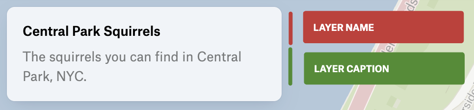

***

> **LayerLegendDisplay**: `"standard"` | `"nameOnly"`

Describes how the layer is displayed in the legend.

There are two display modes:

1. Standard (default):
   * Shows layer name and caption
   * Shows visual representation of the layer's style (e.g. color swatches, proportional symbols)
   * Shows associated layer components

<figure>
  

  <figcaption>Standard layer legend</figcaption>
</figure>

2. Name Only (compact display):
   * Shows only layer name and caption
   * Hides visual representation of the layer's style

<figure>
  

  <figcaption>Name only layer legend</figcaption>
</figure>
