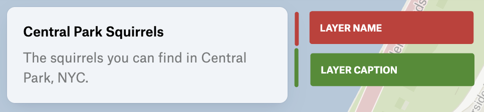

***

> **LegendDisplay**: `"default"` | `"nameOnly"`

Describes how the layer is displayed in the legend.

There are two display modes:

1. Default:
   * Shows layer name and caption
   * Shows representation of the layer's viz (e.g. color swatches, proportional symbols)

<figure>
  

  <figcaption>Default layer legend</figcaption>
</figure>

2. Name-only (compact display):
   * Shows only layer name and caption
   * Hides representation of the layer's viz

<figure>
  

  <figcaption>Name-only layer legend</figcaption>
</figure>
