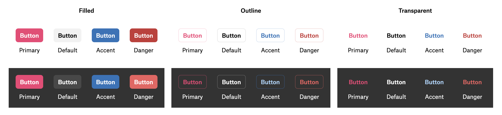

***

Represents a button element in a panel.

<figure>
  

  <figcaption>Button variants</figcaption>
</figure>

# Example

```typescript
{
  type: "Button",
  label: "Click me",
  onClick: () => alert("Button clicked"),
}
```

# Properties

## type

> **type**: `"Button"`

***

## label

> **label**: `string`

The label to display in the button.

***

## onClick()

> **onClick**: (`args`: \{ `id`: `string`; }) => `void`

The action to perform when the button is clicked.

### Parameters

| Parameter | Type                 | Description                           |
| --------- | -------------------- | ------------------------------------- |
| `args`    | \{ `id`: `string`; } | The arguments passed to the function. |
| `args.id` | `string`             | The id of the button.                 |

### Returns

`void`

***

## id

> **id**: `string`

The ID of the element.

***

## variant?

> `optional` **variant**: `"outlined"` | `"transparent"` | `"filled"`

The style variant of the button.

* `"filled"`: a button with background.
  * `background` color is based on button's `tint` (defaults to `default` tint)
* `"transparent"`: a transparent button that gets a subtle dark background when hovered.
  * `text` color is based on button's `tint` (defaults to `default` tint)
* `"outlined"`: a transparent button with a border.
  * `text` and `border` colors are based on button's `tint` (defaults to `default` tint)

### Default Value

`"filled"`

***

## tint?

> `optional` **tint**: `"default"` | `"primary"` | `"accent"` | `"danger"`

The tint of the button.

* `"default"`: Felt's theme-based light/dark colors.
* `"primary"`: Felt's primary color (pink).
* `"accent"`: Felt's accent color (blue).
* `"danger"`: Felt's danger color (red).

### Default Value

`"default"`

***

## disabled?

> `optional` **disabled**: `boolean`

Whether the button is disabled.

### Default Value

`false`

***

## onCreate()?

> `optional` **onCreate**: (`args`: \{ `id`: `string`; }) => `void`

A function to call when the element is created.

### Parameters

| Parameter | Type                 | Description                           |
| --------- | -------------------- | ------------------------------------- |
| `args`    | \{ `id`: `string`; } | The arguments passed to the function. |
| `args.id` | `string`             | The id of the element.                |

### Returns

`void`

***

## onDestroy()?

> `optional` **onDestroy**: (`args`: \{ `id`: `string`; }) => `void`

A function to call when the element is destroyed.

### Parameters

| Parameter | Type                 | Description                           |
| --------- | -------------------- | ------------------------------------- |
| `args`    | \{ `id`: `string`; } | The arguments passed to the function. |
| `args.id` | `string`             | The id of the element.                |

### Returns

`void`
