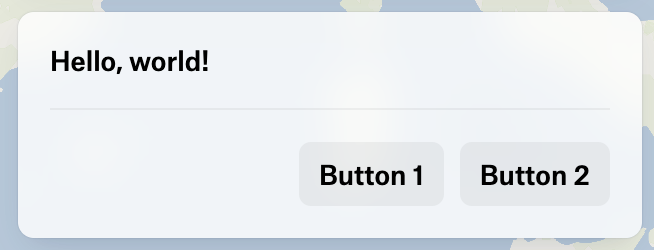

***

Represents a row of buttons.

It is useful to group buttons together and align them.

Unlike on [UIGridContainerElement](UIGridContainerElement.md), buttons do not expand to fill the container.
Instead, they use the space they need and are wrapped to the next line when they overflow.

## Alignment

It is possible to align the button row to the start or end of the container.

### Start alignment

<figure>
  

  <figcaption>Start alignment</figcaption>
</figure>

```typescript
{
  type: "ButtonRow",
  align: "start", // default value
  items: [
    { type: "Button", label: "Button 1", onClick: () => {} },
    { type: "Button", label: "Button 2", onClick: () => {} },
  ],
}
```

### End alignment

<figure>
  

  <figcaption>End alignment</figcaption>
</figure>

```typescript
{
  type: "ButtonRow",
  align: "end",
  items: [
    { type: "Button", label: "Button 1", onClick: () => {} },
    { type: "Button", label: "Button 2", onClick: () => {} },
  ],
}
```

### Overflow

When buttons overflow the container, they are wrapped to the next line.

<figure>
  

  <figcaption>Overflow</figcaption>
</figure>

```typescript
{
  type: "ButtonRow",
  items: [
    { type: "Button", label: "Button with a very long text", onClick: () => {} },
    { type: "Button", label: "Button 2", onClick: () => {} },
    { type: "Button", label: "Button 3", onClick: () => {} },
  ],
}
```

### With Grid container

[UIGridContainerElement](UIGridContainerElement.md), as a generic container, can render [UIButtonRowElement](UIButtonRowElement.md) as well.

In this example, the combination of [UIGridContainerElement](UIGridContainerElement.md) and [UIButtonRowElement](UIButtonRowElement.md) is used to layout a footer
where the buttons are aligned to the end of the container and the text is at the start.

<figure>
  

  <figcaption>With Grid container</figcaption>
</figure>

```typescript
{
  type: "Grid",
  grid: "auto-flow / 1fr auto",
  rowItemsJustify: "space-between",
  rowItemsAlign: "center",
  items: [
    { type: "Text", content: "Continue?" },
    {
      type: "ButtonRow",
      align: "end",
      items: [
        { type: "Button", variant: "transparent", label: "Cancel", onClick: () => {} },
        { type: "Button", variant: "filled", tint: "primary", label: "Continue", onClick: () => {} },
      ]
    },
  ],
}
```

# Properties

## type

> **type**: `"ButtonRow"`

***

## items

> **items**: [`UIButtonElement`](UIButtonElement.md)\[]

The items to add to the button row.

***

## id

> **id**: `string`

The ID of the element.

***

## align?

> `optional` **align**: `"start"` | `"end"`

The alignment of the button row.

### Default Value

`"start"`

***

## onCreate()?

> `optional` **onCreate**: (`args`: \{ `id`: `string`; }) => `void`

A function to call when the element is created.

### Parameters

| Parameter | Type                 | Description                           |
| --------- | -------------------- | ------------------------------------- |
| `args`    | \{ `id`: `string`; } | The arguments passed to the function. |
| `args.id` | `string`             | The id of the element.                |

### Returns

`void`

***

## onDestroy()?

> `optional` **onDestroy**: (`args`: \{ `id`: `string`; }) => `void`

A function to call when the element is destroyed.

### Parameters

| Parameter | Type                 | Description                           |
| --------- | -------------------- | ------------------------------------- |
| `args`    | \{ `id`: `string`; } | The arguments passed to the function. |
| `args.id` | `string`             | The id of the element.                |

### Returns

`void`
