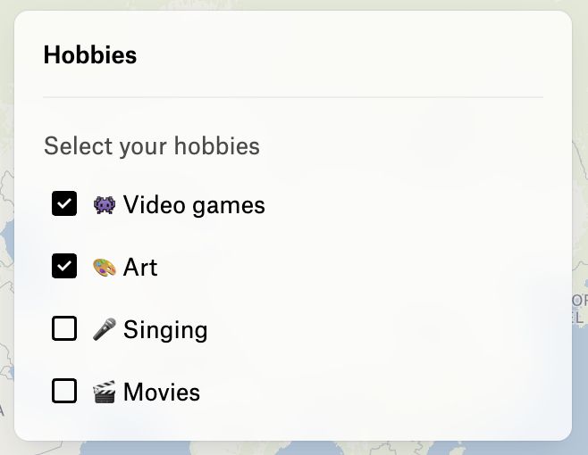

***

The parameters for creating a checkbox group element.

The checkbox group is a control that allows the user to select one or more values from a list of options.

As a control, the checkbox group can have a label displayed above the checkboxes.

If no value is provided, `value` is `[]`, the checkbox group will be empty.

<figure>
  

  <figcaption>
    A checkbox group with a label
  </figcaption>
</figure>

```typescript
{
  type: "CheckboxGroup",
  label: "Select your hobbies",
  options: [
    { label: "👾 Video games", value: "gaming" },
    { label: "🎨 Art", value: "art" },
    { label: "🎤 Singing", value: "singing" },
    { label: "🎬 Movies", value: "movies" },
  ],
  value: ["gaming", "art"],
  onChange: ({ value, id }) => { }
}
```

# Properties

## type

> **type**: `"CheckboxGroup"`

***

## value

> **value**: `string`\[] = `valueSchema`

The value of the checkbox group.

### Default Value

`[]`

***

## options

> **options**: [`UIControlElementOption`](UIControlElementOption.md)\[]

The options to display in the checkbox group.

***

## onChange()

> **onChange**: (`args`: \{ `value`: `string`\[]; `id`: `string`; }) => `void`

The function to call when the value of the checkbox group changes.

### Parameters

| Parameter    | Type                                       | Description                           |
| ------------ | ------------------------------------------ | ------------------------------------- |
| `args`       | \{ `value`: `string`\[]; `id`: `string`; } | The arguments passed to the function. |
| `args.value` | `string`\[]                                | Array of the selected values.         |
| `args.id`    | `string`                                   | The id of the checkbox group element. |

### Returns

`void`

***

## id

> **id**: `string`

The ID of the element.

***

## onCreate()?

> `optional` **onCreate**: (`args`: \{ `id`: `string`; }) => `void`

A function to call when the element is created.

### Parameters

| Parameter | Type                 | Description                           |
| --------- | -------------------- | ------------------------------------- |
| `args`    | \{ `id`: `string`; } | The arguments passed to the function. |
| `args.id` | `string`             | The id of the element.                |

### Returns

`void`

***

## onDestroy()?

> `optional` **onDestroy**: (`args`: \{ `id`: `string`; }) => `void`

A function to call when the element is destroyed.

### Parameters

| Parameter | Type                 | Description                           |
| --------- | -------------------- | ------------------------------------- |
| `args`    | \{ `id`: `string`; } | The arguments passed to the function. |
| `args.id` | `string`             | The id of the element.                |

### Returns

`void`

***

## label?

> `optional` **label**: `string`

Label text to display above the element and used for screen readers.
