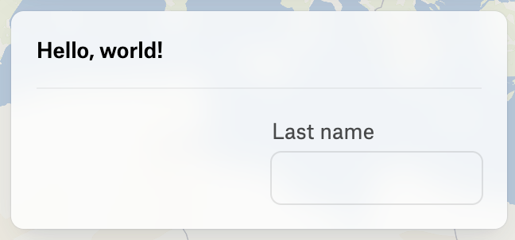
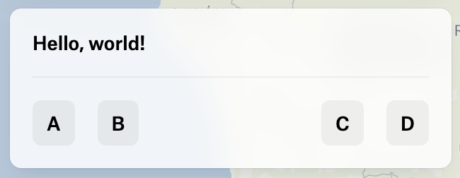

***

Represents a container with a grid layout in a panel.

By default, the grid items are vertically stacked,
but you can change the grid to use a different layout by
setting the `grid` property to a different value.

`grid` property is the exact same as CSS's shorthand property `grid`.
[See the MDN documentation for more details](https://developer.mozilla.org/en-US/docs/Web/CSS/grid).

You can understand [UIPanel](UIPanel.md) `body` and `footer` properties
as grid containers using default vertical stack layout.

## Horizontal stack

As part of CSS Grid Layout capabilities it is possible to create a horizontal stack.

### Alignment & Distribution

On horizontal stacks, it is possible to align and distribute the items.

`verticalAlignment` is used to align the items vertically. By default, items are aligned to the top of the container.
It follows the same values as CSS's `align-items` property. See [MDN documentation](https://developer.mozilla.org/en-US/docs/Web/CSS/align-items) for more details.

`horizontalDistribution` is used to justify the items horizontally. By default, items are justified to the start of the container.
It follows the same values as CSS's `justify-content` property. See [MDN documentation](https://developer.mozilla.org/en-US/docs/Web/CSS/justify-content) for more details.

### Equal width columns

<figure>
  

  <figcaption>Two columns, each sharing 50% of the container width</figcaption>
</figure>

```typescript
{
  type: "Grid",
  grid: "auto-flow / 1fr 1fr",
  items: [
    { type: "TextInput", label: "Name", value: "" },
    { type: "TextInput", label: "Last name", value: "" },
  ],
}
```

## FlexibleSpace element

`FlexibleSpace` element is a handy solution to allow more control over grid layout.

If `grid` is not set, `FlexibleSpace` will add some space between the items.
By using `grid` property it is possible to control FlexibleSpace's size.

### to right align the input

<figure>
  

  <figcaption>Flexible space takes 50% of the container width</figcaption>
</figure>

```typescript
{
  type: "Grid",
  grid: "auto-flow / 1fr 1fr",
  items: [
    { type: "FlexibleSpace" },
    { type: "TextInput", label: "An input" , value: "" },
  ],
}
```

### two columns of buttons with space between them

<figure>
  

  <figcaption>Two groups of buttons</figcaption>
</figure>

```typescript
{
  type: "Grid",
  grid: "auto-flow / auto auto 1fr auto auto",
  items: [
    { type: "Button", label: "A" , onClick: () => {} },
    { type: "Button", label: "B" , onClick: () => {} },
    { type: "FlexibleSpace" },
    { type: "Button", label: "C" , onClick: () => {} },
    { type: "Button", label: "D" , onClick: () => {} },
  ],
}
```

# Properties

## type

> **type**: `"Grid"`

***

## items

> **items**: ([`UIButtonElement`](UIButtonElement.md) | [`UITextElement`](UITextElement.md) | [`UIDividerElement`](UIDividerElement.md) | [`UITextInputElement`](UITextInputElement.md) | [`UISelectElement`](UISelectElement.md) | [`UIFlexibleSpaceElement`](UIFlexibleSpaceElement.md) | [`UIButtonRowElement`](UIButtonRowElement.md) | [`UICheckboxGroupElement`](UICheckboxGroupElement.md) | [`UIRadioGroupElement`](UIRadioGroupElement.md) | [`UIToggleGroupElement`](UIToggleGroupElement.md) | [`UIIframeElement`](UIIframeElement.md))\[]

The items to add to the grid container.

***

## id

> **id**: `string`

The ID of the element.

***

## grid?

> `optional` **grid**: `string`

The grid to use for the container.
It is the exact same as CSS's shorthand property `grid`.

### Example

### horizontal stack

two columns, the first column is 50px wide, the second column takes the remaining space

```typescript
{
  type: "Grid",
  grid: "auto-flow / 50px 1fr",
  items: [...]
}
```

### See

[https://developer.mozilla.org/en-US/docs/Web/CSS/grid](https://developer.mozilla.org/en-US/docs/Web/CSS/grid) for more details.

***

## verticalAlignment?

> `optional` **verticalAlignment**: `"center"` | `"top"` | `"bottom"`

The alignment of the items in the grid.
Only takes effect on horizontal stacks.

### Default Value

`"top"`

***

## horizontalDistribution?

> `optional` **horizontalDistribution**: `"center"` | `"start"` | `"end"` | `"space-between"` | `"space-around"` | `"space-evenly"`

The distribution of the items in the grid.
Only takes effect on horizontal stacks.

### Default Value

`"start"`

***

## onCreate()?

> `optional` **onCreate**: (`args`: \{ `id`: `string`; }) => `void`

A function to call when the element is created.

### Parameters

| Parameter | Type                 | Description                           |
| --------- | -------------------- | ------------------------------------- |
| `args`    | \{ `id`: `string`; } | The arguments passed to the function. |
| `args.id` | `string`             | The id of the element.                |

### Returns

`void`

***

## onDestroy()?

> `optional` **onDestroy**: (`args`: \{ `id`: `string`; }) => `void`

A function to call when the element is destroyed.

### Parameters

| Parameter | Type                 | Description                           |
| --------- | -------------------- | ------------------------------------- |
| `args`    | \{ `id`: `string`; } | The arguments passed to the function. |
| `args.id` | `string`             | The id of the element.                |

### Returns

`void`
