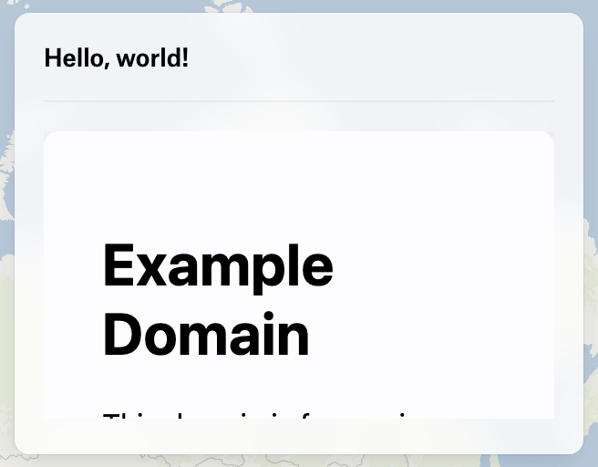

***

Represents an iframe element in a panel.

The height of the iframe can be set by using the `height` property
either as a number (measured in pixels) or a string (e.g. “100px” or “50%“).

By default, the height is calculated following a 16:9 ratio.

<figure>
  

  <figcaption>
    Iframe with default height (16:9)
  </figcaption>
</figure>

```typescript
{ type: "Iframe", url: "https://www.example.com" }
```

<figure>
  

  <figcaption>
    Iframe with custom height
  </figcaption>
</figure>

```typescript
{ type: "Iframe", url: "https://www.example.com", height: 300 }
```

# Properties

## type

> **type**: `"Iframe"`

***

## url

> **url**: `string`

The URL of the iframe.

***

## id

> **id**: `string`

The ID of the element.

***

## height?

> `optional` **height**: `string` | `number`

The height of the iframe.

If not provided, the height will be automatically calculated following a 16:9 ratio.

***

## onCreate()?

> `optional` **onCreate**: (`args`: \{ `id`: `string`; }) => `void`

A function to call when the element is created.

### Parameters

| Parameter | Type                 | Description                           |
| --------- | -------------------- | ------------------------------------- |
| `args`    | \{ `id`: `string`; } | The arguments passed to the function. |
| `args.id` | `string`             | The id of the element.                |

### Returns

`void`

***

## onDestroy()?

> `optional` **onDestroy**: (`args`: \{ `id`: `string`; }) => `void`

A function to call when the element is destroyed.

### Parameters

| Parameter | Type                 | Description                           |
| --------- | -------------------- | ------------------------------------- |
| `args`    | \{ `id`: `string`; } | The arguments passed to the function. |
| `args.id` | `string`             | The id of the element.                |

### Returns

`void`
