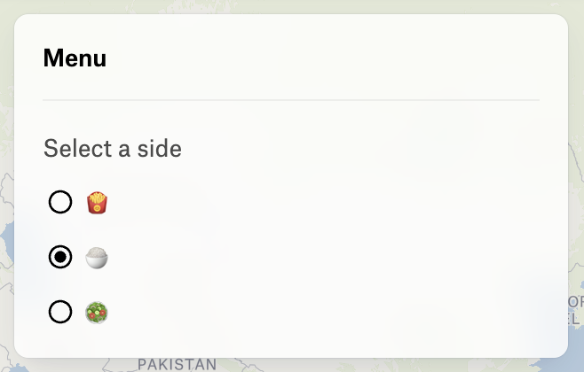

***

The parameters for creating a radio group element.

The radio group is a control that allows the user to select a single value from a list of options.

As a control, the radio group can have a label displayed above the radioes.

If no value is provided, `value` is `undefined`, the radio group will be empty.

<figure>
  

  <figcaption>
    A radio buttons group with a label
  </figcaption>
</figure>

```typescript
{
  type: "RadioGroup",
  label: "Select a side",
  options: [
    { label: "🍟", value: "fries" },
    { label: "🍚", value: "rice" },
    { label: "🥗", value: "salad" },
  ],
  value: "rice",
  onChange: ({ value, id }) => { }
}
```

# Properties

## type

> **type**: `"RadioGroup"`

***

## options

> **options**: \{ `label`: `string`; `value`: `string`; }\[]

The options to display in the radio group.

| Name    | Type     |
| ------- | -------- |
| `label` | `string` |
| `value` | `string` |

***

## onChange()

> **onChange**: (`args`: \{ `value`: `undefined` | `string`; `id`: `string`; }) => `void`

The function to call when the value of the radio group changes.

### Parameters

| Parameter    | Type                                                   | Description                           |
| ------------ | ------------------------------------------------------ | ------------------------------------- |
| `args`       | \{ `value`: `undefined` \| `string`; `id`: `string`; } | The arguments passed to the function. |
| `args.value` | `undefined` \| `string`                                | The selected value.                   |
| `args.id`    | `string`                                               | The id of the radio group element.    |

### Returns

`void`

***

## id

> **id**: `string`

The ID of the element.

***

## value?

> `optional` **value**: `string` = `valueSchema`

The value of the radio group.

### Default Value

`undefined`

***

## onCreate()?

> `optional` **onCreate**: (`args`: \{ `id`: `string`; }) => `void`

A function to call when the element is created.

### Parameters

| Parameter | Type                 | Description                           |
| --------- | -------------------- | ------------------------------------- |
| `args`    | \{ `id`: `string`; } | The arguments passed to the function. |
| `args.id` | `string`             | The id of the element.                |

### Returns

`void`

***

## onDestroy()?

> `optional` **onDestroy**: (`args`: \{ `id`: `string`; }) => `void`

A function to call when the element is destroyed.

### Parameters

| Parameter | Type                 | Description                           |
| --------- | -------------------- | ------------------------------------- |
| `args`    | \{ `id`: `string`; } | The arguments passed to the function. |
| `args.id` | `string`             | The id of the element.                |

### Returns

`void`

***

## label?

> `optional` **label**: `string`

Label text to display above the element and used for screen readers.
