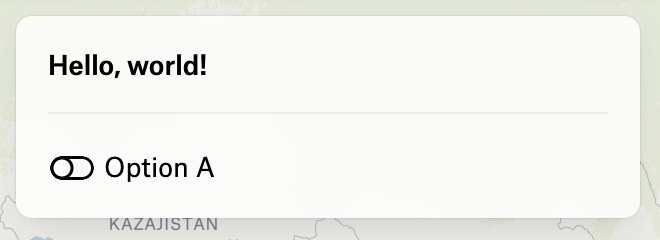
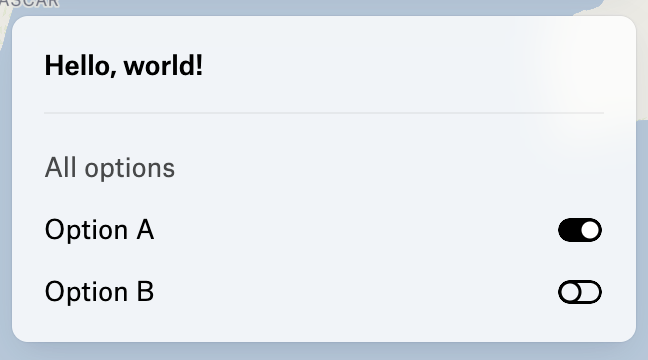

***

The parameters for creating a toggle group element.

## Options

The options to display in the toggle group are defined using the `options` property.
It can contain one or more options and each option renders a toggle.

<figure>
  

  <figcaption>
    A group with a single option
  </figcaption>
</figure>

```typescript
{
  type: "ToggleGroup",
  options: [{ label: "Option A", value: "optionA" }],
  value: [],
  onChange: ({ value, id }) => { }
}
```

## Alignment

By default, the toggles are aligned to the start of the group,
but it can be changed to `end` by setting the `alignment` property to `end`.

<figure>
  

  <figcaption>
    The toggles are aligned to the end
  </figcaption>
</figure>

```typescript
{
  type: "ToggleGroup",
  alignment: "end",
  label: "All options",
  options: [
    { label: "Option A", value: "optionA" },
    { label: "Option B", value: "optionB" },
  ],
  value: ["optionA"],
  onChange: ({ value, id }) => { }
}
```

## Label

As a control, the toggle group can have a label displayed above the toggles.


```typescript
{
  type: "ToggleGroup",
  label: "All options",
  options: [
    { label: "Option A", value: "optionA" },
    { label: "Option B", value: "optionB" },
  ],
  value: ["optionA"],
  onChange: ({ value, id }) => { }
}
```

# Properties

## type

> **type**: `"ToggleGroup"`

***

## value

> **value**: `string`\[] = `valueSchema`

The value of the toggle group.

### Default Value

`[]`

***

## options

> **options**: [`UIControlOption`](UIControlOption.md)\[]

The options to display in the toggle group.

***

## onChange()

> **onChange**: (`args`: \{ `value`: `string`\[]; `id`: `string`; }) => `void`

The function to call when the value of the toggle group changes.

### Parameters

| Parameter    | Type                                       | Description                           |
| ------------ | ------------------------------------------ | ------------------------------------- |
| `args`       | \{ `value`: `string`\[]; `id`: `string`; } | The arguments passed to the function. |
| `args.value` | `string`\[]                                | Array of the selected values.         |
| `args.id`    | `string`                                   | The id of the toggle group element.   |

### Returns

`void`

***

## id

> **id**: `string`

The ID of the element.

***

## alignment?

> `optional` **alignment**: `"start"` | `"end"`

The alignment of the toggle group.

### Default Value

`"start"`

***

## onCreate()?

> `optional` **onCreate**: (`args`: \{ `id`: `string`; }) => `void`

A function to call when the element is created.

### Parameters

| Parameter | Type                 | Description                           |
| --------- | -------------------- | ------------------------------------- |
| `args`    | \{ `id`: `string`; } | The arguments passed to the function. |
| `args.id` | `string`             | The id of the element.                |

### Returns

`void`

***

## onDestroy()?

> `optional` **onDestroy**: (`args`: \{ `id`: `string`; }) => `void`

A function to call when the element is destroyed.

### Parameters

| Parameter | Type                 | Description                           |
| --------- | -------------------- | ------------------------------------- |
| `args`    | \{ `id`: `string`; } | The arguments passed to the function. |
| `args.id` | `string`             | The id of the element.                |

### Returns

`void`

***

## label?

> `optional` **label**: `string`

Label text to display above the element and used for screen readers.
